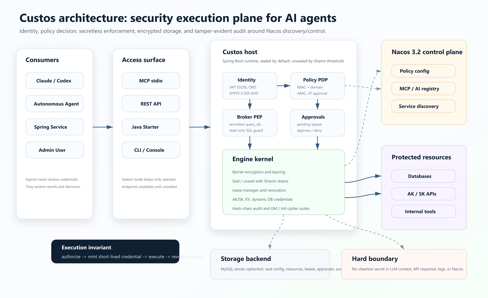
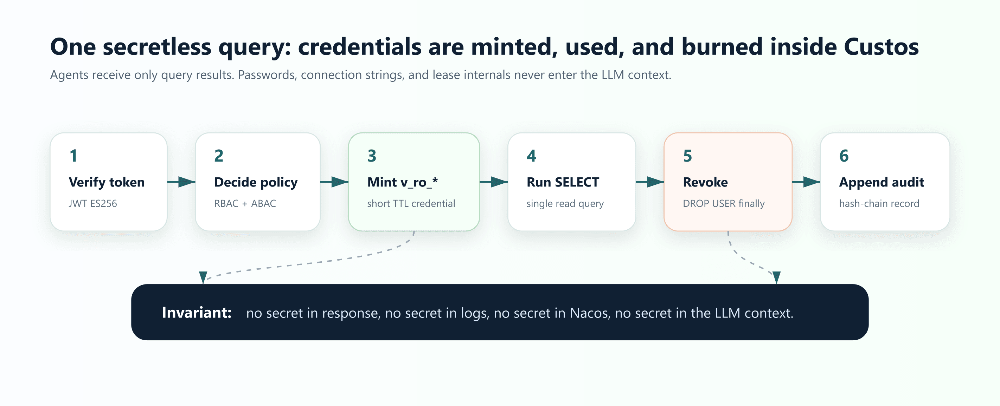

# Custos

> Nacos-native, self-hosted **identity, secrets, and authorization** engine for AI agents.

[](#license)
[](pom.xml)
[](app/pom.xml)
[](examples/docker-compose.yml)
[](examples/demo.md)

**Languages:** English | [简体中文](README.zh-CN.md)

Custos is a security execution plane for AI agents before they touch enterprise resources. It verifies identity, evaluates policy, mints short-lived credentials on demand, executes secretless operations, and writes every decision to a tamper-evident audit chain. Agents and LLMs receive only results, never database passwords, AK/SK pairs, connection strings, or lease internals.



## Why Custos

The Nacos 3.2 AI management center is strong at discovery: agents, MCP tools, skills, and service instances. Custos completes the execution-side security loop.

| Question | Custos answer |
|---|---|
| How does an agent prove its identity? | Per-session identity, JWT ES256, OBO delegation, SPIFFE/SVID capabilities |
| Who can call which tool or resource? | jCasbin RBAC + domain, ABAC tri-state decisions, REQUIRE_APPROVAL workflow |
| Can an agent see secrets? | No. The broker mints burn-after-use credentials and returns only business results |
| How fast does policy revocation take effect? | Policy is delivered through Nacos config + gRPC hot push; measured revocation is about 275ms |
| How do we investigate later? | Every allow/deny decision is appended to a hash-chain audit log; tampering breaks at a precise seq |
| Does it depend on Vault/OpenBao code? | No. The key engine is 100% self-authored; design ideas are studied, code is not copied |

## Features

| Capability | Status |
|---|---|
| Self-authored key engine: Barrier, Seal/Unseal, Keyring, Lease, Revocation | Done |
| Shamir 5/3 unseal; host starts sealed by default | Done |
| AES-256-GCM/SHA-256/ECDSA-P256 international suite and SM4-GCM/SM3/SM2 GM suite | Done |
| JWT identity, OBO delegation, SPIFFE X.509 SVID | Done |
| RBAC + domain, ABAC tri-state decisions, explainable PDP | Done |
| Secretless DB query: broker creates `v_ro_*` read-only accounts and drops them in `finally` | Done |
| Resource registry: Barrier-managed admin credentials, masked list responses, credential rotation | Done |
| AK/SK secrets engine and KV engine | Done |
| Tamper-evident hash-chain audit | Done |
| REST host, MCP stdio server, CLI, Spring Boot Starter, Vue Admin Console | Done |
| Register Custos MCP server into Nacos AI management center | Roadmap v0.5 |
| Multi-host discovery, Prometheus/Tracing, namespace multi-tenant demo | Roadmap v0.6 |
| A2A PEP, production HA, external security audit closure | Roadmap v0.7+ |

[docs/ROADMAP.md](docs/ROADMAP.md) is the source of truth for delivered and planned capabilities. This README marks shipped capabilities as Done and future work as Roadmap.

## Quickstart

Prerequisites:

- Docker / Docker Compose
- Java 21
- Maven 3.9+
- Node.js 20+, only needed for `console/`

Start the full stack:

```bash
docker compose -f examples/docker-compose.yml up -d --build
```

This starts:

| Service | URL / Port | Notes |
|---|---:|---|
| Custos host | `http://localhost:8080` | REST API, sealed on boot |
| Nacos API | `localhost:8848` | API auth enabled |
| Nacos console / AI center | `http://localhost:8081` | `nacos` / `DemoPass123` |
| MySQL | `localhost:3306` | `custos` / `custospwd` |

Build the CLI:

```bash
mvn -pl cli -am -DskipTests package
```

Then follow [examples/demo.md](examples/demo.md). The runbook covers AC1-AC9: sealed boot, threshold unseal, encrypted-at-rest storage, dynamic DB credentials, secretless result flow, explainable deny, Nacos policy revocation, audit verification, and Barrier-managed resource admin credentials.

## Secretless Flow



At runtime, `query_db` follows one narrow path:

```text
JWT verify
  -> PDP decision: RBAC + domain + ABAC
  -> issue temporary v_ro_* credential
  -> execute one SELECT / WITH statement
  -> revoke credential in finally
  -> append hash-chain audit record
```

Security invariants:

- Secrets never enter the LLM context.
- Secrets never appear in API responses.
- Secrets never go to Nacos.
- Resource admin credentials are encrypted by the Custos Barrier before storage.
- Audit records form a hash chain; tampering is detected at the broken seq.

## Architecture

Custos is a Java 21 Maven multi-module project:

| Module | Responsibility |
|---|---|
| `engine/` | Cryptographic kernel: Barrier, Seal/Unseal, storage, lease, audit, AK/SK, KV, DB credential engines, Raft parts |
| `identity/` | Agent identity, JWT, OBO, SPIFFE/SVID, token verification |
| `authz/` | PDP: jCasbin RBAC/domain, ABAC, risk scoring, approval hooks, Nacos policy watcher |
| `broker/` | PEP: secretless query broker, MCP tool server, read-only SQL enforcement |
| `app/` | Spring Boot host: REST API, operator lifecycle, policy, resources, approvals, audit, monitor |
| `cli/` | Picocli admin and query client |
| `sdk/` | `custos-spring-boot-starter` client auto-configuration |
| `console/` | Vue 3 + Element Plus admin console |
| `examples/` | Docker stack, schema, MCP config, smoke client, acceptance runbook |
| `docs/` | Design docs, roadmap, specs, docs cockpit, audit prep |

Module dependency shape:

```text
engine <- identity/authz <- broker <- app / cli / sdk
```

Nacos is the control and discovery plane. Custos stores no cleartext secret in Nacos; Nacos carries policy/config metadata and, in later milestones, richer MCP/AI registry integration.

## API Surface

The Spring Boot host exposes these main REST areas:

| Area | Endpoint |
|---|---|
| Operator lifecycle | `POST /operator/init`, `POST /operator/unseal`, `POST /operator/seal`, `GET /operator/status` |
| Policy | `POST /policy`, `GET /policy` |
| Resource registry | `POST /resources`, `GET /resources`, `POST /resources/{name}/rotate-admin`, `DELETE /resources/{name}` |
| Query broker | `POST /query_db` |
| Token issuing | `POST /token/issue` |
| Approval workflow | `GET /approvals`, `POST /approvals/{id}/approve`, `POST /approvals/{id}/deny` |
| Audit | `GET /audit`, `GET /audit/verify` |
| Monitor / leases | `GET /monitor/stats`, `GET /leases` |

MCP stdio mode is available when `custos.transport.mcp-stdio=true`. The Claude/Codex example config lives in [examples/claude-mcp.json](examples/claude-mcp.json), and the smoke client lives in [examples/mcp_smoke_client.py](examples/mcp_smoke_client.py).

## Java SDK

Add the starter:

```xml
<dependency>
  <groupId>io.custos</groupId>
  <artifactId>custos-spring-boot-starter</artifactId>
  <version>0.1.0-SNAPSHOT</version>
</dependency>
```

Configure `custos.client.*` in your Spring Boot service to get an auto-configured `CustosClient`. See [sdk/src/main/java/io/custos/sdk](sdk/src/main/java/io/custos/sdk).

## Admin Console

The console is a standalone Vue app:

```bash
cd console
npm install
npm run dev
```

It targets the host API and includes operator, resource, approval, audit, and monitor views.

## Development

Common commands:

```bash
# Full gate. Requires Docker for Testcontainers.
mvn -B clean verify

# Module tests
mvn -pl engine test
mvn -pl broker test -Dtest=BrokerAuditWiringTest -Dsurefire.failIfNoSpecifiedTests=false

# Include benchmark-tagged tests
mvn -pl engine test -DbenchExcluded=

# Console
cd console && npm run test:unit && npm run build

# MCP smoke test
python examples/mcp_smoke_client.py "SELECT 1"
```

Project workflow is documented in [CLAUDE.md](CLAUDE.md): brainstorm -> spec -> plan -> TDD implementation -> `mvn -B verify` -> docs cockpit update.

## Documentation Map

| Document | Purpose |
|---|---|
| [docs/ROADMAP.md](docs/ROADMAP.md) | Delivered vs planned capabilities |
| [examples/demo.md](examples/demo.md) | Runnable AC1-AC9 acceptance flow |
| [docs/audit/AUDIT-PREP.md](docs/audit/AUDIT-PREP.md) | External security audit entry and known gaps |
| [docs/design/01-architecture.md](docs/design/01-architecture.md) | Architecture, trust boundaries, data flows |
| [docs/design/02-engine-crypto-design.md](docs/design/02-engine-crypto-design.md) | Threat model and cryptographic design |
| [docs/cockpit.html](docs/cockpit.html) | Module/spec/plan dashboard |

## Security Posture

Custos is built around a few hard rules:

- The key engine is self-authored. Do not copy Vault, OpenBao, or Infisical-EE code.
- Do not invent cryptography. Use JDK crypto and BouncyCastle through `CipherSuite`.
- Nacos carries policy and metadata, not secrets.
- The LLM boundary is untrusted; the broker returns results, not credentials.
- Known production gaps are tracked in [docs/audit/AUDIT-PREP.md](docs/audit/AUDIT-PREP.md), including TLS, JWT/SVID key custody, least-privilege resource admin roles, and external audit items.

## License

Apache-2.0.
