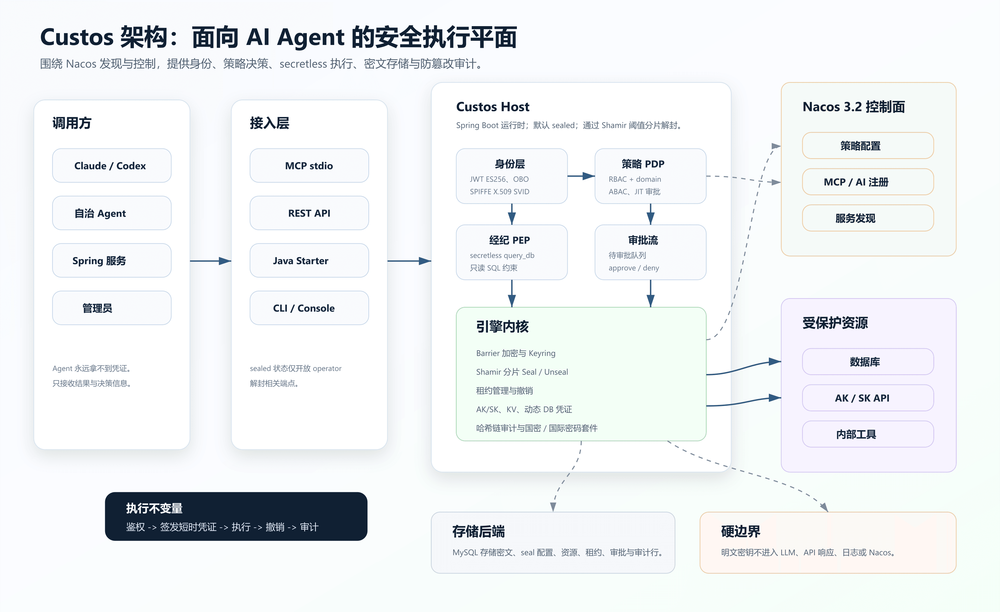
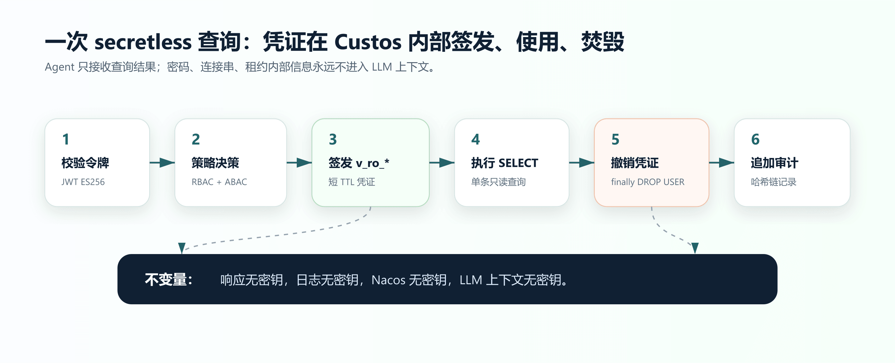

# Custos

> Nacos-native、自托管、面向 AI Agent 的 **身份 · 密钥 · 权限**统一引擎。

[](#license)
[](pom.xml)
[](app/pom.xml)
[](examples/docker-compose.yml)
[](examples/demo.md)

**语言:** [English](README.md) | 简体中文

Custos 是 AI Agent 访问企业资源前的一层安全执行平面：它校验身份、做策略决策、现场签发短时凭证、执行 secretless 调用，并把每次决策写入防篡改审计链。Agent 和 LLM 只拿到结果，拿不到数据库密码、AK/SK、连接串或租约内部信息。



## 为什么是 Custos

Nacos 3.2 AI 管理中心擅长发现：有哪些 Agent、MCP 工具、Skill、服务实例。Custos 补上执行侧的安全闭环。

| 问题 | Custos 的回答 |
|---|---|
| Agent 怎么证明自己是谁？ | per-session 身份、JWT ES256、OBO 委托、SPIFFE/SVID 能力 |
| 谁能调用哪个工具/资源？ | jCasbin RBAC + domain、ABAC 三态、REQUIRE_APPROVAL 审批闭环 |
| Agent 是否会看见密钥？ | 不会。Broker 现场签发即用即焚凭证，只返回业务结果 |
| 策略变更多久生效？ | 策略走 Nacos 配置 + gRPC 热推，已有实测吊销生效约 275ms |
| 事后怎么追责？ | 每次 allow/deny 都追加哈希链审计，改一行即断链并定位 seq |
| 是否依赖 Vault/OpenBao 代码？ | 不依赖。密钥引擎 100% 自研，参考赛道设计语言但不混入相关代码 |

## 核心能力

| 能力 | 状态 |
|---|---|
| 自研密钥引擎：Barrier、Seal/Unseal、Keyring、Lease、Revocation | 已交付 |
| Shamir 5/3 解封，host 默认 sealed 启动 | 已交付 |
| AES-256-GCM/SHA-256/ECDSA-P256 国际套件与 SM4-GCM/SM3/SM2 国密套件 | 已交付 |
| JWT 身份、OBO 委托、SPIFFE X.509 SVID | 已交付 |
| RBAC + domain、ABAC 三态、可解释 PDP | 已交付 |
| Secretless DB 查询，经纪层现场创建 `v_ro_*` 只读账号并 `finally DROP USER` | 已交付 |
| 资源注册表：高权限管理凭证 Barrier 加密托管、脱敏列表、轮换 | 已交付 |
| AK/SK secrets engine、KV engine | 已交付 |
| 防篡改哈希链审计 | 已交付 |
| REST host、MCP stdio server、CLI、Spring Boot Starter、Vue Admin Console | 已交付 |
| custos MCP server 注册进 Nacos AI 管理中心 | Roadmap v0.5 |
| 多 host 服务发现、Prometheus/Tracing、namespace 多租户演示 | Roadmap v0.6 |
| A2A PEP、生产 HA、外部安全审计闭环 | Roadmap v0.7+ |

Roadmap 的唯一真相源是 [docs/ROADMAP.md](docs/ROADMAP.md)。README 只把已交付能力写成“已交付”，规划能力显式标 Roadmap。

## 快速开始

前置要求：

- Docker / Docker Compose
- Java 21
- Maven 3.9+
- Node.js 20+，仅运行 `console/` 时需要

启动完整栈：

```bash
docker compose -f examples/docker-compose.yml up -d --build
```

启动后会有：

| 服务 | 地址 / 端口 | 说明 |
|---|---:|---|
| Custos host | `http://localhost:8080` | REST API，启动即 sealed |
| Nacos API | `localhost:8848` | API 鉴权开启 |
| Nacos 控制台 / AI 中心 | `http://localhost:8081` | `nacos` / `DemoPass123` |
| MySQL | `localhost:3306` | `custos` / `custospwd` |

构建 CLI：

```bash
mvn -pl cli -am -DskipTests package
```

然后按 [examples/demo.md](examples/demo.md) 跑完整验收流程。该流程覆盖 AC1-AC9：sealed 启动、阈值解封、落盘加密、动态 DB 凭证、secretless 返回、可解释拒绝、Nacos 策略吊销、审计校验、资源高权限凭证 Barrier 托管。

## Secretless 链路



运行时，`query_db` 走一条很窄的路径：

```text
JWT verify
  -> PDP decision: RBAC + domain + ABAC
  -> issue temporary v_ro_* credential
  -> execute one SELECT / WITH statement
  -> revoke credential in finally
  -> append hash-chain audit record
```

安全不变量：

- 密钥不进入 LLM 上下文。
- 密钥不出现在 API 响应里。
- 密钥不进入 Nacos。
- 资源高权限管理凭证落盘前经 Custos Barrier 加密。
- 审计记录串成哈希链，篡改会在校验时定位到断链 seq。

## 架构

Custos 是 Java 21 Maven 多模块项目：

| 模块 | 职责 |
|---|---|
| `engine/` | 密码学内核：Barrier、Seal/Unseal、存储、租约、审计、AK/SK、KV、DB credential engines、Raft 零件 |
| `identity/` | Agent 身份、JWT、OBO、SPIFFE/SVID、令牌校验 |
| `authz/` | PDP：jCasbin RBAC/domain、ABAC、风险评分、审批 hook、Nacos 策略 watcher |
| `broker/` | PEP：secretless query broker、MCP tool server、只读 SQL 约束 |
| `app/` | Spring Boot host：REST API、operator 生命周期、策略、资源、审批、审计、监控 |
| `cli/` | Picocli 管理与查询客户端 |
| `sdk/` | `custos-spring-boot-starter` 客户端自动装配 |
| `console/` | Vue 3 + Element Plus 管理控制台 |
| `examples/` | Docker 栈、schema、MCP 配置、冒烟客户端、验收 runbook |
| `docs/` | 设计文档、roadmap、spec、docs cockpit、审计准备包 |

模块依赖形态：

```text
engine <- identity/authz <- broker <- app / cli / sdk
```

Nacos 是控制面和发现面。Custos 不把明文密钥存入 Nacos；Nacos 承载策略、配置元数据，以及后续里程碑中的 MCP/AI registry 集成。

## API Surface

Spring Boot host 暴露的主要 REST 区域：

| 区域 | Endpoint |
|---|---|
| Operator 生命周期 | `POST /operator/init`, `POST /operator/unseal`, `POST /operator/seal`, `GET /operator/status` |
| 策略 | `POST /policy`, `GET /policy` |
| 资源注册表 | `POST /resources`, `GET /resources`, `POST /resources/{name}/rotate-admin`, `DELETE /resources/{name}` |
| 查询经纪 | `POST /query_db` |
| 令牌签发 | `POST /token/issue` |
| 审批流 | `GET /approvals`, `POST /approvals/{id}/approve`, `POST /approvals/{id}/deny` |
| 审计 | `GET /audit`, `GET /audit/verify` |
| 监控 / 租约 | `GET /monitor/stats`, `GET /leases` |

设置 `custos.transport.mcp-stdio=true` 后可启用 MCP stdio 模式。Claude/Codex 示例配置见 [examples/claude-mcp.json](examples/claude-mcp.json)，冒烟客户端见 [examples/mcp_smoke_client.py](examples/mcp_smoke_client.py)。

## Java SDK

引入 starter：

```xml
<dependency>
  <groupId>io.custos</groupId>
  <artifactId>custos-spring-boot-starter</artifactId>
  <version>0.1.0-SNAPSHOT</version>
</dependency>
```

在 Spring Boot 服务中配置 `custos.client.*` 后可获得自动装配的 `CustosClient`。代码见 [sdk/src/main/java/io/custos/sdk](sdk/src/main/java/io/custos/sdk)。

## Admin Console

控制台是独立 Vue 应用：

```bash
cd console
npm install
npm run dev
```

控制台面向 host API，包含 operator、resource、approval、audit、monitor 等视图。

## 开发

常用命令：

```bash
# 全量门禁，需要 Docker 支持 Testcontainers
mvn -B clean verify

# 单模块测试
mvn -pl engine test
mvn -pl broker test -Dtest=BrokerAuditWiringTest -Dsurefire.failIfNoSpecifiedTests=false

# 纳入 bench 标签用例
mvn -pl engine test -DbenchExcluded=

# Console
cd console && npm run test:unit && npm run build

# MCP 冒烟测试
python examples/mcp_smoke_client.py "SELECT 1"
```

项目工作节奏见 [CLAUDE.md](CLAUDE.md)：brainstorm -> spec -> plan -> TDD implementation -> `mvn -B verify` -> docs cockpit update。

## 文档地图

| 文档 | 用途 |
|---|---|
| [docs/ROADMAP.md](docs/ROADMAP.md) | 已交付能力与规划能力 |
| [examples/demo.md](examples/demo.md) | 可执行 AC1-AC9 验收流程 |
| [docs/audit/AUDIT-PREP.md](docs/audit/AUDIT-PREP.md) | 外部安全审计入口与已知缺口 |
| [docs/design/01-architecture.md](docs/design/01-architecture.md) | 架构、信任边界、数据流 |
| [docs/design/02-engine-crypto-design.md](docs/design/02-engine-crypto-design.md) | 威胁模型与密码学设计 |
| [docs/cockpit.html](docs/cockpit.html) | 模块/spec/plan 看板 |

## 安全姿态

Custos 围绕几条硬规则构建：

- 密钥引擎完全自研，不复制 Vault、OpenBao、Infisical-EE 代码。
- 不自造密码学；通过 `CipherSuite` 使用 JDK crypto 与 BouncyCastle。
- Nacos 承载策略和元数据，不承载密钥。
- LLM 边界不可信；Broker 返回结果，不返回凭证。
- 生产缺口记录在 [docs/audit/AUDIT-PREP.md](docs/audit/AUDIT-PREP.md)，包括 TLS、JWT/SVID key custody、最小权限 resource admin role、外部审计项等。

## License

Apache-2.0.
