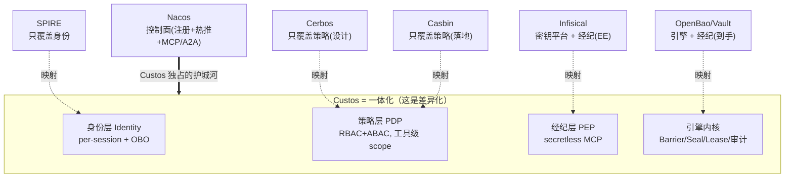

# 00 · 综合与决策（Synthesis & Decisions）

> **目的**：把阶段一 7 篇竞品笔记（`../research/*.md`）收敛成 Custos 的设计决策——跨竞品对比、应借鉴的设计模式、明确放弃的做法、**自研 vs 不重造的边界**、**钉死的差异化护城河**、**许可证合规表**。本文是阶段三全部设计文档（`01`~`08`）的共同前提。
>
> 输入：`openbao.md`、`vault.md`、`spire.md`、`cerbos.md`、`casbin.md`、`nacos.md`、`infisical.md`（均已源码级佐证）+ `../../brief/custos-agent-secrets-PRD.md`。

---

## 1. 竞品在 Custos 三层模型中的落位

Custos = **身份层 + 策略层(PDP) + 经纪层(PEP)** 叠在**自研引擎内核**之上，以 **Nacos 为控制面**。各竞品只覆盖其中一两块：

**一句话洞察**：市面上没有任何一个项目**同时**覆盖"身份 + 密钥 + 权限"，更没有一个**建在 Nacos 上**。Custos 的价值 = **一体化 × Nacos-native**。

---

## 2. 跨竞品多维对比

> 列 = 各竞品 + Custos（目标）；✅强 / ◐部分 / ✕无。评估基于阶段一源码/文档分析。

### 2.1 引擎内核（密钥）维度

| 维度 | OpenBao | Vault | Infisical | **Custos（目标）** |
|---|---|---|---|---|
| Barrier 落盘加密 | ✅ AES-256-GCM | ✅ AES-256-GCM | ◐ 平台加密/自有 KMS | ✅ AES-256-GCM **+ 国密 SM4 可切换** |
| 密钥层级 | ✅ data→keyring→root→unseal | ✅ 同 | ◐ | ✅ 借鉴四层 |
| Seal/Unseal | ✅ Shamir + KMS auto | ✅ 同 | ✕ | ✅ Shamir(+SM 套件) + KMS |
| 动态凭证 | ✅ database 等 | ✅ 最广 | ◐ **EE 商业许可** | ✅ 首版 DB 只读 |
| 租约/撤销 | ✅ Expiration Mgr + 前缀/级联 | ✅ 同 | ◐ lease | ✅ 借鉴 **+ Nacos 秒级吊销** |
| 防篡改审计 | ◐ HMAC 脱敏（非链） | ◐ 同 | ◐ 审计日志 | ✅ **哈希链/只追加（差异化）** |
| 存储后端 | ◐ raft+postgresql | ✅ 多后端 | ◐ DB | ✅ 自研抽象，**首版 MySQL** |

### 2.2 身份 + 委托维度

| 维度 | SPIRE | OpenBao/Vault | Infisical | **Custos（目标）** |
|---|---|---|---|---|
| 非人类/机器身份 | ✅ SVID（事实标准） | ◐ token | ◐ machine identity | ✅ 借鉴 SPIRE |
| per-session 临时身份 | ◐ 短 TTL SVID | ✕ | ✕ | ✅ **每会话** |
| 不预置密钥的 attestation | ✅ node+workload | ✕ | ◐ K8s/OIDC/云 | ✅ 借鉴 |
| 多认证方法 | ✅ 插件谱系 | ✅ K8s/OIDC/AppRole | ✅ K8s/AWS/GCP/**alicloud** | ✅ JWT/OIDC/K8s SA/(SPIFFE) |
| **OBO 委托（用户∩Agent）** | ✕ | ✕ | ✕ | ✅ **必须新造（无人有）** |
| 身份命名规范 | ✅ SPIFFE URI | ◐ | ◐ | ✅ 借鉴 URI 化 |

### 2.3 权限 + 审计维度

| 维度 | Cerbos | Casbin | Nacos | **Custos（目标）** |
|---|---|---|---|---|
| RBAC | ✅ | ✅（含 domain） | ◐ 鉴权 | ✅ |
| ABAC/上下文 | ✅ Derived Roles + CEL | ◐ matcher 表达式 | ✕ | ✅ |
| 工具/动作级 scope（MCP SEP-835） | ◐ resource/action | ◐ keyMatch/glob | ◐ MCP 工具开关 | ✅ **对齐 SEP-835** |
| PDP/PEP 解耦 | ✅ 独立服务 | ✕（库） | ✕ | ✅ |
| 可解释决策 | ✅ tracer 命中规则 | ✕ | ✕ | ✅ 借鉴 Cerbos |
| JIT + 人工审批 | ✕ | ✕ | ◐ 工具熔断 | ✅ 新造 |
| 策略热更新 | ◐ 自身 loader | ◐ Watcher（无 Nacos） | ✅ **gRPC 秒级** | ✅ **Nacos 秒级吊销** |

### 2.4 部署 / 控制面 / 许可 / 自主可控维度

| 维度 | OpenBao | Vault | SPIRE | Cerbos | Casbin | Nacos | Infisical | **Custos** |
|---|---|---|---|---|---|---|---|---|
| 语言 | Go | Go | Go | Go | 多语言(含 Java) | **Java** | TS/Node | **Java（倾向）** |
| 控制面 | 自身 sys/ | 自身 | 自身 | 自身 | 无 | **本体** | 自身 | **Nacos** |
| Nacos 原生 | ✕ | ✕ | ✕ | ✕ | ✕（可缝合） | — | ✕ | ✅ |
| 许可证 | MPL-2.0 | BSL-1.1 | Apache-2.0 | Apache-2.0 | Apache-2.0 | Apache-2.0 | MIT + **EE 商业** | **Apache-2.0** |
| 自主可控 | 中（LF） | 低（BSL/海外） | 中（CNCF） | 中（海外） | **高（国产）** | **高（国产）** | 低（海外/SaaS） | **高（目标）** |
| 国密 | ✕ | ✕ | ✕ | ✕ | ✕ | ◐ | ✕ | ✅ **SM2/3/4 可切换** |

---

## 3. Custos 应借鉴的设计模式（提炼）

| 来源 | 借鉴的设计模式 | 落到 Custos 哪份文档 |
|---|---|---|
| **OpenBao/Vault** | Barrier 屏障（存储不可信、落盘前 AEAD）、**四层密钥**、Shamir+KMS 双解封、**Lease/Expiration Manager**（前缀批量 + token 级联撤销）、动态凭证 creation/revocation statements、**显式威胁模型（声明边界）**、检测入侵一键 seal | `02-engine-crypto`、`06-secrets-broker` |
| **SPIRE** | **不预置密钥的两段式 attestation**、短时 **SVID 双载体（X.509 + JWT）**、**SPIFFE URI 身份命名**、签名密钥托管 KMS、**内置外部安全审计（Cure53）的工程实践** | `03-identity`、`02-engine-crypto`、`07/08` |
| **Cerbos** | **PDP/PEP 彻底解耦**、**Derived Roles + CEL** 结构化 ABAC、**可解释决策（tracer：命中规则+原因）**、**Scopes 层级作用域**、Decision Log、Schema 校验/标准对齐 | `04-authz` |
| **Casbin** | **PERM 元模型**统一 RBAC+ABAC、keyMatch/glob 表达路径/工具通配、**Watcher 抽象**（→ 自研 Nacos Watcher）、domain/tenant RBAC、**jCasbin 与 Java 同栈** | `04-authz`、`05-nacos`、`08` |
| **Nacos** | 策略存配置走 **Raft CP 强一致**、**gRPC 长连接秒级热推=秒级吊销**、Namespace/Group 多租户、**MCP/A2A/agentspecs/skills 注册**、工具动态开关（熔断）、配置灰度 Beta | `05-nacos` |
| **Infisical** | 开发者体验（控制台/SDK/Operator/CLI）、**Agent sidecar 注入**模式、machine identity 多认证、"**agents never see the secret**"产品方向（印证 secretless 价值） | `06-secrets-broker`、`08` |

---

## 4. 明确放弃 / 不做的做法

| 放弃项 | 原因 |
|---|---|
| **复制任何竞品代码** | Vault=BSL、OpenBao=MPL 文件级 copyleft、Infisical `ee/`=商业许可——一律红线，只借思想 |
| **自创密码学算法** | 安全大忌；用审计过的标准库（PRD 硬约束） |
| **追求 Vault/Infisical 的引擎/后端广度** | 首版做窄做深（一条 DB 只读纵向线），避免摊大 |
| **引入 SPIRE 每节点 Agent 重型拓扑** | 运维重；改走 SDK/MCP 注入轻实现 |
| **把 Cerbos（Go）服务当内核** | 跨栈 + 海外 + 非 Nacos；改"借设计、用 jCasbin 落地" |
| **做 AI 网关 / 注册中心本体 / RAG / 编排** | PRD 非目标；与 Nacos/Higress 互补不重造 |
| **做通用人类 SSO/IDP** | 聚焦非人类/Agent 身份；人走既有 SSO 作委托源 |
| **密钥进入 Nacos 或 LLM 上下文** | PRD 红线：注册中心只放非敏感配置；经纪层只回结果 |
| **交付与灰度（Delivery & Rollout）纳入本期** | 按 PRD §2.2 + 交付调研结论，留作演进路线锚点（Nacos 灰度+Higress） |

---

## 5. 自研 vs 不重造 边界（关键决策）

| 能力 | 归属 | 具体做法 |
|---|---|---|
| **密码学算法** | 🟦 复用审计库 | Java：**BouncyCastle / Tink**；国密：**BouncyCastle GM / 铜锁 Tongsuo**。绝不自写算法 |
| **密钥引擎内核**（Barrier/Seal/Lease/动态凭证） | 🟩 自研（借 OpenBao 思想） | 100% 原创实现，规避 MPL/BSL/EE |
| **防篡改审计哈希链** | 🟩 自研 | 竞品默认无，差异化能力 |
| **身份签发**（per-session/SVID 风格） | 🟩 自研（借 SPIRE 思想） | 后续可兼容 SPIFFE 标准（Apache，可对接） |
| **OBO 委托** | 🟩 自研 | 借 **OAuth2 Token Exchange / On-Behalf-Of**，取用户∩Agent 最小权限 |
| **授权求值内核** | 🟦 复用 jCasbin（Apache，国产） | 外包一层 Custos PDP 服务壳：补**可解释** + **Nacos 策略 loader** + 工具级 scope |
| **授权设计范式** | 🟩 借鉴 Cerbos | PDP/PEP 解耦、Derived Roles/CEL 思路、Scopes |
| **secretless 经纪** | 🟩 自研（MCP-native） | PEP 执行并只回结果，凭证不返回 LLM |
| **控制面**（注册/配置热推/多租户/MCP 注册） | 🟦 复用 Nacos（依赖，护城河） | 抽象"控制面接口"，Nacos 为首选实现；**不可替换为其它注册中心** |
| **存储后端** | 🟩 自研抽象 | 首版 MySQL（全密文）；后续可插拔 |
| **HA/强一致** | 🟦 复用 + 自研 | 首版单节点；后续 Raft（可借 JRaft）保证租约不丢不重 |
| **SDK/Starter** | 🟩 自研 | Spring Boot Starter（借 Infisical/Spring Cloud Vault 体验） |

> 总原则：**密码学算法、控制面、授权求值内核**用经审计/成熟的国产或标准件（不重造）；**引擎内核、身份、委托、经纪、哈希链审计**自研（借思想不抄码）。

---

## 6. 差异化护城河（钉死）

> **Custos = 为 Nacos / Spring Cloud 生态打造的、自托管的 Agent 身份·密钥·权限统一引擎。**

四根支柱，缺一不可，且**没有任何竞品同时具备**：

| 支柱 | 内涵 | 谁也没有 |
|---|---|---|
| **① Nacos-native** | 注册 + 策略分发 + 秒级热推都走 Nacos；国内 Java 企业"装上即用" | OpenBao/Vault/SPIRE/Cerbos/Infisical 全部脱节 |
| **② 自托管 · 纯开源 · 自主可控** | Apache-2.0 + **国密 SM2/3/4 可切换** + 国产组件优先（Nacos/jCasbin） | Vault=BSL，Infisical 关键能力=EE 商业，均非纯开源/海外 |
| **③ 身份·密钥·权限一体** | 三层 + 引擎内核一个产品交付 | 各家只覆盖一两块，需"另接一套" |
| **④ 策略热更新 = 秒级吊销** | Nacos 配置变更 → gRPC 秒级热推 → PDP/PEP 即时生效 | Vault 撤销靠自身后台，无 Nacos 秒级护城河 |

**验证方式（呼应 MVP）**：在 Nacos 改一条策略 → 目标 Agent 访问**秒级被吊销**——这是对 Vault 的可演示优势。

---

## 7. 许可证合规表（IP 红线）

| 项目 | 许可证 | 对 Custos 的约束 | 我们的应对 |
|---|---|---|---|
| **OpenBao** | **MPL-2.0**（文件级 copyleft） | 改其文件需以 MPL 公开该文件；混入污染 Apache 仓库 | **不抄码**；只读官方文档/思想；引用作"灵感来源"；引擎自研 |
| **Vault** | **BSL-1.1**（商用受限，海外） | 比 MPL 更严，含生产/商用限制 | **绝不用其代码**；仅理解设计基线；需公开引用时改用 OpenBao(MPL) 文档 |
| **SPIRE / SPIFFE** | **Apache-2.0** | 最友好，可借鉴甚至复用思路/接口形态 | 借鉴 attestation/SVID；**首版轻实现**，后续可对接 SPIFFE 标准 |
| **Cerbos** | **Apache-2.0** | 可借鉴/理论可依赖 | **借设计、不直依赖**（跨栈/海外/非 Nacos）；范式写入 `04-authz` |
| **Casbin / jCasbin** | **Apache-2.0**（国产） | 可作**运行时依赖** | **直接依赖 jCasbin** 作授权求值内核，外包 Custos PDP 壳 |
| **Nacos** | **Apache-2.0**（国产） | 可作**控制面依赖** | 强依赖 Nacos 3.x；抽象控制面接口；护城河定位不可替换 |
| **Infisical** | **MIT 核心 + `ee/` 商业许可** | **dynamic-secret/rotation 在 `ee/`=商业**，严禁触碰；MIT 部分（machine identity/存储）亦不抄码 | 只借**产品形态/设计方向**；**EE 代码连看都不参考实现**；引擎/经纪 100% 自研 |
| **Custos（自身）** | **Apache-2.0**（计划） | 持密钥系统需明确安全责任声明与漏洞披露策略 | 代码 100% 原创；发布前外部安全审计（v0.4） |

> **结论性提醒**：同方向项目里，**最相关的能力恰恰压在最严格的许可下**（Vault=BSL、Infisical 动态密钥=EE 商业）。这从合规角度**反向证明了 PRD「密钥引擎完全自研」的必要性**——不是为了造轮子，而是为了规避许可纠缠、实现自主可控。

---

## 8. 阶段二结论 → 阶段三输入（衔接）

阶段二钉死的决策，作为阶段三各文档的前提：

| 决策 | 取向 | 详见 |
|---|---|---|
| 引擎语言 | **倾向 Java**（与 Nacos/Spring 生态一致），`08` 仍做 Java vs Go 完整论证 | `08` |
| 密码学库 | BouncyCastle/Tink + 国密 Tongsuo/BC-GM，**可切换算法套件** | `02` |
| 解封方式 | Shamir（默认）+ KMS 自动解封，**默认值/存储后端留选项给你拍板** | `02` |
| 审计 | **哈希链/只追加防篡改**（差异化） | `02` |
| 身份 | 借 SPIRE：per-session + attestation + 双载体令牌；OBO 自研（OAuth2 token-exchange） | `03` |
| 授权 | **借 Cerbos 设计 + jCasbin 落地**；工具级 scope 对齐 MCP SEP-835；可解释 | `04` |
| 控制面 | Nacos：策略=配置(Raft CP) + gRPC 秒级热推 + namespace + MCP/A2A 注册 | `05` |
| 经纪 | secretless MCP-native；动态 DB 凭证 1h TTL | `06` |
| MVP | PRD §7 纵向线 → 模块 + WBS + 验收 | `07` |

> **下一步（阶段三）**：先写 `01-architecture.md`（总体架构 + 数据流时序），再写**重中之重** `02-engine-crypto-design.md`（威胁模型 + 密码学设计），其余 `03`~`08` 顺次展开。其中"解封默认方式、存储后端、国密套件默认开关、引擎语言最终拍板"等岔路口会在对应文档**列选项 + 推荐 + 理由**请你决策，不擅自定死。
