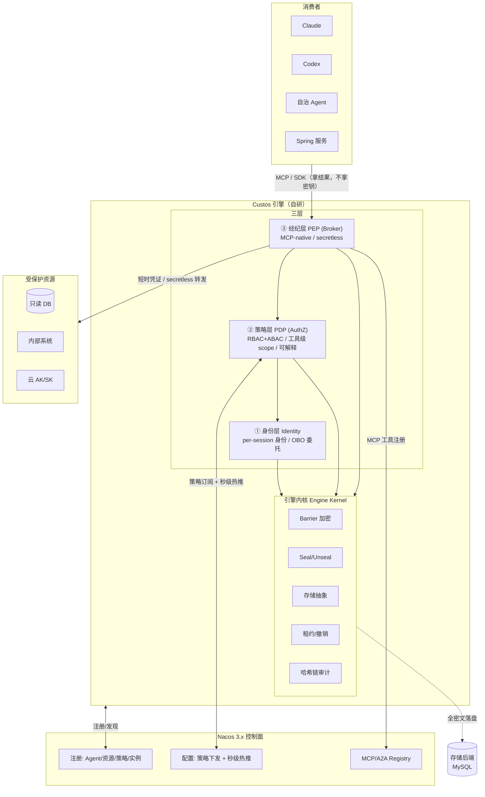
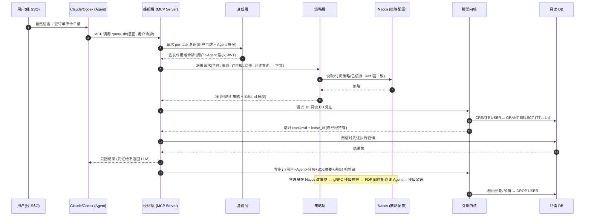
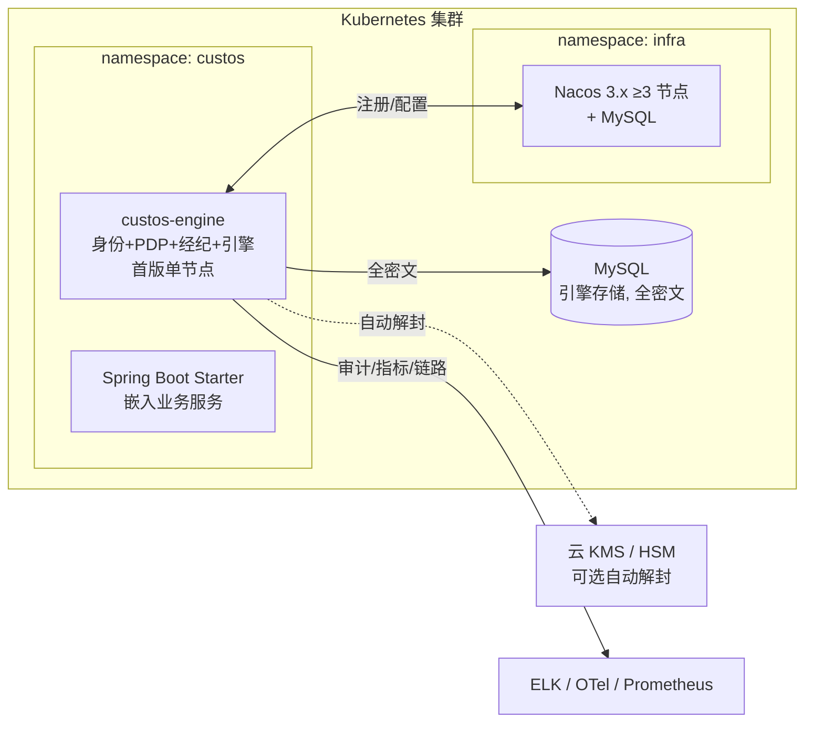
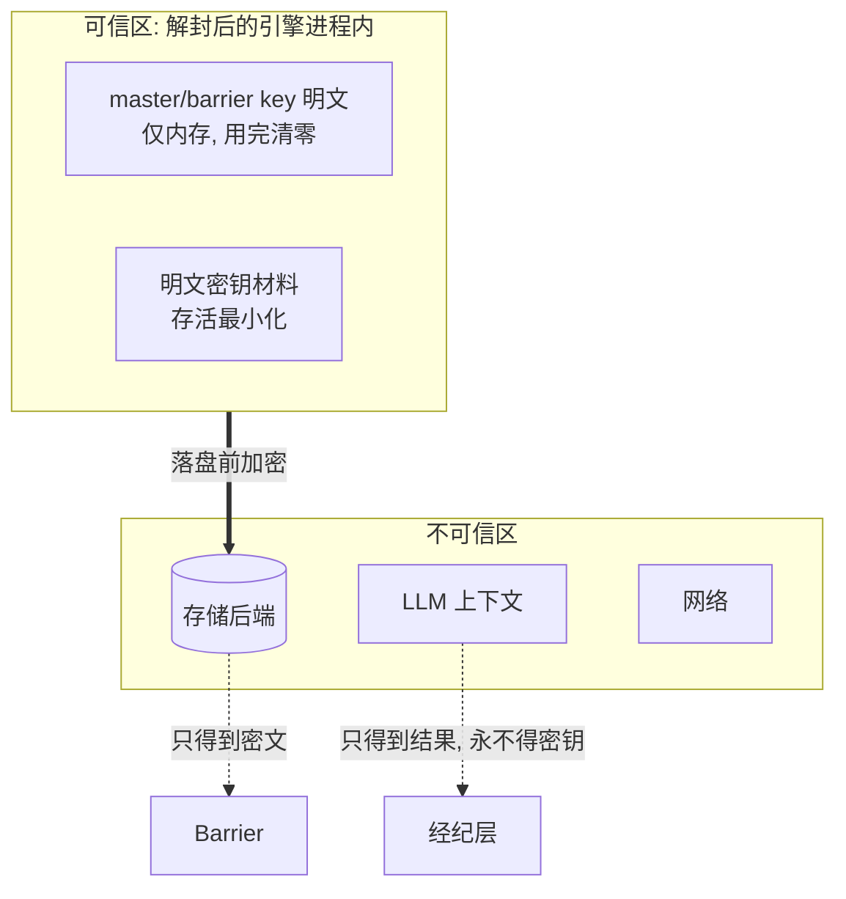

# 01 · 总体架构（Architecture）

> **定位**：本文给出 Custos 的总体架构——经典 **PDP/PEP 模型** + **三层（身份/策略/经纪）** + **自研引擎内核**，以 **Nacos 为控制面**。给出组件图、职责边界、核心数据流时序、部署拓扑与信任边界。
>
> 前提：见 `00-synthesis.md`。本文不展开密码学细节（见 `02-engine-crypto-design.md`）。

---

## 1. 一图总览

---

## 2. PDP / PEP 模型（经典授权架构在 Custos 的落地）

| 角色 | 标准含义 | 在 Custos 中 |
|---|---|---|
| **PAP**（Policy Administration Point） | 策略管理/编写 | 管理员经 CLI/控制台编辑策略 → 写入 **Nacos 配置** |
| **PRP/PIP**（Policy Retrieval/Information Point） | 策略与属性来源 | **Nacos 配置**（策略，Raft 强一致）+ 身份层提供主体属性、风险/上下文 |
| **PDP**（Policy Decision Point） | 决策"准/拒" | **策略层**：评估 Agent ∩ 用户 ∩ 资源 ∩ 风险，输出可解释决策 |
| **PEP**（Policy Enforcement Point） | 执行决策 | **经纪层**：决策为"准"则签发短时凭证或 secretless 转发；为"拒"则阻断并审计 |

> 关键：**策略以 Nacos 配置承载**，因此 PAP→PDP 的策略分发天然获得 Nacos 的 **gRPC 长连接秒级热推 = 秒级权限变更与吊销**（差异化护城河）。

---

## 3. 三层 + 引擎内核：职责边界

| 模块 | 职责 | 不负责 | 对应 PRD |
|---|---|---|---|
| **身份层 Identity** | 每 Agent/每会话临时身份签发（JWT/SVID 风格）；多认证方法（OIDC/JWT/K8s SA/SPIFFE）；**OBO 委托**（用户∩Agent 最小）；身份在 Nacos 注册 | 不做密钥加解密、不评估策略 | FR-ID |
| **策略层 PDP** | RBAC+ABAC/PBAC 评估；工具/动作级 scope（对齐 MCP SEP-835）；高危 JIT+人工审批；**可解释**决策 | 不持有密钥、不执行访问 | FR-AUTHZ |
| **经纪层 PEP** | MCP-native 暴露工具；**secretless 执行只回结果**；调引擎签发动态凭证；密钥不进 LLM | 不做策略判定（调 PDP） | FR-SEC / FR-IF |
| **引擎内核** | Barrier 加密、Seal/Unseal、存储抽象、租约/撤销、哈希链审计 | 不懂业务语义/MCP | FR-ENGINE / FR-AUDIT |
| **Nacos 控制面** | 注册（Agent/资源/策略/实例）、策略配置秒级热推、namespace 隔离、MCP/A2A 注册、服务发现 | **绝不存密钥/明文凭证** | FR-NACOS |

---

## 4. 核心数据流时序（MVP 纵向线）

> 演示"身份 + 权限 + 密钥 + Nacos 秒级吊销 + 密钥不进 LLM"五件事。

---

## 5. 与 Nacos 的控制面交互

| 交互 | 机制 | Nacos 能力 |
|---|---|---|
| 组件注册/发现 | 引擎/经纪/PDP 实例注册为 service（ephemeral） | 服务发现（Distro AP）|
| 资源/Agent/策略注册 | 作为持久化配置/实例 | Raft CP 强一致 |
| **策略下发 + 秒级吊销** | PDP 订阅策略 DataId，gRPC 长连接监听变更 | 配置中心秒级热推 |
| 多租户隔离 | 每团队/环境一个 namespace（用 ID 引用） | Namespace/Group |
| MCP 工具注册/熔断 | 经纪把工具注册到 MCP Registry；高危工具一键下线 | MCP/A2A Registry（端口 9080）|

> **红线**：Nacos 只承载**非敏感**的策略、目录、元数据；**密钥/凭证绝不进 Nacos**。

---

## 6. 部署拓扑（K8s）

- **首版单节点引擎**（PRD 可用性 NFR）；后续 Raft HA（`02`/`08` 展开）。
- Nacos 与引擎可同集群不同 namespace；引擎存储 MySQL 全密文（落盘前 Barrier 加密）。

---

## 7. 信任边界与组件清单

| 信任边界 | 说明 |
|---|---|
| **LLM ↔ 经纪** | LLM 在不可信区，只能拿到**结果**，永远拿不到密钥（secretless） |
| **引擎 ↔ 存储** | 存储不可信，只见密文（Barrier） |
| **解封态进程内** | 唯一持有 master/barrier key 明文的地方；内存清零 + 禁 swap |
| **Agent ↔ 用户身份** | 分离授权与吊销；OBO 取交集 |

**组件清单**（→ 详见 `08-repo-scaffold.md`）：`engine/`（内核）、`identity/`、`authz/`（PDP）、`broker/`（PEP/MCP）、`nacos/`（控制面集成）、`sdk/`、`cli/`、`examples/`。

---

## 8. 技术栈对齐

| 层 | 选型（倾向） | 依据 |
|---|---|---|
| 引擎语言 | **Java**（`08` 做 Java vs Go 完整论证） | 与 Spring Cloud/Nacos 生态一致 |
| 密码学 | BouncyCastle/Tink + 国密 Tongsuo/BC-GM | `02`，可切换套件 |
| 授权内核 | jCasbin（Apache，国产）+ 自研 PDP 壳 | `00`/`04` |
| 控制面 | Nacos 3.x | 护城河 |
| 存储 | MySQL（首版，全密文） | PRD E4 |
| 接口 | MCP-native + Spring Boot Starter + CLI | FR-IF |
| 可观测 | Prometheus + ELK/OTel | NFR |

> **下一篇**：`02-engine-crypto-design.md`——威胁模型与密码学设计（重中之重），含解封默认方式、存储后端、国密套件等**待决策岔路口**。
