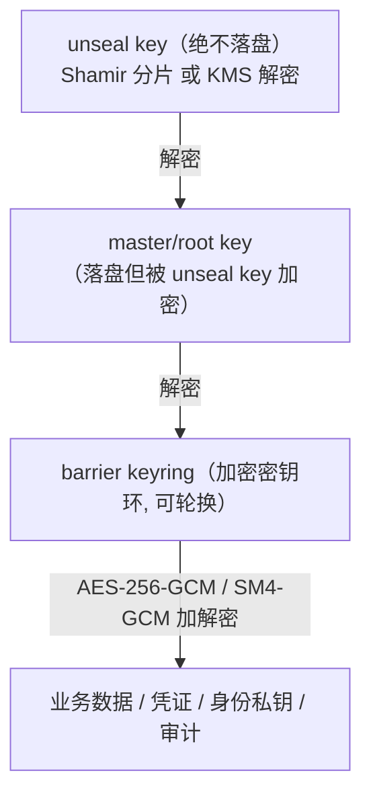

# 02 · 引擎内核：威胁模型与密码学设计（重中之重）

> **定位**：本文是 Custos 安全的基石——给出引擎内核的**威胁模型**与**密码学设计**：密钥层级、Barrier 加密、Seal/Unseal（Shamir/KMS）、存储加密、内存安全、**哈希链防篡改审计**、**国密 SM2/SM3/SM4 可切换套件**，并明确所用**密码库与标准算法**。
>
> **铁律**：① **不自创密码学**——只用经过审计的密码库实现**标准算法**；② **master key 不明文落盘**；③ **数据落盘前 Barrier 加密**；④ **审计防篡改**；⑤ **密钥内存用完清零、禁 swap**；⑥ **吊销/租约可靠传播**。
>
> 设计灵感来源：OpenBao / Vault 的 Barrier·Seal·Lease 概念、SPIRE 的 KeyManager 思路（均**只借思想、不抄码**，见 `00-synthesis.md` 许可证表）。**本文为防御性安全软件的设计文档。**

---

## 1. 为什么这是重中之重

Custos 是**持有密钥**的系统：一旦引擎内核设计有误，等于把企业所有凭证一次性暴露。PRD 风险表把"自研密钥引擎安全风险"列为 🔴 极高。因此本文遵循"**先威胁建模、后密码设计、上生产前外部审计（v0.4）**"的顺序，并在每个安全决策处标注风险与缓解。

---

## 2. 资产与信任边界

### 2.1 受保护资产（按敏感度）
| 资产 | 敏感度 | 失陷后果 |
|---|---|---|
| **master key / root key** | 🔴 最高 | 全盘沦陷（可解密一切） |
| **barrier key（keyring）** | 🔴 | 解密所有落盘数据 |
| 业务密钥 / 动态凭证 | 🟠 | 单资源泄漏（有 TTL，窗口小） |
| 身份签名私钥 | 🟠 | 可伪造 Agent 身份 |
| 审计日志 | 🟡 | 篡改可掩盖入侵 |
| 策略（Nacos 配置） | 🟡 | 非密钥，但篡改可越权 |

### 2.2 信任边界
- **解封后的引擎进程内存** = 唯一持有 master/barrier key 明文之处（可信，但需内存防护）。
- **存储后端、网络、LLM 上下文、Nacos 配置** = 不可信。

---

## 3. 威胁模型（STRIDE + 显式边界）

### 3.1 在威胁模型内（必须防护）
| 类别(STRIDE) | 威胁 | 缓解 |
|---|---|---|
| **S 伪造** | 伪造 Agent/用户身份 | 身份签名（ECDSA/SM2）、短 TTL、OBO 交集；mTLS |
| **T 篡改** | 篡改落盘数据 / 审计日志 | Barrier AEAD（GCM tag 检测）；**审计哈希链**（任一条被改则链断） |
| **R 抵赖** | 否认访问行为 | 每次"决策+访问"留痕（用户+Agent+任务+资源+结果），审计先于返回密钥 |
| **I 信息泄露** | 窃听通信 / 读存储 / **密钥进 LLM** | TLS + 落盘前加密（只见密文）；**secretless 经纪（密钥不进 LLM）** |
| **D 拒绝服务** | 引擎不可用 → 业务断 | 首版单节点（可用性受限，已知）；后续 Raft HA |
| **E 提权** | 越权访问资源 | 默认拒绝 ACL；最小权限；JIT+审批；**Nacos 秒级吊销** |

### 3.2 明确**不在**威胁模型内（声明边界，借 OpenBao 实践）
- **对存储后端的任意控制**（可删可回滚）：攻击者若能任意写存储，可致数据丢失/回滚，难以完全防护（缓解：存储访问控制 + 备份 + Raft 多副本）。
- **运行中进程的完整内存转储**：若攻击者能 dump 解封态进程内存，机密性受损（缓解：内存清零 + 禁 swap + 最小存活，**缩小**而非消除）。
- **宿主机 root / 任意代码执行**：等同失守（缓解：最小权限部署、不 root 跑、镜像加固）。
- **被攻陷的合法客户端**：持其凭证可在其权限内访问（缓解：短 TTL + 行为审计 + 秒级吊销）。
- **管理员注入恶意策略/配置**：属内部恶意（缓解：策略变更审计 + 审批 + 四眼）。

> **原则**：像 OpenBao 一样**显式声明边界**——不假装能防一切，把有限的防护资源投在最高价值资产（master key、审计完整性、密钥不进 LLM）。

---

## 4. 密钥层级（Key Hierarchy）

借鉴 OpenBao 四层，落到 Custos：



| 层 | 存放 | 加密者 | 说明 |
|---|---|---|---|
| **unseal key** | **不落盘** | Shamir 分片 / KMS | 只用于解封；分片不能直接请求 |
| **master/root key** | 落盘（密文） | unseal key | 启动后解密得到 |
| **barrier key（keyring）** | 落盘（密文） | master key | 支持轮换（多版本 keyring） |
| **数据加密密钥/数据** | 落盘（密文） | barrier key | 业务密钥、动态凭证元数据、身份私钥、审计链 |

- **轮换**：barrier key 可在线轮换（新写用新版本，旧数据按版本号解密），master key/unseal key 经管理操作轮换；轮换不停服（除 seal 迁移）。

---

## 5. Barrier 加密层

| 项 | 设计 |
|---|---|
| **算法（默认）** | **AES-256-GCM**，96-bit 随机 nonce（每对象独立随机），GCM 认证标签做完整性校验（AEAD：机密性+抗篡改一体） |
| **算法（国密套件）** | **SM4-GCM**（128-bit 分组）或 SM4-CTR+SM3-HMAC（视库支持），可切换 |
| **格式** | `[suite_id][key_version][nonce][ciphertext+tag]`——suite_id 标识算法套件，key_version 标识 keyring 版本，支持平滑轮换与套件迁移 |
| **读路径** | 解密时校验 GCM tag/HMAC；失败即视为篡改，**中止处理** |
| **实现** | 调审计库（见 §9），**不自写分组密码/GCM 模式** |

---

## 6. Seal / Unseal

- 启动默认 **sealed**：知道存储位置，但无 master key，无法解密；除"解封/查状态"外几乎不可操作。
- **解封流程**：提供 unseal key → 解密 master key → 解密 keyring → 进入 unsealed → 加载审计/认证/策略。
- **检测入侵一键 seal**：丢弃内存中 master/barrier key，立即锁库。

### 决策点 ① 解封默认方式（请你拍板）

| 选项 | 机制 | 优点 | 缺点 |
|---|---|---|---|
| **A. Shamir 分片（默认）** ⭐推荐 | unseal key 用 Shamir 切 N 片取 M 片重建（默认 5/3） | 不依赖外部、不信任单人、契合自主可控、可演示 | 解封手动，自动化运维不便 |
| **B. KMS/HSM 自动解封** | 启动调云 KMS/HSM 解密 master key，用 recovery key 做高危授权 | 运维省心、自动重启 | 强生命周期依赖（KMS key 删=不可恢复）、依赖外部信任、国内需信创 KMS |
| **C. 两者皆备，按部署选** | 同时实现，配置切换 | 灵活 | 实现/测试成本高 |

> **推荐**：**首版 A（Shamir）为默认 + 预留 KMS 接口（C 的接口形态）**。理由：① 自主可控、不绑外部 KMS；② 可演示 two-person rule；③ 接口预留，企业有信创 KMS（如阿里 KMS、华为 DEW）时可切 B。**KMS 自动解封若启用，文档须显著告警"KMS key 删除=集群不可恢复"并强制备份策略。**

---

## 7. 存储加密

- **落盘前一律 Barrier 加密**，存储后端只见密文（存储不可信）。
- 存储抽象接口（`engine/storage`）：`get/put/delete/list`，全部走 Barrier。

### 决策点 ② 存储后端（请你拍板）

| 选项 | 说明 | 优点 | 缺点 |
|---|---|---|---|
| **A. MySQL（首版默认）** ⭐推荐 | 企业已有，全密文存储 | 国内企业普遍在用、运维熟、PRD 指定 | 自身非强一致 HA（靠主从），HA 需额外方案 |
| **B. 嵌入式（RocksDB/H2）** | 单机自带 | 零外部依赖、起步快 | 不适合集群、生产受限 |
| **C. Raft 集成存储** | 自带强一致 HA（借 JRaft 思路） | 强一致、租约不丢不重 | 自研成本高，放 v0.3 HA |

> **推荐**：**首版 A（MySQL，全密文）**作默认 + 抽象存储接口；**v0.3 引入 C（Raft/JRaft）做强一致 HA**（呼应"租约不丢不重"）。B 仅用于本地 dev。

---

## 8. 内存安全（Java 的挑战与对策）

> 这是 Java 引擎相较 Go 的**主要短板**，必须正面设计（也是 `08` 引擎语言论证的关键输入）。

| 风险 | Java 的问题 | 对策 |
|---|---|---|
| 明文密钥驻留 | `String` 不可变、入常量池，无法清零 | **一律用 `byte[]`/`char[]`/`javax.crypto.SecretKey`**，用完 `Arrays.fill(buf,(byte)0)` 显式清零；禁止把密钥转 `String` |
| GC 复制残留 | GC 移动对象，明文可能在堆里留多份副本 | 关键密钥材料放**堆外内存（DirectByteBuffer / JNA malloc）**，手动清零；最小化明文存活时间 |
| 换页到磁盘（swap） | 内存被换出 → 密钥落盘 | **mlock**：用 JNA 调 `mlock`/`VirtualLock` 锁定敏感内存页禁 swap；部署层禁用 swap |
| 核心转储 | crash dump 含密钥 | 关闭 core dump（`ulimit -c 0`）、容器禁 dump |
| 日志泄漏 | 误把密钥打日志 | 审计/日志层强制对密钥字段 HMAC 脱敏；代码评审红线 |

- **明文存活最小化**：动态凭证"现用现取、即用即清"；身份私钥仅签名瞬间在内存。
- 对比 Go：Go 可更细控内存（`[]byte` + 显式清零 + `mlock`），无 GC 复制串问题；**Java 需用堆外 + JNA 补齐**——这是 `08` 语言决策要权衡的点（生态一致性 vs 内存可控性）。

---

## 9. 密码学库与算法选型（明确"用什么实现标准算法"）

> **绝不自写算法**。下表为"标准国际套件"与"国密套件"的可切换设计。

| 用途 | 国际标准套件 | 国密套件 | 实现库 |
|---|---|---|---|
| 对称加密（Barrier/存储） | **AES-256-GCM** | **SM4-GCM** | **BouncyCastle**（含 GM/国密）；或 Tink（AES 部分） |
| 哈希（审计链/指纹） | **SHA-256** | **SM3** | BouncyCastle / JDK MessageDigest |
| HMAC（审计脱敏/完整性） | HMAC-SHA-256 | HMAC-SM3 | BouncyCastle / JDK Mac |
| 签名（身份令牌） | **ECDSA P-256 / EdDSA / RSA-2048+** | **SM2** | BouncyCastle（含 SM2） |
| 密钥派生 | HKDF / PBKDF2 / Argon2 | HKDF-SM3 | BouncyCastle |
| 秘密分享（解封） | **Shamir's Secret Sharing**（GF(256)） | 同（算法无国别） | 成熟实现/审计库，不自写 |
| 随机数 | `SecureRandom`（DRBG） | 同 | JDK / BC |

**库选型**：
- **BouncyCastle（含 BC-FIPS 与 GM 国密扩展）**：覆盖 AES/SM2/SM3/SM4/Shamir，Java 生态成熟、被广泛审计——**首选**。
- **Tongsuo（铜锁）**：国密合规强（支持 TLCP/国密双证书），可作 TLS 层国密或经 JNI 调用，作信创合规增强选项。
- **Tink**：高层易用、误用难，AES-GCM 等可用；国密支持弱，作辅助。

### 决策点 ③ 国密默认开关（请你拍板）

| 选项 | 说明 | 适用 |
|---|---|---|
| **A. 默认国际套件(AES/SHA/ECDSA)，国密可切换** ⭐推荐 | 算法套件抽象，配置切到 SM2/SM3/SM4 | 通用 + 信创可选 |
| **B. 默认国密(SM2/SM3/SM4)** | 开箱即国密 | 强信创/合规客户 |
| **C. 双栈并行** | 同时跑，按资源/租户选套件 | 复杂混合环境 |

> **推荐 A**：默认 AES-256-GCM/SHA-256/ECDSA，**通过 `CipherSuite` 抽象一键切换到 SM4-GCM/SM3/SM2**。理由：兼顾通用性能与生态，同时把"国密"作为可宣称的信创/自主可控卖点；B/C 作部署期配置选项。**算法套件设计见 §10。**

---

## 10. 算法套件（CipherSuite）抽象设计

```
interface CipherSuite {
    byte suiteId();                          // 0x01=intl, 0x02=gm(国密)
    byte[] encrypt(byte[] key, byte[] plaintext, byte[] aad);   // AES-GCM / SM4-GCM
    byte[] decrypt(byte[] key, byte[] ciphertext, byte[] aad);  // 校验 tag, 失败抛异常
    byte[] hash(byte[] data);                // SHA-256 / SM3
    byte[] hmac(byte[] key, byte[] data);    // HMAC-SHA256 / HMAC-SM3
    KeyPair genSignKey();                    // ECDSA-P256 / SM2
    byte[] sign(PrivateKey k, byte[] data);
    boolean verify(PublicKey k, byte[] data, byte[] sig);
}
// 实现：IntlSuite（BC: AES/SHA/ECDSA） / GmSuite（BC-GM: SM4/SM3/SM2）
```

- **落盘格式带 `suite_id`**：同一引擎可读取历史不同套件加密的数据，支持**套件平滑迁移**（类似 seal 迁移）。
- 套件选择在**初始化时确定默认值**，按租户/namespace 可覆盖（高级）。

---

## 11. 防篡改审计（哈希链）—— 差异化能力

> OpenBao/Vault 默认仅对敏感字段 HMAC 脱敏（非链）。Custos **升级为哈希链/只追加**，让日志不可被悄悄改（PRD E7/AU2）。

### 11.1 哈希链结构
```
record_n = {
  seq: n,
  ts, actor(user+agent), task, resource, action, decision, result_digest,
  sensitive_fields: HMAC(audit_key, value),     // 脱敏，不存明文
  prev_hash: H(record_{n-1}),                    // 链接前一条
}
chain_hash_n = H( prev_hash || canonical(record_n) )   // H = SHA-256 / SM3
```
- 改动任一历史记录 → 其后所有 `chain_hash` 失配 → **可检测**。
- 定期把 `chain_hash` 锚定（如周期性签名 checkpoint，或外发只追加存储/SIEM）→ 抗"整体重写"。

### 11.2 性质
| 性质 | 做法 |
|---|---|
| 完整性 | 哈希链 + 周期签名 checkpoint |
| 机密性 | 敏感字段 HMAC 脱敏（可关联不泄明文） |
| 可问责 | 审计**先于**把密钥/结果返回客户端 |
| 不可抵赖 | 记录 user+agent+task+resource+decision |
| 外送 | 导出 ELK/OTel；异常/超额告警（AU2） |

> **验证审计完整性**是一个独立可调用的操作（CLI `custos audit verify`）：重算链，定位首个断裂点。

---

## 12. 安全红线落地核对表（每条对应实现点）

| 红线 | 落地 |
|---|---|
| master key 不明文落盘 | Shamir/KMS 加密后落盘；明文仅解封态内存（§4/§6） |
| 数据落盘前 Barrier 加密 | 存储抽象强制走 Barrier（§5/§7） |
| 审计防篡改 | 哈希链 + 只追加 + 周期签名（§11） |
| 内存清零 + 禁 swap | byte[]+清零、堆外、mlock、禁 core dump（§8） |
| 吊销/租约可靠传播 | Expiration Manager + Nacos 秒级热推 + 端到端验证（见 `05`/`06`） |
| 不自创密码学 | 全用 BC/Tink/Tongsuo 实现标准/国密算法（§9） |
| 密钥不进 LLM | secretless 经纪只回结果（见 `06`） |

---

## 13. 残留风险与外部审计

| 残留风险 | 等级 | 缓解/计划 |
|---|---|---|
| 解封态内存被 dump | 🟠 | 内存清零/禁 swap 缩小窗口；不 root、镜像加固；声明在边界外 |
| master key 泄漏 | 🔴 | Shamir/KMS、最小存活、一键 seal、轮换 |
| Java GC 残留明文 | 🟠 | 堆外 + 显式清零（§8）；`08` 评估 Go 是否更优 |
| 自研引擎实现缺陷 | 🔴 | 用审计库、威胁建模、单元/模糊测试；**v0.4 前外部安全审计**（借 SPIRE 的 Cure53 实践）|
| KMS 自动解封强依赖 | 🟠 | 文档告警 + 强制备份；默认用 Shamir |

> **上生产前置条件（PRD v0.4）**：完成**外部安全审计** + 渗透 + 密码学实现复核；发布安全责任声明与漏洞披露策略。

---

## 14. 待你拍板的三个岔路口（汇总）

| # | 决策 | 推荐 | 备选 |
|---|---|---|---|
| ① | 解封默认方式 | **Shamir 默认 + KMS 接口预留** | 纯 KMS / 双备 |
| ② | 存储后端 | **MySQL 全密文（首版）+ Raft（v0.3 HA）** | 嵌入式 / 直接 Raft |
| ③ | 国密策略 | **默认国际套件 + 国密可切换（CipherSuite）** | 默认国密 / 双栈 |

> 这三个会影响 `06`（经纪/租约）、`08`（语言与脚手架）。**默认值我已给推荐并据此继续设计；若你有不同取向，告诉我，我据此调整后续文档。**
