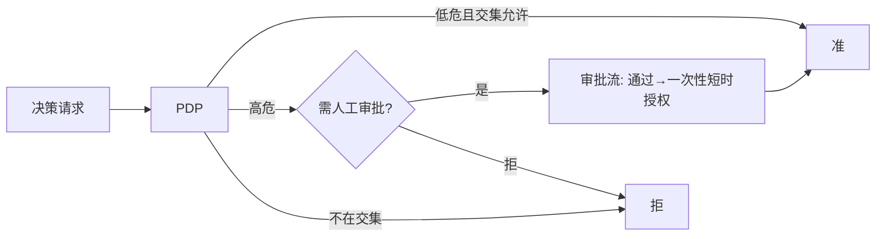

# 04 · 策略层设计（AuthZ / PDP）

> **定位**：权限/系统权限管理——**RBAC + ABAC/PBAC**、**工具/动作级 scope（对齐 MCP SEP-835）**、**JIT + 人工审批**、**PDP/PEP 分离**、**可解释决策**。设计范式借 **Cerbos**（PDP 解耦 / Derived Roles+CEL / tracer 可解释 / Scopes），求值内核用 **jCasbin**（Apache-2.0，国产，Java 同栈），策略以 **Nacos 配置**承载实现秒级热更新。
>
> 前提：`00-synthesis.md`、`01`、`03`。

---

## 1. 设计取向：借 Cerbos 的"形"，用 jCasbin 的"魂"

| 维度 | 取自 Cerbos（设计） | 取自 jCasbin（落地） |
|---|---|---|
| 架构 | **PDP/PEP 解耦**、无状态 PDP | — |
| 模型 | Derived Roles + CEL 的结构化 ABAC 思路 | **PERM 元模型**承载 RBAC+ABAC |
| 可解释 | tracer：命中规则 + 原因 | 自研增强（jCasbin 默认弱） |
| 作用域 | Scopes 层级 | 对齐 Nacos namespace/group |
| 热更新 | 自身 loader | **Watcher → 自研 Nacos Watcher** |

> 一句话：**Custos PDP = jCasbin 求值内核 + Custos 服务壳（可解释 + Nacos 策略源 + 工具级 scope + JIT 审批）**。

---

## 2. 决策模型

### 2.1 决策请求（PDP 输入）
```
Decision Request {
  principal: { user, agent, scopes(来自 OBO 交集), risk },   // 来自身份层(03)
  resource:  { type, id, attrs, classification(分级) },
  action:    { tool, operation },                            // MCP 工具/动作
  context:   { time, ip, intent, env }
}
```

### 2.2 PERM 模型（jCasbin model.conf，Custos 定制）
```ini
[request_definition]
r = sub, agent, dom, obj, act, ctx
[policy_definition]
p = sub, agent, dom, obj, act, eft
[role_definition]
g = _, _, _          # 用户/Agent 角色继承(带 domain=namespace)
[policy_effect]
e = priority(p.eft) || deny     # 默认拒绝 + deny 优先（高危可显式 deny）
[matchers]
m = g(r.sub, p.sub, r.dom) && agentAllowed(r.agent, p.agent) \
    && keyMatch2(r.obj, p.obj) && actMatch(r.act, p.act) \
    && abac(r, p, r.ctx)        # ABAC/上下文（风险、分级、意图）
```
- **默认拒绝**（borrow OpenBao default-deny）；**deny 优先**（高危可硬禁）。
- `keyMatch2`/`globMatch` 承载**工具/动作级路径通配**（→ §3 SEP-835）。
- `abac()` 自定义函数：读 `ctx`（风险/分级/意图）做属性判定，等价 Cerbos 的 CEL 条件。

### 2.3 RBAC + ABAC + PBAC
- **RBAC**：用户/Agent ↔ 角色 ↔ 权限（带 domain=Nacos namespace 多租户）。
- **ABAC**：matcher 内按资源分级、风险分、上下文（时间/IP/意图）判定。
- **PBAC（策略）**：策略即 Nacos 配置，声明式、可版本、可热更。

---

## 3. 工具/动作级 scope（对齐 MCP SEP-835）

| 概念 | Custos 表达 |
|---|---|
| MCP 工具 | `obj = tool:<server>/<tool>`，如 `tool:db/query_orders` |
| 动作/操作 | `act = read|write|exec|...`（只读查询=read） |
| scope 通配 | jCasbin `keyMatch2`：`tool:db/*` 允许该 server 全部只读工具 |
| 与 OBO | 请求 scope = 用户∩Agent 交集（`03`），PDP 再按策略收窄 |

- SEP-835 的"工具级授权"= 把 MCP tool/action 映射为 PDP 的 obj/act，策略对其授权。
- 经纪层（PEP，`06`）把每次 MCP 工具调用转成一个 Decision Request 交 PDP。

---

## 4. 可解释决策（借 Cerbos tracer）

PDP 输出不只 allow/deny，而是结构化、可审计的解释：
```json
{
  "effect": "DENY",
  "matched_policy": "policy/db-readonly@v7",
  "matched_rule": "deny: action=write on classification=high",
  "reason": "Agent claude-prod 经用户 u123 请求 write，但策略仅允许 read；且资源分级=high 需审批",
  "obligations": ["require_human_approval"],   // 附加义务(JIT)
  "evaluated_at": "..."
}
```
- 决策与解释一并写入**哈希链审计**（`02` §11）。
- jCasbin 默认不给原因 → Custos 服务壳记录命中的 policy/rule 与求值轨迹补齐。

---

## 5. 资源分级 + Agent 自治等级 + JIT 人工审批

| 机制 | 设计 |
|---|---|
| **资源分级** | resource.classification：low/medium/high/critical（存 Nacos 资源目录） |
| **Agent 自治等级** | agent.autonomy：auto / confirm / approval —— 决定高危动作是否需人工 |
| **JIT + 人工审批** | PDP 对高危(分级×动作)返回 `effect=DENY/PENDING` + obligation `require_human_approval`；经纪层发起审批流（审批通过→签发一次性短 TTL 授权），全程审计 |



---

## 6. 策略存储与秒级热更新（与 `05` 联动）

| 项 | 设计 |
|---|---|
| 策略来源 | **Nacos 配置**（DataId=策略集，Raft CP 强一致） |
| 加载 | 自研 **Nacos Adapter**（jCasbin persist.Adapter 实现）从 Nacos 拉策略 |
| 热更新 | 自研 **Nacos Watcher**：监听配置变更（gRPC 长连接）→ 触发 enforcer 重载 → **秒级生效=秒级吊销** |
| 多租户 | domain=namespace；每 namespace 独立策略集 |

> 这是把 Casbin（无现成 Nacos Watcher）缝合到 Nacos 护城河的关键自研件。

---

## 7. 模块与接口（→ `08`）
```
authz/
  ├─ pdp/          # 决策入口(gRPC/内部 API), 可解释封装
  ├─ engine/       # jCasbin 封装: model + enforcer
  ├─ model/        # Custos PERM model.conf + scope/abac 自定义函数
  ├─ nacos/        # Adapter(策略源) + Watcher(热更新)
  ├─ approval/     # JIT 人工审批流
  └─ explain/      # tracer/决策解释 → 审计
```
| 接口 | 职责 |
|---|---|
| `Pdp.decide(DecisionRequest) → Decision(effect, explanation, obligations)` | 核心决策 |
| `PolicyAdapter`（jCasbin Adapter） | 从 Nacos 读策略 |
| `PolicyWatcher` | Nacos 变更 → 重载 |

---

## 8. 对 PRD 覆盖 + 待确认

| PRD | 覆盖 |
|---|---|
| A1 RBAC+ABAC/PBAC | §2 |
| A2 工具/动作级 scope（SEP-835） | §3 |
| A3 分级 + 自治等级 + JIT 审批 | §5 |
| A4 PDP/PEP 分离 + 可解释 | §1/§4 |

**待确认岔路口（已按推荐继续）**：
- 授权落地内核：**jCasbin（推荐，已在 `00` 钉死）** vs 自研 PERM vs 嵌 Cerbos——已选 jCasbin。
- 策略编写语言：**首版用 jCasbin policy(csv/行) + Custos 高层 YAML 包装**（向 Cerbos 风格靠拢）；若你更想直接用 Cerbos YAML 语义，可议。
- deny 优先 vs allow 优先：推荐 **默认拒绝 + deny 优先**（安全更稳）。

> **下一篇**：`05-nacos-integration.md`（注册 + 秒级吊销 + namespace + 服务发现）。
