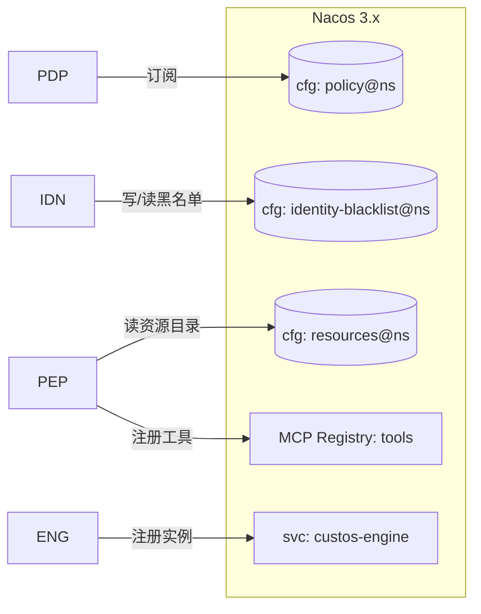
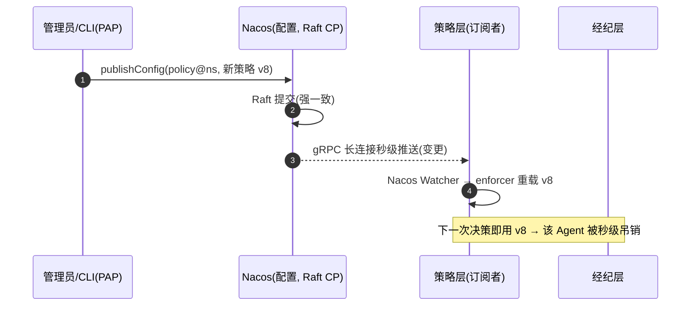

# 05 · Nacos 控制面集成（差异化护城河）

> **定位**：Custos 把 Nacos 3.x 作控制面——**注册**（Agent/资源/策略/实例）、**配置热更新 = 秒级权限变更与吊销**、**namespace 隔离**、**服务发现**、**MCP/A2A 注册**。这是 Custos 区别于所有竞品的护城河。
>
> 源据：`../research/nacos.md`（源码佐证：`config/`、`consistency/`、`ai/`、`ai-registry-adaptor/`）。红线：**密钥绝不进 Nacos**。

---

## 1. 注册什么（N1）

| 注册对象 | 形态 | 一致性 | 说明 |
|---|---|---|---|
| **引擎/经纪/PDP 实例** | service instance（ephemeral） | Distro AP | 心跳保活，宕机自动摘除 |
| **Agent 身份 / 会话** | 配置 + 持久实例 | Raft CP | 可查询、可吊销（黑名单） |
| **受保护资源目录** | 配置（含分级 classification） | Raft CP | 资源→类型/动作/分级 |
| **权限策略** | 配置（DataId=策略集） | **Raft CP 强一致** | 策略不丢不脏（吊销可靠性基石） |
| **MCP 工具** | MCP/A2A Registry | — | 工具注册/发现/熔断 |



---

## 2. 配置热更新 = 秒级权限变更与吊销（N2，护城河核心）



| 要点 | 设计 |
|---|---|
| 传输 | Nacos 2.x+ **gRPC 长连接（9848）秒级推送**（非轮询） |
| 落地 | 自研 `PolicyWatcher`（jCasbin Adapter+Watcher，见 `04`）监听 → 重载 |
| 吊销路径 | ① 改策略；② 身份/会话黑名单（`identity-blacklist`）；③ 资源下线/工具熔断 → 全部秒级热推 |
| 可验证 | MVP 要端到端演示并测量"改策略→拒绝"延迟（PRD 吊销正确性 NFR）|

> **为何强一致重要**：策略走 Nacos **配置数据 = Raft/JRaft（CP）**，保证策略变更不丢不脏——吊销"说生效就生效、可验证"。

---

## 3. namespace / group 隔离（N3）

| 层 | 用途 |
|---|---|
| **Namespace（用 ID 引用）** | 环境（prod/test/dev）或团队/租户强隔离；对齐 `04` 的 domain |
| **Group** | 业务线/子系统逻辑分组 |
| 命名约定 | 策略 DataId：`custos-policy-<scope>.yaml`；资源：`custos-resources.yaml`；黑名单：`custos-identity-blacklist.yaml` |

- prod 独立 namespace + 独立账号 + 最小权限（借 `nacos.md` 最佳实践）。

---

## 4. 服务发现（N4）

- 引擎/经纪/PDP 注册为 service；组件间经服务名 + 客户端负载均衡发现调用。
- 实例 metadata 带版本/区域；可用权重做灰度（未来 AI 资产灰度底座）。

---

## 5. MCP / A2A Registry 集成

| 能力（源码：`ai/`、`ai-registry-adaptor/`）| Custos 用法 |
|---|---|
| MCP Server 动态注册（多 ns、版本） | 经纪层把受治理工具注册为 MCP（端口 9080） |
| 工具描述/参数热更新 | 运行时调整暴露面 |
| **工具动态开关（一键熔断）** | 高危工具秒级下线 = 运行时吊销（呼应 `04` JIT、PRD 秒级吊销）|
| A2A / agentspecs / skills | 后续：Agent 能力注册与发现对齐 Nacos AI 生态 |

---

## 6. 鉴权与安全边界

| 项 | 设计 |
|---|---|
| Nacos 鉴权 | 开启 `nacos.core.auth`；Custos 用独立账号 + 最小权限访问其 namespace |
| 端口 | 放通 8848 + **9848（gRPC，必需）**；MCP 9080（按需） |
| **红线** | **密钥/明文凭证绝不写入 Nacos**；只放策略/资源目录/黑名单等**非敏感**数据 |
| 降耦 | 抽象"控制面接口"（注册/订阅/热推），Nacos 为首选实现；但护城河定位 → **不可替换为其它注册中心**（PRD 硬约束） |

---

## 7. 模块与接口（→ `08`）
```
nacos/
  ├─ client/        # 封装 nacos-client / Spring Cloud Alibaba
  ├─ config/        # 策略/资源/黑名单 的发布与订阅
  ├─ watcher/       # 变更监听 → 回调 PDP/PEP 重载(秒级)
  ├─ discovery/     # 实例注册与发现
  └─ mcp/           # MCP/A2A Registry 注册与工具熔断
```

| 接口 | 职责 |
|---|---|
| `ControlPlane.publish/subscribe(dataId, ns)` | 配置发布/订阅 |
| `ControlPlane.onChange(cb)` | 秒级变更回调 |
| `ControlPlane.register/discover(service)` | 服务注册/发现 |
| `McpRegistry.registerTool / disableTool` | 工具注册/熔断 |

---

## 8. 对 PRD 覆盖 + 风险

| PRD | 覆盖 |
|---|---|
| N1 注册 | §1 |
| N2 秒级吊销 | §2 |
| N3 namespace 隔离 | §3 |
| N4 服务发现 | §4 |

| 风险 | 缓解 |
|---|---|
| Nacos 单点/可用性 | ≥3 节点集群 + 外置 MySQL；引擎本地缓存策略，Nacos 短暂不可用时按最后已知策略 fail-safe（高危默认拒）|
| 9848 未放通致推送失败 | 部署校验；监控长连接与推送成功率 |
| 强绑 Nacos | 抽象控制面接口（但护城河定位决定不可替换）|
| 版本兼容 | 锁定 Nacos 3.x；Spring Boot↔Cloud↔Alibaba 版本对齐（见 `08`）|

> **下一篇**：`06-secrets-broker.md`（动态凭证 + secretless 经纪 + 轮换）。
