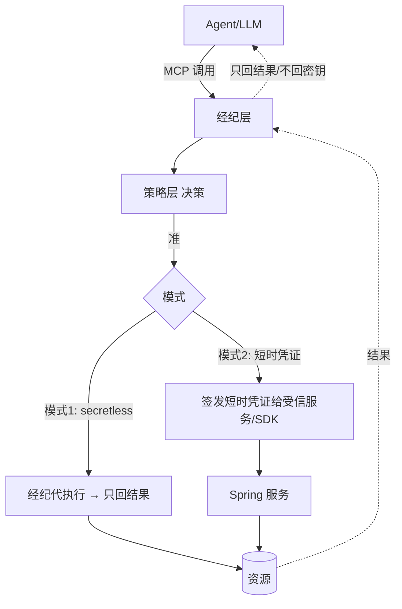
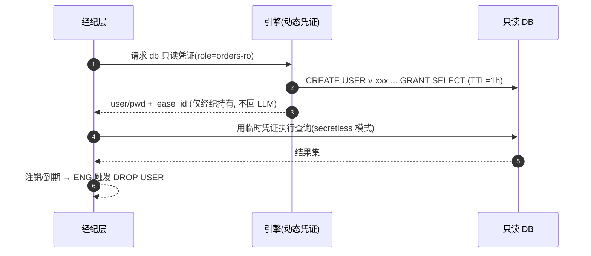

# 06 · 经纪层设计（Secrets Broker / PEP）

> **定位**：经纪层是 PEP（执行点）——**动态 DB 凭证**、**secretless 经纪（MCP-native，密钥不进 LLM）**、**KV/AK-SK 轮换**。设计灵感：OpenBao/Vault 动态凭证与 Lease、Vault Transit「操作不暴露密钥」、Infisical「agents never see the secret」方向（均借思想不抄码）。
>
> 前提：`01`、`02`（引擎/租约）、`03`（身份）、`04`（决策）、`05`（吊销）。**铁律：密钥不进 LLM 上下文。**

---

## 1. 经纪层职责

| 职责 | 说明 |
|---|---|
| MCP-native 暴露 | 把"受治理工具"做成 MCP server/tool，Claude/Codex 标准接入（IF1） |
| 决策执行（PEP） | 每次工具调用 → 组装 Decision Request 调 PDP（`04`）→ 准则执行 |
| 动态凭证签发 | 调引擎现场签发短时只读凭证（S1） |
| **secretless 执行** | 经纪代执行、**只回结果**，凭证不返回 LLM（S2） |
| 轮换 | KV/AK-SK 签发与定期轮换（S3） |
| SDK 取凭证 | Spring 服务经 SDK 直取动态凭证、随租约续期/失效（S4） |

---

## 2. 两种经纪模式



| 模式 | 适用 | 密钥可见性 |
|---|---|---|
| **① secretless 经纪**（默认，对 LLM） | Claude/Codex 经 MCP 查库/调系统 | **Agent 永不见密钥**（最彻底，满足红线）|
| **② 短时凭证下发**（对受信服务） | Spring 服务/SDK 程序化取凭证 | 受信服务拿到带 TTL 的凭证（非 LLM）|

---

## 3. 动态 DB 只读凭证（S1）

借 OpenBao database engine 思路，自研实现：

| 项 | 设计 |
|---|---|
| 角色定义 | `creation_statements`（CREATE USER + GRANT SELECT）、`revocation_statements`（DROP USER）、`default_ttl=1h`、`max_ttl=4h`（PRD S1） |
| 签发 | 引擎现场连库建临时只读账号，登记 **lease**（`02` 租约） |
| 撤销 | 租约到期/主动吊销 → 执行 revocation（DROP USER）；与 `05` 秒级吊销联动 |
| 最小权限 | 只读、限库表（最小只读权限，合规 NFR） |



---

## 4. secretless 经纪（S2，密钥不进 LLM 的关键）

| 机制 | 设计 |
|---|---|
| 调用面 | LLM 只发"意图 + 参数"（如 query_orders(date=today)），**不接触连接串/密码** |
| 执行 | 经纪在 LLM 上下文之外取凭证、连资源、执行，**只把结果回给 LLM** |
| 结果脱敏 | 可选：对结果做字段级脱敏/行级过滤（结合 `04` 决策义务） |
| 审计 | 记录 user+agent+task+SQL摘要+决策（哈希链，`02`）；不记明文凭证 |
| 防注入 | 工具参数 schema 校验；只读语句白名单/解析，防 SQL 注入与越权语句 |

> 这是对 PRD 红线「密钥绝不进 LLM 上下文」的直接实现，也是相对 Vault（凭证仍到手）的差异化。

---

## 5. KV 与 AK/SK 轮换（S3）+ SDK 取凭证（S4）

| 能力 | 设计 |
|---|---|
| **KV 密钥** | 引擎 KV engine（Barrier 加密存储），按需读取（受 PDP 授权） |
| **AK/SK 签发 + 轮换** | 定期轮换静态云凭证；新旧并存过渡窗口；轮换事件审计 |
| **Spring SDK（S4）** | Spring Boot Starter：注解/配置取动态凭证，随租约自动续期/失效（借 Spring Cloud Vault 体验，自研实现）；凭证注入 DataSource，不落配置文件 |

```yaml
# 示意：业务服务用 Custos Starter 取动态只读库凭证
custos:
  broker:
    db:
      role: orders-ro
      auto-renew: true     # 随租约续期；失效自动重取
```

---

## 6. 与各层协作

| 协作 | 说明 |
|---|---|
| ← 身份层(`03`) | 携带 OBO 作用域令牌（user∩agent） |
| ← 策略层(`04`) | 每次调用先决策；高危走 JIT 审批；决策义务（脱敏/审批）在此执行 |
| ← 引擎(`02`) | 签发凭证 + 租约 + 审计；密钥内存清零 |
| ← Nacos(`05`) | 工具注册/熔断；吊销秒级生效 |

---

## 7. 模块与接口（→ `08`）
```
broker/
  ├─ mcp/           # MCP server/tool 暴露(IF1)
  ├─ pep/           # 决策执行: 调 PDP, 执行义务
  ├─ secretless/    # 代执行引擎(db/http/...), 只回结果
  ├─ creds/         # 动态凭证签发(调 engine), 租约管理
  ├─ rotate/        # KV/AK-SK 轮换
  └─ sdk-bridge/    # 给 Spring Starter 的取凭证接口
```
| 接口 | 职责 |
|---|---|
| `Tool.invoke(intent, params, token) → Result` | MCP 工具调用（secretless）|
| `Broker.issueCreds(role, token) → LeasedCred` | 短时凭证（受信服务）|
| `Rotator.rotate(secretRef)` | 轮换 |

---

## 8. 对 PRD 覆盖 + 待确认

| PRD | 覆盖 |
|---|---|
| S1 动态 DB 只读 1h/4h | §3 |
| S2 secretless 经纪 | §4 |
| S3 KV/AK-SK 轮换 | §5 |
| S4 Spring SDK 取凭证 | §5 |
| IF1 MCP-native | §1/§2 |

**待确认（已按推荐继续）**：
- 首版资源类型：推荐**只 MySQL 只读 DB engine**（一条纵向线），HTTP/内部系统经纪与 AK/SK 放 v0.2。
- secretless 结果脱敏：首版**可选、默认关**，由策略义务驱动。

> **下一篇**：`07-mvp-vertical-slice.md`（纵向线 → 模块 + WBS + 验收）。
