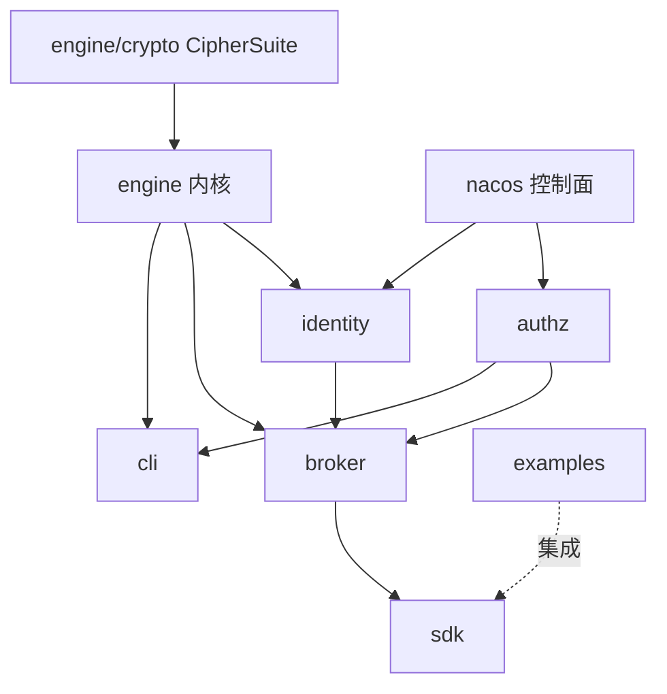

# 08 · 仓库脚手架 · 技术选型 · 引擎语言决策

> **定位**：仓库目录结构、模块边界、技术选型、**引擎语言 Java vs Go 论证与推荐**、构建与 CI 草案、对外依赖清单与自主可控考量。
>
> 前提：`00`~`07`。注：本阶段不写生产代码，本文是脚手架的**设计描述**。

---

## 1. 仓库目录结构（目标）

```
custos/
├── README.md                 # 文档总索引
├── LICENSE                   # Apache-2.0
├── engine/                   # 自研密钥引擎内核
│   ├── barrier/  seal/  storage/  lease/  audit/  crypto(CipherSuite)
├── identity/                 # Agent 身份与 OBO
│   ├── authn/  sts/  token/  registry/  lifecycle/
├── authz/                    # 策略引擎 PDP
│   ├── pdp/  engine(jCasbin)/  model/  nacos/  approval/  explain/
├── broker/                   # 经纪/执行 PEP（MCP-native, secretless）
│   ├── mcp/  pep/  secretless/  creds/  rotate/  sdk-bridge/
├── nacos/                    # Nacos 控制面集成
│   ├── client/  config/  watcher/  discovery/  mcp/
├── sdk/                      # Spring Boot Starter / 客户端
├── cli/                      # custos CLI（解封/策略/审计）
├── examples/                 # docker-compose / helm + MVP demo
└── docs/                     # 设计文档 + 竞品笔记 + 引用资料（本批产出）
```

- 包名：`io.custos.*`（`io.custos.engine.barrier` …）；CLI 命令 `custos`。
- 模块边界遵循 `01` 的职责表：`engine` 不懂业务/MCP；`authz` 不持密钥；`broker` 不判策略（调 PDP）；`nacos` 只做控制面、不碰密钥。

---

## 2. 引擎语言决策：Java vs Go（核心论证）

> PRD/任务书默认倾向 **Java**，但要求论证。下面给出对比与推荐。

### 2.1 对比

| 维度 | **Java** | **Go** |
|---|---|---|
| **生态一致性** | ✅ 与 Spring Cloud / **Nacos**（Java）/ jCasbin 同栈，团队熟、集成顺 | ❌ 与目标生态异栈，集成需跨语言 |
| **Nacos 原生** | ✅ 官方 nacos-client + Spring Cloud Alibaba 最成熟 | ◐ nacos-sdk-go 可用但非一等 |
| **授权内核** | ✅ jCasbin 直接依赖 | ◐ casbin(Go) 亦可，但与 Spring 脱节 |
| **密码学库** | ✅ BouncyCastle（含国密 GM）成熟、审计充分；Tongsuo 可 JNI | ✅ Go crypto + 国密第三方库 |
| **内存/密钥控制** | ❌ 短板：GC 复制、String 不可清零 → 需 byte[]+堆外+JNA mlock（`02` §8） | ✅ 强项：[]byte 显式清零、mlock 直接、无 GC 串残留，竞品(Vault/SPIRE)同款 |
| **竞品一致性** | ◐ 与 Vault/OpenBao/SPIRE(Go) 不同栈 | ✅ 与之一致，借鉴落地直观 |
| **部署体积/启动** | ◐ JVM 较重（GraalVM native 可缓解） | ✅ 单二进制、轻、快 |
| **团队与招聘（国内 Java 企业）** | ✅ 契合目标客户与团队 | ◐ 安全基础设施 Go 人才相对少 |
| **MCP SDK** | ◐ MCP Java SDK 渐成熟 | ◐ Go MCP SDK 亦有 |

### 2.2 推荐

> **推荐：引擎内核与全栈用 Java（默认采纳）**，把内存安全短板用工程手段补齐；**SDK 侧无论如何提供 Java/Spring Boot Starter**。

**理由**：
1. **生态一致性 + Nacos 原生**是本项目护城河的根基——引擎、控制面、授权、SDK 同在 Java/Spring 栈，集成成本与团队效率压倒性优势。
2. 目标客户是**国内 Java/Spring Cloud 企业**，Java 实现"装上即用"、易二开、易招聘。
3. 唯一硬短板是**内存/密钥控制**，但可工程补齐：`byte[]/SecretKey` + 显式清零 + 堆外内存 + **JNA mlock** + 禁 swap/core dump（`02` §8）；必要时关键路径用 native（GraalVM/JNI）。
4. 密码学有 **BouncyCastle（含国密 GM）** 成熟支撑，国密合规可叠 **Tongsuo**。

**何时重新考虑 Go**：若后续 profiling 表明 JVM 内存中密钥残留风险无法接受、或需要极致轻量边车——可将**引擎内核**单独以 Go 重写为独立进程（gRPC 接口），上层仍 Java。架构上把 `engine/` 设计为可替换的进程边界，为此留后路。

> 这是一个岔路口，**已按 PRD 默认 + 上述论证采纳 Java**；若你倾向 Go 或"引擎 Go + 上层 Java"的混合，告诉我，我调整选型与脚手架。

---

## 3. 技术选型（Java 路线）

| 层 | 选型 | 理由 / 自主可控 |
|---|---|---|
| 语言/运行时 | **Java 21（LTS）** | 新特性 + 长期支持 |
| 应用框架 | **Spring Boot 3.x / Spring Cloud + Spring Cloud Alibaba** | 与 Nacos 对齐；版本三者严格对齐 |
| 密码学 | **BouncyCastle（+ GM 国密）**；可选 **Tongsuo(铜锁)** 经 JNI/TLCP | 审计充分；国密合规（自主可控）|
| 授权内核 | **jCasbin** | 国产 Apache，Java 同栈（`04`）|
| 控制面 | **nacos-client / Spring Cloud Alibaba Nacos** | 护城河，国产 |
| 持久化 ORM | **Jimmer**（不可变实体 + 类型安全 DSL，Apache-2.0，国内活跃）| 接管 Custos 自身元数据表；无 N+1、与 Spring 栈一致（ADR-8 / `../research/jimmer.md`）|
| 存储 | **MySQL** 全密文（可换 OceanBase/TiDB）| PRD 指定；后续 Raft/JRaft（HA）|
| MCP | **MCP Java SDK**（server 暴露工具）| IF1 |
| 组件通信 | gRPC / REST（内部 PDP/经纪）| — |
| 构建 | **Maven**（多模块）或 Gradle | 见 §4 |
| 可观测 | Micrometer→**Prometheus** + **OTel** + ELK | NFR |
| 容器/编排 | Docker + **Helm**（K8s）| 部署 |

> 国密与 HA 的具体库版本在 PoC 中锁定（BouncyCastle GM 版本、JRaft 版本、Nacos 3.x 版本、Spring 三件套版本对照）。

### ADR-8 · 持久化框架：Jimmer（而非裸 JDBC / JPA）

- **决策**：Custos **自身元数据表**（`custos_storage`/`seal_config`/`lease`/`audit`/`dyn_role`）用 **Jimmer**（不可变实体 + `JavaRepository` + 类型安全 DSL）持久化；**裸 JDBC 仅保留在两类非 ORM 场景**：① 目标库的 DDL/账号管理（动态凭证 `CREATE/DROP USER`、`GRANT`）；② 经纪层对目标库的 **secretless 任意 SELECT** 执行。
- **理由**：① 无 N+1、强类型 DSL，减少手写 SQL 与拼接注入面；② 不可变实体支持"残缺对象保存"，契合按版本写 keyring / 部分更新 lease；③ Spring Boot Starter 与 Custos 的 Java/Spring 栈天然一致；④ Apache-2.0 + 国内活跃，契合自主可控；⑤ DTO/OpenAPI/TS 生成利好未来控制台/SDK。
- **加密边界**：实体的 `byte[]` 列存 **Barrier 密文**，加解密在 service 层完成，**Jimmer 不接触明文密钥**——不破坏"落盘前加密"红线。
- **代价/注意**：Jimmer 是**编译时框架（APT/KSP）**，CI/IDE 需启用注解处理；团队需了解其不可变实体/Fetcher/DTO 理念。详见 `../research/jimmer.md`。

---

## 4. 构建与 CI 草案

| 项 | 草案 |
|---|---|
| 构建 | Maven 多模块（root pom 聚合 engine/identity/authz/broker/nacos/sdk/cli）；统一依赖管理 BOM |
| 代码规范 | Checkstyle/Spotless + 统一格式；提交前 hook |
| 测试 | JUnit5 + 单元/集成；引擎加解密/解封/审计**重点测 + 模糊测试(jqf)**；Testcontainers 起 MySQL/Nacos 做集成 |
| 安全扫描 | 依赖漏洞（OWASP Dependency-Check / Trivy）；SAST（CodeQL/SpotBugs+FindSecBugs）；密钥扫描（gitleaks）|
| CI | GitHub Actions / 国内可换 Gitee/自建：build → test → 安全扫描 → 镜像构建 |
| 制品 | 容器镜像 + Helm chart；examples 的 docker-compose |
| 发布 | 语义化版本；v0.4 前置**外部安全审计**（`02` §13）|


---

## 5. 对外依赖清单 + 自主可控考量

| 依赖 | 许可证 | 自主可控 | 角色 |
|---|---|---|---|
| Nacos 3.x | Apache-2.0（阿里，国产）| ✅ 高 | 控制面（不可替换）|
| jCasbin | Apache-2.0（国产社区）| ✅ 高 | 授权内核 |
| BouncyCastle | MIT 风格 | ◐ 中（国际，审计充分）| 密码学（标准+国密）|
| Tongsuo（铜锁）| Apache-2.0（国产/openAtom）| ✅ 高 | 国密合规增强（可选）|
| Spring Boot/Cloud | Apache-2.0 | ◐ 中（国际，事实标准）| 框架 |
| Jimmer | Apache-2.0（国内作者，活跃）| ✅ 高 | 持久化 ORM（自身元数据表）|
| MySQL | GPL/商业（连接器 driver 许可注意）| ◐ 中 | 存储（可换国产兼容库如 OceanBase/TiDB）|
| MCP Java SDK | 开源（核对许可）| ◐ | MCP 接入 |

**自主可控策略**：
- 核心可控件（Nacos/jCasbin/Tongsuo）优先国产；国际件（Spring/BC）为事实标准且许可友好，作可接受依赖。
- **抽象关键接口**（CipherSuite、ControlPlane、Storage、PolicyAdapter）→ 便于把任一依赖替换为国产/信创实现（如存储换 OceanBase、KMS 换信创 KMS、密码经 Tongsuo）。
- 全部依赖**许可证合规**（无 BSL/受限）；Custos 自身 **Apache-2.0**。

---

## 6. 模块依赖关系（构建顺序）



---

## 7. 待确认（已按推荐继续）

| 岔路口 | 推荐 | 备选 |
|---|---|---|
| 引擎语言 | **Java 全栈**（内存短板工程补齐）| Go 引擎 + Java 上层（混合）|
| 构建工具 | **Maven 多模块** | Gradle |
| 存储驱动 | MySQL（留国产兼容） | 直接 OceanBase/TiDB |

> 至此阶段三 8 篇设计文档齐备。**下一步**：整理 `docs/references/` 引用资料中文摘要 → 写仓库根 `README.md` 索引 → 打包 `custos-design-docs.zip`。
