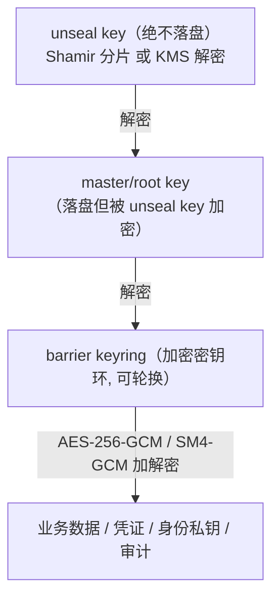

你正在 **refine** docs-cockpit module **M01 · 引擎基座（crypto · barrier · shamir · seal）**(sprint v0.1)。

我已经写了这个 module 的 frontmatter + subtasks + linked docs · 现在需要你 **检查 anchor 精度** · 给出 YAML patch。

## 执行模式 · 二选一(先判断你是谁)

- **A · 你有文件编辑工具**(Claude Code / Cursor / Codex CLI · 即能用 Edit / Write 直接改本地文件):**直接动手** · 不要只输出 patch。优先 (1) 改 module MD 的 `## 待办` / `## 3 · 待办` body checklist 行 · 给每个 subtask 补 inline `@code:path[:lines]` 和 `@docs:path[#§N.M | :start-end]` annotation(parser 支持多次堆叠 · 见 plan §6.1)· 这是 diff 友好的首选;或 (2) 把 `subtasks:` 写进 frontmatter object schema · 给每个 subtask 显式 `code:` / `docs:` 字段。改完跑 `docs-cockpit build` 验证 anchor 落到 `state.json` 即可。**不要让用户复制粘贴 · Claude Code 的副驾价值就在不让人重复打字。**
- **B · 你没有文件编辑工具**(浏览器里的 ChatGPT / Claude.ai / 其它 web 端):输出 YAML patch · 用户会复制回 MD。

判断标准:如果你能调用 `Edit` / `Write` / `MultiEdit` 之类工具,就是 A;只能在 chat 框输出文本就是 B。

## 不要改的字段(out of scope)

- `id` · `title` · `sprint` · `status` · `progress` · `desc`
- subtask 的 `title` / `status` · 这些反映工作意图 · 不在 anchor 精度范畴

## 要 refine 的字段

- subtask 的 `code:` · 应该精确到 `path:start-end` 行号 · 不是 `directory/` 整目录
- subtask 的 `docs:` · 应该精确到 `path.md#§N.M` heading 或 `:start-end` 行号 · 不是整个 doc
- subtask 的 `docs:` · 检查是否漏了相关 plan / RFC 引用(`linked_docs` 列表里有但 subtask 没引用)

## 当前 module frontmatter

```yaml
id: M01
title: "引擎基座（crypto · barrier · shamir · seal）"
status: done
sprint: "v0.1"
progress: 100
desc: "CipherSuite/AES-256-GCM/SHA/HMAC/ECDSA · Barrier 封套 · Shamir 解封 · 密钥层级。18 单测全绿。"


subtasks:

  - id: M01-d8833f
    title: "T1 Maven 多模块脚手架 + CI + 冒烟"
    status: done


  - id: M01-62cbd9
    title: "T2 IntlSuite AES-256-GCM（TDD）"
    status: done


  - id: M01-6e8199
    title: "T3 SHA-256 + HMAC"
    status: done


  - id: M01-e1f956
    title: "T4 ECDSA P-256 签名/验签"
    status: done


  - id: M01-a96c6b
    title: "T5 Keyring + Barrier 封套"
    status: done


  - id: M01-0c817d
    title: "T6 Shamir 分片封装"
    status: done


  - id: M01-9e9360
    title: "T7 密钥层级 + Seal/Unseal"
    status: done


```

## 当前 linked docs(已 embed 摘要 · 完整 doc 在 repo)


### 引擎加密设计（重中之重）

`docs/design/02-engine-crypto-design.md`

# 02 · 引擎内核：威胁模型与密码学设计（重中之重）

> **定位**：本文是 Custos 安全的基石——给出引擎内核的**威胁模型**与**密码学设计**：密钥层级、Barrier 加密、Seal/Unseal（Shamir/KMS）、存储加密、内存安全、**哈希链防篡改审计**、**国密 SM2/SM3/SM4 可切换套件**，并明确所用**密码库与标准算法**。
>
> **铁律**：① **不自创密码学**——只用经过审计的密码库实现**标准算法**；② **master key 不明文落盘**；③ **数据落盘前 Barrier 加密**；④ **审计防篡改**；⑤ **密钥内存用完清零、禁 swap**；⑥ **吊销/租约可靠传播**。
>
> 设计灵感来源：OpenBao / Vault 的 Barrier·Seal·Lease 概念、SPIRE 的 KeyManager 思路（均**只借思想、不抄码**，见 `00-synthesis.md` 许可证表）。**本文为防御性安全软件的设计文档。**

---

## 1. 为什么这是重中之重

Custos 是**持有密钥**的系统：一旦引擎内核设计有误，等于把企业所有凭证一次性暴露。PRD 风险表把"自研密钥引擎安全风险"列为 🔴 极高。因此本文遵循"**先威胁建模、后密码设计、上生产前外部审计（v0.4）**"的顺序，并在每个安全决策处标注风险与缓解。

---

## 2. 资产与信任边界

### 2.1 受保护资产（按敏感度）
| 资产 | 敏感度 | 失陷后果 |
|---|---|---|
| **master key / root key** | 🔴 最高 | 全盘沦陷（可解密一切） |
| **barrier key（keyring）** | 🔴 | 解密所有落盘数据 |
| 业务密钥 / 动态凭证 | 🟠 | 单资源泄漏（有 TTL，窗口小） |
| 身份签名私钥 | 🟠 | 可伪造 Agent 身份 |
| 审计日志 | 🟡 | 篡改可掩盖入侵 |
| 策略（Nacos 配置） | 🟡 | 非密钥，但篡改可越权 |

### 2.2 信任边界
- **解封后的引擎进程内存** = 唯一持有 master/barrier key 明文之处（可信，但需内存防护）。
- **存储后端、网络、LLM 上下文、Nacos 配置** = 不可信。

---

## 3. 威胁模型（STRIDE + 显式边界）

### 3.1 在威胁模型内（必须防护）
| 类别(STRIDE) | 威胁 | 缓解 |
|---|---|---|
| **S 伪造** | 伪造 Agent/用户身份 | 身份签名（ECDSA/SM2）、短 TTL、OBO 交集；mTLS |
| **T 篡改** | 篡改落盘数据 / 审计日志 | Barrier AEAD（GCM tag 检测）；**审计哈希链**（任一条被改则链断） |
| **R 抵赖** | 否认访问行为 | 每次"决策+访问"留痕（用户+Agent+任务+资源+结果），审计先于返回密钥 |
| **I 信息泄露** | 窃听通信 / 读存储 / **密钥进 LLM** | TLS + 落盘前加密（只见密文）；**secretless 经纪（密钥不进 LLM）** |
| **D 拒绝服务** | 引擎不可用 → 业务断 | 首版单节点（可用性受限，已知）；后续 Raft HA |
| **E 提权** | 越权访问资源 | 默认拒绝 ACL；最小权限；JIT+审批；**Nacos 秒级吊销** |

### 3.2 明确**不在**威胁模型内（声明边界，借 OpenBao 实践）
- **对存储后端的任意控制**（可删可回滚）：攻击者若能任意写存储，可致数据丢失/回滚，难以完全防护（缓解：存储访问控制 + 备份 + Raft 多副本）。
- **运行中进程的完整内存转储**：若攻击者能 dump 解封态进程内存，机密性受损（缓解：内存清零 + 禁 swap + 最小存活，**缩小**而非消除）。
- **宿主机 root / 任意代码执行**：等同失守（缓解：最小权限部署、不 root 跑、镜像加固）。
- **被攻陷的合法客户端**：持其凭证可在其权限内访问（缓解：短 TTL + 行为审计 + 秒级吊销）。
- **管理员注入恶意策略/配置**：属内部恶意（缓解：策略变更审计 + 审批 + 四眼）。

> **原则**：像 OpenBao 一样**显式声明边界**——不假装能防一切，把有限的防护资源投在最高价值资产（master key、审计完整性、密钥不进 LLM）。

---

## 4. 密钥层级（Key Hierarchy）

借鉴 OpenBao 四层，落到 Custos：



| 层 | 存放 | 加密者 | 说明 |
|---|---|---|---|
| **unseal key** | **不落盘** | Shamir 分片 / KMS | 只用于解封；分片不能直接请求 |
| **master/root key** | 落盘（密文） | unseal key | 启动后解密得到 |
| **barrier key（keyring）** | 落盘（密文） | master key | 支持轮换（多版本 keyring） |
| **数据加密密钥/数据** | 落盘（密文） | barrier key | 业务密钥、动态凭证元数据、身份私钥、审计链 |

- **轮换**：barrier key 可在线轮换（新写用新版本，旧数据按版本号解密），master key/unseal key 经管理操作轮换；轮换不停服（除 seal 迁移）。

---

## 5. Barrier 加密层

| 项 | 设计 |
|---|---|
| **算法（默认）** | **AES-256-GCM**，96-bit 随机 nonce（每对象独立随机），GCM 认证标签做完整性校验（AEAD：机密性+抗篡改一体） |
| **算法（国密套件）** | **SM4-GCM**（128-bit 分组）或 SM4-CTR+SM3-HMAC（视库支持），可切换 |
| **格式** | `[suite_id][key_version][nonce][ciphertext+tag]`——suite_id 标识算法套件，key_version 标识 keyring 版本，支持平滑轮换与套件迁移 |
| **读路径** | 解密时校验 GCM tag/HMAC；失败即视为篡改，**中止处理** |
| **实现** | 调审计库（见 §9），**不自写分组密码/GCM 模式** |

---

## 6. Seal / Unseal

- 启动默认 **sealed**：知道存储位置，但无 master key，无法解密；除"解封/查状态"外几乎不可操作。
- **解封流程**：提供 unseal key → 解密 master key → 解密 keyring → 进入 unsealed → 加载审计/认证/策略。
- **检测入侵一键 seal**：丢弃内存中 master/barrier key，立即锁库。

### 决策点 ① 解封默认方式（请你拍板）

| 选项 | 机制 | 优点 | 缺点 |
|---|---|---|---|
| **A. Shamir 分片（默认）** ⭐推荐 | unseal key 用 Shamir 切 N 片取 M 片重建（默认 5/3） | 不依赖外部、不信任单人、契合自主可控、可演示 | 解封手动，自动化运维不便 |
| **B. KMS/HSM 自动解封** | 启动调云 KMS/HSM 解密 master key，用 recovery key 做高危授权 | 运维省心、自动重启 | 强生命周期依赖（KMS key 删=不可恢复）、依赖外部信任、国内需信创 KMS |
| **C. 两者皆备，按部署选** | 同时实现，配置切换 | 灵活 | 实现/测试成本高 |

> **推荐**：**首版 A（Shamir）为默认 + 预留 KMS 接口（C 的接口形态）**。理由：① 自主可控、不绑外部 KMS；② 可演示 two-person rule；③ 接口预留，企业有信创 KMS（如阿里 KMS、华为 DEW）时可切 B。**KMS 自动解封若启用，文档须显著告警"KMS key 删除=集群不可恢复"并强制备份策略。**

---

## 7. 存储加密

- **落盘前一律 Barrier 加密**，存储后端只见密文（存储不可信）。
- 存储抽象接口（`engine/storage`）：`get/put/delete/list`，全部走 Barrier。

### 决策点 ② 存储后端（请你拍板）

| 选项 | 说明 | 优点 | 缺点 |
|---|---|---|---|
| **A. MySQL（首版默认）** ⭐推荐 | 企业已有，全密文存储 | 国内企业普遍在用、运维熟、PRD 指定 | 自身非强一致 HA（靠主从），HA 需额外方案 |
| **B. 嵌入式（RocksDB/H2）** | 单机自带 | 零外部依赖、起步快 | 不适合集群、生产受限 |
| **C. Raft 集成存储** | 自带强一致 HA（借 JRaft 思路） | 强一致、租约不丢不重 | 自研成本高，放 v0.3 HA |

> **推荐**：**首版 A（MySQL，全密文）**作默认 + 抽象存储接口；**v0.3 引入 C（Raft/JRaft）做强一致 HA**（呼应"租约不丢不重"）。B 仅用于本地 dev。

---

## 8. 内存安全（Java 的挑战与对策）

> 这是 Java 引擎相较 Go 的**主要短板**，必须正面设计（也是 `08` 引擎语言论证的关键输入）。

| 风险 | Java 的问题 | 对策 |
|---|---|---|
| 明文密钥驻留 | `String` 不可变、入常量池，无法清零 | **一律用 `byte[]`/`char[]`/`javax.crypto.SecretKey`**，用完 `Arrays.fill(buf,(byte)0)` 显式清零；禁止把密钥转 `String` |
| GC 复制残留 | GC 移动对象，明文可能在堆里留多份副本 | 关键密钥材料放**堆外内存（DirectByteBuffer / JNA malloc）**，手动清零；最小化明文存活时间 |
| 换页到磁盘（swap） | 内存被换出 → 密钥落盘 | **mlock**：用 JNA 调 `mlock`/`VirtualLock` 锁定敏感内存页禁 swap；部署层禁用 swap |
| 核心转储 | crash dump 含密钥 | 关闭 core dump（`ulimit -c 0`）、容器禁 dump |
| 日志泄漏 | 误把密钥打日志 | 审计/日志层强制对密钥字段 HMAC 脱敏；代码评审红线 |

- **明文存活最小化**：动态
… [truncated · 9107 chars total]

---

### 实现计划 1/5 · 引擎基座

`docs/superpowers/plans/2026-06-09-custos-mvp-v0.1-engine-foundation.md`

# Custos MVP v0.1 — 引擎密码学基座 Implementation Plan（计划 1/5）

> **For agentic workers:** REQUIRED SUB-SKILL: Use superpowers:subagent-driven-development (recommended) or superpowers:executing-plans to implement this plan task-by-task. Steps use checkbox (`- [ ]`) syntax for tracking.

**Goal:** 搭好 Maven 多模块工程，并以 TDD 实现 Custos 引擎的密码学基座——CipherSuite（AES-256-GCM/SHA-256/HMAC/ECDSA）、Barrier 加密封套、Shamir 分片、Seal/Unseal 与密钥层级——为后续存储/审计/租约/动态凭证打地基。

**Architecture:** 纯 Java、无外部服务依赖，全部可单元测试。Intl 密码套件用 JDK `javax.crypto`（AES-GCM/SHA-256/HMAC/ECDSA 均为 JDK 内置、经审计的标准算法实现）；Shamir 用经审计的 `com.codahale:shamir`（Apache-2.0）。**不自写任何密码学算法**。`CipherSuite` 抽象为后续国密 SM4/SM3/SM2 留切换点（本计划不实现国密）。

**Tech Stack:** Java 21 · Maven 多模块 · JUnit 5 · JDK javax.crypto · com.codahale:shamir

> **计划序列**（v0.1 全貌）：**1/5 引擎密码学基座（本计划）** → 2/5 引擎持久化（Storage/MySQL + 哈希链审计 + Lease + 动态 DB 凭证）→ 3/5 身份层（JWT 签发/校验）→ 4/5 策略层（jCasbin + Nacos Adapter/Watcher 秒级吊销）→ 5/5 经纪层 + MCP + docker-compose demo。每个计划独立可测。本计划对应详设 `docs/design/02-engine-crypto-design.md` 与 spec `docs/superpowers/specs/2026-06-09-custos-mvp-v0.1-design.md` §3.1–3.3。

---

## File Structure（本计划创建/修改的文件）

| 文件 | 职责 |
|---|---|
| `pom.xml` | 父 POM：聚合模块、依赖管理、Java 21 |
| `engine/pom.xml` | engine 模块 POM：shamir + JUnit |
| `.github/workflows/ci.yml` | CI：mvn verify |
| `engine/src/main/java/io/custos/engine/crypto/CipherSuite.java` | 密码套件接口（切换点）|
| `engine/src/main/java/io/custos/engine/crypto/IntegrityException.java` | 完整性校验失败异常 |
| `engine/src/main/java/io/custos/engine/crypto/IntlSuite.java` | 国际标准套件实现 |
| `engine/src/main/java/io/custos/engine/crypto/Keyring.java` | barrier 多版本密钥环 |
| `engine/src/main/java/io/custos/engine/barrier/Barrier.java` | Barrier 接口 |
| `engine/src/main/java/io/custos/engine/barrier/DefaultBarrier.java` | Barrier 封套实现（suite_id\|version\|body）|
| `engine/src/main/java/io/custos/engine/seal/ShamirSplitter.java` | Shamir 分片封装 |
| `engine/src/main/java/io/custos/engine/seal/SealStore.java` | 解封所需持久化抽象（本计划用内存实现）|
| `engine/src/main/java/io/custos/engine/seal/SealStatus.java` | 密封状态 |
| `engine/src/main/java/io/custos/engine/seal/SealedException.java` | 未解封时操作异常 |
| `engine/src/main/java/io/custos/engine/seal/SealManager.java` | 解封接口 |
| `engine/src/main/java/io/custos/engine/seal/DefaultSealManager.java` | 解封实现（密钥层级）|
| `engine/src/test/java/io/custos/engine/**` | 对应测试 |

---

## Task 1: Maven 多模块脚手架 + CI + 冒烟测试

**Files:**
- Create: `pom.xml`
- Create: `engine/pom.xml`
- Create: `.github/workflows/ci.yml`
- Create: `engine/src/main/java/io/custos/engine/package-info.java`
- Test: `engine/src/test/java/io/custos/engine/SmokeTest.java`

- [ ] **Step 1: 写父 POM**

`pom.xml`:
```xml
<?xml version="1.0" encoding="UTF-8"?>
<project xmlns="http://maven.apache.org/POM/4.0.0"
         xmlns:xsi="http://www.w3.org/2001/XMLSchema-instance"
         xsi:schemaLocation="http://maven.apache.org/POM/4.0.0 http://maven.apache.org/xsd/maven-4.0.0.xsd">
  <modelVersion>4.0.0</modelVersion>
  <groupId>io.custos</groupId>
  <artifactId>custos-parent</artifactId>
  <version>0.1.0-SNAPSHOT</version>
  <packaging>pom</packaging>
  <modules>
    <module>engine</module>
  </modules>
  <properties>
    <maven.compiler.release>21</maven.compiler.release>
    <project.build.sourceEncoding>UTF-8</project.build.sourceEncoding>
    <junit.version>5.10.2</junit.version>
  </properties>
  <dependencyManagement>
    <dependencies>
      <dependency>
        <groupId>org.junit</groupId>
        <artifactId>junit-bom</artifactId>
        <version>${junit.version}</version>
        <type>pom</type>
        <scope>import</scope>
      </dependency>
    </dependencies>
  </dependencyManagement>
  <build>
    <pluginManagement>
      <plugins>
        <plugin>
          <groupId>org.apache.maven.plugins</groupId>
          <artifactId>maven-surefire-plugin</artifactId>
          <version>3.2.5</version>
        </plugin>
      </plugins>
    </pluginManagement>
  </build>
</project>
```

- [ ] **Step 2: 写 engine 模块 POM**

`engine/pom.xml`:
```xml
<?xml version="1.0" encoding="UTF-8"?>
<project xmlns="http://maven.apache.org/POM/4.0.0"
         xmlns:xsi="http://www.w3.org/2001/XMLSchema-instance"
         xsi:schemaLocation="http://maven.apache.org/POM/4.0.0 http://maven.apache.org/xsd/maven-4.0.0.xsd">
  <modelVersion>4.0.0</modelVersion>
  <parent>
    <groupId>io.custos</groupId>
    <artifactId>custos-parent</artifactId>
    <version>0.1.0-SNAPSHOT</version>
  </parent>
  <artifactId>custos-engine</artifactId>
  <dependencies>
    <dependency>
      <groupId>com.codahale</groupId>
      <artifactId>shamir</artifactId>
      <version>0.7.0</version>
    </dependency>
    <dependency>
      <groupId>org.junit.jupiter</groupId>
      <artifactId>junit-jupiter</artifactId>
      <scope>test</scope>
    </dependency>
  </dependencies>
</project>
```

- [ ] **Step 3: 写包说明与冒烟测试**

`engine/src/main/java/io/custos/engine/package-info.java`:
```java
/** Custos 自研密钥引擎内核：crypto / barrier / seal / storage / lease / audit。 
… [truncated · 37901 chars total]

---


## Repo 根路径
`D:\harvey_work\custos`
当前分支:`main`


## 你的任务

1. **读 linked docs 的内容** · 理解每个 plan / RFC 的章节布局
2. **对每个 subtask** · 判断它在做什么 · 然后:
   - 找出 plan / RFC 里对应的具体 section(`#§N.M` heading slug 或 `:start-end` 行号)
   - 找出 repo 里对应的代码 file + 行号(如果 code 已经存在;新代码留 `code: <path>` 不带行号)
3. **按上面「执行模式」分支落地**:
   - **模式 A**:直接 Edit MD body checklist · 每行末尾追加 ` @code:path[:lines]` 和 ` @docs:path[#§N.M | :start-end]`(多个就堆叠空格分隔)· 完事跑 `docs-cockpit build` · 检查 `docs/state.json` 里对应 subtask 的 `code` / `docs` 字段。报告简短:每个 subtask 改了什么 + build 是否干净。
   - **模式 B**:输出下面格式的 YAML patch 给用户复制:

```yaml
subtasks:
  - id: <现有 subtask id>
    code: "<更精确的 code anchor · 或 list>"
    docs: ["<更精确的 docs anchor>", ...]
```

如果某个 subtask 在 linked docs 里找不到对应 section · 模式 A 留 `# TODO: ...` 注释行不写 anchor · 模式 B 在 patch 里输出 `# TODO: ...` 注释行 · **不要瞎猜 anchor**(driver-seat 信任来自精度 · 错 anchor 比缺 anchor 伤害更大)。
