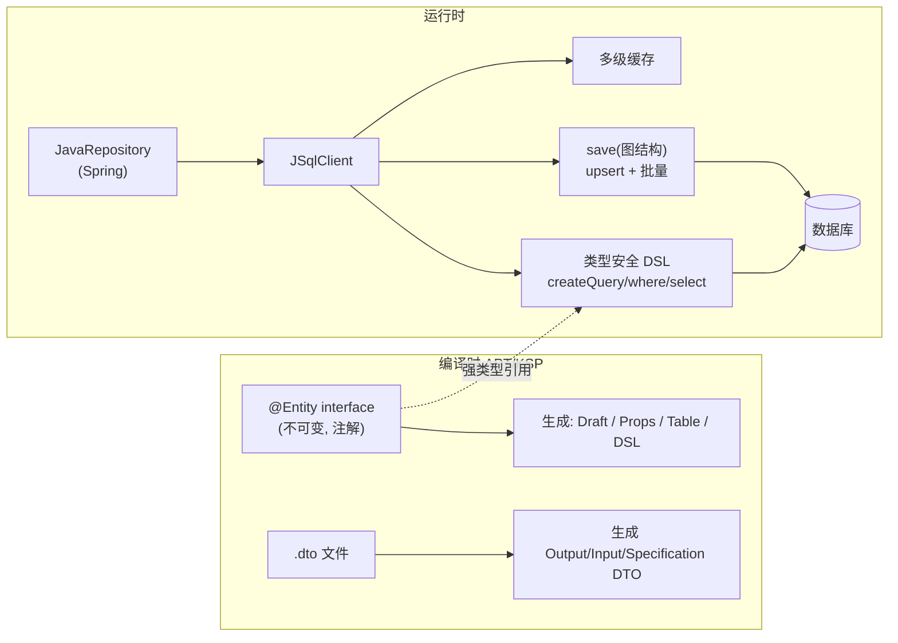

你正在 **refine** docs-cockpit module **M02 · 引擎持久化（Jimmer · MySQL 全密文）**(sprint v0.1)。

我已经写了这个 module 的 frontmatter + subtasks + linked docs · 现在需要你 **检查 anchor 精度** · 给出 YAML patch。

## 执行模式 · 二选一(先判断你是谁)

- **A · 你有文件编辑工具**(Claude Code / Cursor / Codex CLI · 即能用 Edit / Write 直接改本地文件):**直接动手** · 不要只输出 patch。优先 (1) 改 module MD 的 `## 待办` / `## 3 · 待办` body checklist 行 · 给每个 subtask 补 inline `@code:path[:lines]` 和 `@docs:path[#§N.M | :start-end]` annotation(parser 支持多次堆叠 · 见 plan §6.1)· 这是 diff 友好的首选;或 (2) 把 `subtasks:` 写进 frontmatter object schema · 给每个 subtask 显式 `code:` / `docs:` 字段。改完跑 `docs-cockpit build` 验证 anchor 落到 `state.json` 即可。**不要让用户复制粘贴 · Claude Code 的副驾价值就在不让人重复打字。**
- **B · 你没有文件编辑工具**(浏览器里的 ChatGPT / Claude.ai / 其它 web 端):输出 YAML patch · 用户会复制回 MD。

判断标准:如果你能调用 `Edit` / `Write` / `MultiEdit` 之类工具,就是 A;只能在 chat 框输出文本就是 B。

## 不要改的字段(out of scope)

- `id` · `title` · `sprint` · `status` · `progress` · `desc`
- subtask 的 `title` / `status` · 这些反映工作意图 · 不在 anchor 精度范畴

## 要 refine 的字段

- subtask 的 `code:` · 应该精确到 `path:start-end` 行号 · 不是 `directory/` 整目录
- subtask 的 `docs:` · 应该精确到 `path.md#§N.M` heading 或 `:start-end` 行号 · 不是整个 doc
- subtask 的 `docs:` · 检查是否漏了相关 plan / RFC 引用(`linked_docs` 列表里有但 subtask 没引用)

## 当前 module frontmatter

```yaml
id: M02
title: "引擎持久化（Jimmer · MySQL 全密文）"
status: done
sprint: "v0.1"
progress: 100
desc: "Jimmer 全密文存储 · SealStore · 哈希链防篡改审计 · 租约 · 动态 MySQL 只读凭证。12 IT 全绿。"


subtasks:

  - id: M02-318af9
    title: "P2-T1 Jimmer 接入 + StorageEntry + JimmerStorage（IT）"
    status: done


  - id: M02-59d807
    title: "P2-T2 SealConfigEntry + JimmerSealStore（IT）"
    status: done


  - id: M02-85c59b
    title: "P2-T3 哈希链审计 HashChainAuditLog（IT）"
    status: done


  - id: M02-d00598
    title: "P2-T4 租约 DefaultLeaseManager（IT）"
    status: done


  - id: M02-bd97a9
    title: "P2-T5 动态 DB 凭证 DynamicDbCredentials（IT）"
    status: done


```

## 当前 linked docs(已 embed 摘要 · 完整 doc 在 repo)


### 实现计划 2/5 · 引擎持久化

`docs/superpowers/plans/2026-06-09-custos-mvp-v0.1-engine-persistence.md`

# Custos MVP v0.1 — 引擎持久化（Jimmer）Implementation Plan（计划 2/5）

> **For agentic workers:** REQUIRED SUB-SKILL: Use superpowers:subagent-driven-development (recommended) or superpowers:executing-plans to implement this plan task-by-task. Steps use checkbox (`- [ ]`) syntax for tracking.

**Goal:** 在引擎基座（计划 1/5）之上，以 TDD + **Jimmer ORM** 实现持久化层——MySQL 全密文存储、Jimmer 版 SealStore、哈希链防篡改审计、租约管理、动态 MySQL 只读凭证。

**Architecture:** Custos **自身元数据表**用 **Jimmer 不可变实体 + JSqlClient**（类型安全 DSL、无 N+1）持久化（决策见 ADR-8 / `docs/research/jimmer.md`）。`byte[]` 列存 **Barrier 密文**，加解密在 service 层完成，Jimmer 不接触明文。**裸 JDBC 仅保留两处非 ORM 场景**：动态凭证的 `CREATE/DROP USER`（目标库账号管理）、经纪层的 secretless 任意 SELECT（计划 5）。集成测试用 Testcontainers 起真实 MySQL。

**Tech Stack:** Java 21 · **Jimmer 0.10.10**（jimmer-sql + jimmer-apt 编译时）· MySQL 8 · Testcontainers · JUnit 5 ·（依赖计划 1 的 `IntlSuite`/`DefaultBarrier`/`SealManager`/`SealStore`）

> 前置：计划 1/5 完成。对应 spec §3.4–3.6、§4、ADR-8，详设 `docs/design/02` §7/§11、`docs/design/06` §3、`docs/design/08` ADR-8。
> **Jimmer 是编译时框架**：实体为 `@Entity interface`，`mvn` 编译时由 jimmer-apt 生成 `XxxDraft`/`XxxTable`/`XxxProps`。测试引用这些生成类，首次编译即生成。

---

## File Structure

| 文件 | 职责 |
|---|---|
| `engine/pom.xml` | 加 jimmer-sql + jimmer-apt（annotationProcessorPaths）+ mysql + testcontainers |
| `engine/src/main/resources/db/schema.sql` | 建表 DDL（列名避开 KEY/VALUE 保留字）|
| `engine/src/main/java/io/custos/engine/persistence/JimmerClients.java` | 由 DataSource 构建 JSqlClient |
| `engine/src/main/java/io/custos/engine/storage/StorageEntry.java` | `@Entity` 存储行 |
| `engine/src/main/java/io/custos/engine/storage/Storage.java` | 存储抽象 |
| `engine/src/main/java/io/custos/engine/storage/JimmerStorage.java` | Jimmer 全密文存储 |
| `engine/src/main/java/io/custos/engine/seal/SealConfigEntry.java` | `@Entity` 解封配置行 |
| `engine/src/main/java/io/custos/engine/seal/JimmerSealStore.java` | SealStore 的 Jimmer 实现 |
| `engine/src/main/java/io/custos/engine/audit/AuditRow.java` | `@Entity` 审计行 |
| `engine/src/main/java/io/custos/engine/audit/{AuditRecord,VerifyResult,AuditLog,HashChainAuditLog}.java` | 哈希链审计 |
| `engine/src/main/java/io/custos/engine/lease/LeaseRow.java` | `@Entity` 租约行 |
| `engine/src/main/java/io/custos/engine/lease/{Lease,Revoker,LeaseManager,DefaultLeaseManager}.java` | 租约 |
| `engine/src/main/java/io/custos/engine/secrets/{IssuedCred,DynamicDbCredentials}.java` | 动态 DB 凭证（裸 JDBC 账号管理 + Jimmer 租约）|
| `engine/src/test/java/io/custos/engine/**` | Testcontainers 集成测试 |

---

## Task 1: Jimmer 接入 + StorageEntry 实体 + JimmerStorage（全密文）

**Files:**
- Modify: `engine/pom.xml`
- Create: `engine/src/main/resources/db/schema.sql`
- Create: `engine/src/main/java/io/custos/engine/persistence/JimmerClients.java`
- Create: `engine/src/main/java/io/custos/engine/storage/StorageEntry.java`
- Create: `engine/src/main/java/io/custos/engine/storage/Storage.java`
- Create: `engine/src/main/java/io/custos/engine/storage/JimmerStorage.java`
- Test: `engine/src/test/java/io/custos/engine/storage/JimmerStorageIT.java`

- [ ] **Step 1: 加 Jimmer/MySQL/Testcontainers 依赖 + APT 到 `engine/pom.xml`**

在 `<dependencies>` 加：
```xml
    <dependency>
      <groupId>org.babyfish.jimmer</groupId>
      <artifactId>jimmer-sql</artifactId>
      <version>0.10.10</version>
    </dependency>
    <!-- 实测必需：jimmer-apt 生成的 XxxDraft 引用 Jackson 注解，而 jimmer-sql 把 jackson 设为 optional，
         不显式引入则 APT 生成代码编译期报 “package com.fasterxml.jackson.annotation does not exist”。 -->
    <dependency>
      <groupId>com.fasterxml.jackson.core</groupId>
      <artifactId>jackson-databind</artifactId>
      <version>2.17.2</version>
    </dependency>
    <dependency>
      <groupId>com.mysql</groupId>
      <artifactId>mysql-connector-j</artifactId>
      <version>8.4.0</version>
    </dependency>
    <dependency>
      <groupId>org.testcontainers</groupId>
      <artifactId>mysql</artifactId>
      <version>1.19.8</version>
      <scope>test</scope>
    </dependency>
    <dependency>
      <groupId>org.testcontainers</groupId>
      <artifactId>junit-jupiter</artifactId>
      <version>1.19.8</version>
      <scope>test</scope>
    </dependency>
    <!-- 测试日志绑定：强制 slf4j-api 2.x 与 slf4j-simple 2.x 对齐。jimmer 传递的 slf4j-api 1.7.36
         会让 2.x 的 simple 绑定失败而退化为 NOP，导致 Testcontainers 的诊断日志（含连接失败原因）全部消失。 -->
    <dependency>
      <groupId>org.slf4j</groupId>
      <artifactId>slf4j-api</artifactId>
      <version>2.0.16</version>
      <scope>test</scope>
    </dependency>
    <dependency>
      <groupId>org.slf4j</groupId>
      <artifactId>slf4j-simple</artifactId>
      <version>2.0.16</version>
      <scope>test</scope>
    </dependency>
```
并在 `engine/pom.xml` 加 `<build>`（jimmer-apt 注解处理器 + failsafe 跑 IT + 钉死 Docker API 版本）：
```xml
  <build>
    <plugins>
      <plugin>
        <groupId>org.apache.maven.plugins</groupId>
        <artifactId>maven-compiler-plugin</artifactId>
        <version>3.13.0</version>
        <configuration>
          <annotationProcessorPaths>
            <path>
              <groupId>org.babyfi
… [truncated · 44806 chars total]

---

### Jimmer 研究笔记

`docs/research/jimmer.md`

# Jimmer — JVM 上的不可变实体 ORM（持久化框架选型）

> **一句话定位**：Jimmer 是面向 Java & Kotlin 的现代 ORM——以**不可变实体 + 编译时代码生成（APT/KSP）**为核心，强类型 SQL DSL、**无 N+1**、DTO 语言、强大多级缓存。**Apache-2.0**、国内作者（babyfish-ct）活跃维护。是 Custos **持久化层**相对裸 JDBC / JPA 的候选框架。
>
> 本笔记基于本地克隆 `research/jimmer`（Gitee 镜像，Apache-2.0）：`README_zh_CN.md`、`project/jimmer-sql`、`project/jimmer-spring-boot-starter` 源码精读。这是**框架选型评估**（非竞品），结构略调整。

---

## 1. 它解决什么问题 & 核心理念

传统 ORM（JPA/Hibernate）以「POJO 实体」为中心，查询/保存「任意形状的数据图」很别扭（EntityGraph 复杂、DTO 退化成无关联的 OM、update 改全列、N+1）。Jimmer 的核心理念：**把"任意形状的数据结构"作为整体读写**——

- 实体**不是 POJO**，而是**不可变接口**（`@Entity interface`），编译时生成实现；可表达"残缺/任意层级"的数据结构。
- **读**：Jimmer 按你要的形状（Fetcher/DTO）构造数据图给你；**写**：你构造任意形状的数据图交给 Jimmer 整体保存（upsert merge、批量 DML）。



---

## 2. 关键机制（源码佐证）

### 2.1 不可变实体（`@Entity` 接口）
样例（`jimmer-sql/.../arrays/ArrayModel.java`）：
```java
@Entity
public interface ArrayModel {
    @Id @GeneratedValue(generatorType = UUIDIdGenerator.class) UUID id();
    String[] strings();
    @Serialized Byte[] serializedArr();   // 自定义序列化
}
```
- 实体是**接口**，属性是**方法**；编译时（`jimmer-apt`/`jimmer-ksp`）生成 Draft（构造可变草稿）、Props 元数据、Table（DSL 用）。
- 不可变 → 线程安全、天然适合"残缺对象"（只设置部分属性即可保存部分列）。

### 2.2 类型安全 DSL & SQL 优化（`jimmer-sql`）
- `sqlClient.createQuery(table).where(table.foo().eq(x)).select(table).execute()`——**编译期类型检查**。
- 可混入原生 SQL 表达式；支持 Derived Table / CTE / Recursive-CTE。
- **自动 SQL 优化**：去除无用 join、合并逻辑等价 join/隐式子查询、分页自动生成并优化 count 查询。

### 2.3 对象图读写：无 N+1（核心卖点）
- **读**：Object Fetcher 控制返回实体的"形状"（哪些属性/关联/层级），或用 DTO 直接投影；**任意层级、无 N+1**。
- **写**：保存任意形状的图结构，利用数据库 upsert merge，每层批量 DML，自动翻译约束冲突异常；**可保存残缺对象**（不像 JPA update 改全列）。

### 2.4 DTO 语言（`jimmer-dto-compiler`）
- 独立 `.dto` 文件声明 Output/Input/Specification DTO，编译时生成；与 ORM 无缝集成，**唯一支持基于 DTO 的嵌套投影的 ORM**。

### 2.5 Spring 集成（`jimmer-spring-boot-starter`）
- `JavaRepository<E, ID>` 接口（源码确认）：`findById(id[, fetcher/viewType])`、`findByIds`、`findAll(sortedProps)`、`save(entity) → SimpleSaveResult<E>` 等；自定义 repo 继承它并用 `sql()`（JSqlClient）写复杂查询。
- `@EnableJimmerRepositories`；配置项 `jimmer.dialect`、`jimmer.database-validation`、`jimmer.show-sql` 等。
- 多级缓存（对象/关联/计算值/多视图）+ 自动缓存一致性；GraphQL 快速支持；按文档注释生成 OpenAPI/TypeScript 客户端契约。

### 2.6 注意：编译时框架
- 依赖 **APT（Java）/ KSP（Kotlin）**；改实体/Controller 后需触发一次编译生成代码（IDE Run 即可）；仅改 `.dto` 时需 DTO 插件或全量编译。团队需了解 APT 工作方式。

### 2.7 保存语义与 SaveMode（持久化代码的关键约束，源码 `SaveOperations`/save-mode 文档）
`save(entity)` 默认 **UPSERT**；聚合根保存由 `SaveMode` 控制 5 种模式：

| SaveMode | 行为 | 快捷方法 |
|---|---|---|
| **UPSERT**（默认）| 按 @Id 或 @Key 判存在 → INSERT 或 UPDATE | `save(e)` |
| **INSERT_ONLY** | 无条件 INSERT | `insert(e)` |
| **UPDATE_ONLY** | 无条件 UPDATE（按 id 或 key）| `update(e)` |
| **INSERT_IF_ABSENT** | 存在则忽略，否则插入 | `insertIfAbsent(e)` |
| **NON_IDEMPOTENT_UPSERT** | wild 对象=insert，否则 upsert（不推荐）| — |

**三条必须记住的硬规则**（直接决定持久化代码正确性）：
1. **既无 @Id 也无 @Key 的对象用默认 UPSERT 会直接报错**（"entity with neither id nor key cannot be accepted"）。→ 自增主键、未设 id、无 @Key 的实体（如**审计行**）**必须显式 `INSERT_ONLY`**。
2. **残缺对象更新**：`UPDATE_ONLY` 只更新被设置（loaded）的列（`update T set <仅所设列> where id=?`），契合"只改部分字段"；但用 UPSERT 做**部分更新**在 MySQL 上因 `insert ... on duplicate key` 要求 NOT NULL 列有值而不可靠 → **部分更新（如续约只改 expire_at）应显式 `UPDATE_ONLY`**。
3. **MySQL upsert**：按 @Key upsert 依赖唯一约束，需 `@KeyUniqueConstraint(noMoreUniqueConstraints = true)`；按 **@Id**（主键）upsert 则直接 `insert ... on duplicate key update`，无需额外注解。

API 入口（源码核准）：`getEntities().save(e)` / `getEntities().saveCommand(e).setMode(SaveMode.X).execute()`；查询 `getEntities().findById(Class,id)`；删除 `getEntities().delete(Class,id)`（注意是 `delete` 不是 `deleteById`）；DSL `createQuery(Table.$).where(t.x().eq(..)/.like(..)/.lt(..)).orderBy(t.x().asc()).select(..).execute()`。

---

## 3. 对 Custos 的适配与边界（关键）

Custos 持久化分两类，**Jimmer 只接管第一类**：

| 数据 | 用 Jimmer? | 说明 |
|---|---|---|
| **Custos 自身元数据**：`custos_storage`(密文 KV)、`custos_seal_config`、`custos_lease`、`custos_audit`、`custos_dyn_role` | ✅ **是** | 实体 + repository，类型安全、无手写 SQL；`byte[]` 列存 Barrier 密文（加解密在 service 层，Jimmer 只存已加密字节）|
| **目标库的 DDL / 用户管理**：`CREATE/DROP USER`、`GRANT` | ❌ 否 | ORM 不做 DDL/账号管理；动态凭证签发/撤销保留**裸 JDBC admin 连接** |
| **目标库的 secretless 任意 SELECT** | ❌ 否 | 经纪层用临时凭证执行用户的任意只读 SQL，非实体 CRUD，保留**裸 JDBC** |

**加密边界保持清晰**：Jimmer 实体的 `svalue/wrapped_*` 属性是 `byte[]`，**进库前已被 Barrier 加密、出库后由 service 解密**；Jimmer 完全不碰明文密钥。→ 既享 ORM 便利，又不破坏「落盘前加密」红线。

**APT 对引擎模块的影响**：engine 模块引入 `jimmer-apt`（编译时），运行时依赖 `jimmer-sql`/starter。属可接受的成熟依赖。

**Custos 各表的 SaveMode 映射**（依 §2.7 硬规则，已落实到实现计划 2/5）：

| 表 / 操作 | @Id | SaveMode | 原因 |
|---|---|---|---|
| `custos_storage` pu
… [truncated · 6778 chars total]

---


## Repo 根路径
`D:\harvey_work\custos`
当前分支:`main`


## 你的任务

1. **读 linked docs 的内容** · 理解每个 plan / RFC 的章节布局
2. **对每个 subtask** · 判断它在做什么 · 然后:
   - 找出 plan / RFC 里对应的具体 section(`#§N.M` heading slug 或 `:start-end` 行号)
   - 找出 repo 里对应的代码 file + 行号(如果 code 已经存在;新代码留 `code: <path>` 不带行号)
3. **按上面「执行模式」分支落地**:
   - **模式 A**:直接 Edit MD body checklist · 每行末尾追加 ` @code:path[:lines]` 和 ` @docs:path[#§N.M | :start-end]`(多个就堆叠空格分隔)· 完事跑 `docs-cockpit build` · 检查 `docs/state.json` 里对应 subtask 的 `code` / `docs` 字段。报告简短:每个 subtask 改了什么 + build 是否干净。
   - **模式 B**:输出下面格式的 YAML patch 给用户复制:

```yaml
subtasks:
  - id: <现有 subtask id>
    code: "<更精确的 code anchor · 或 list>"
    docs: ["<更精确的 docs anchor>", ...]
```

如果某个 subtask 在 linked docs 里找不到对应 section · 模式 A 留 `# TODO: ...` 注释行不写 anchor · 模式 B 在 patch 里输出 `# TODO: ...` 注释行 · **不要瞎猜 anchor**(driver-seat 信任来自精度 · 错 anchor 比缺 anchor 伤害更大)。
