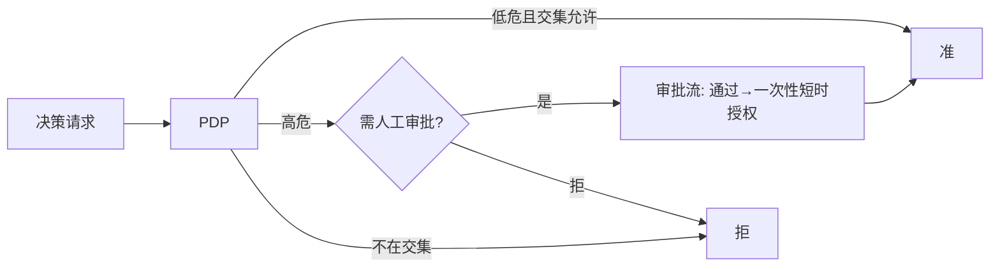
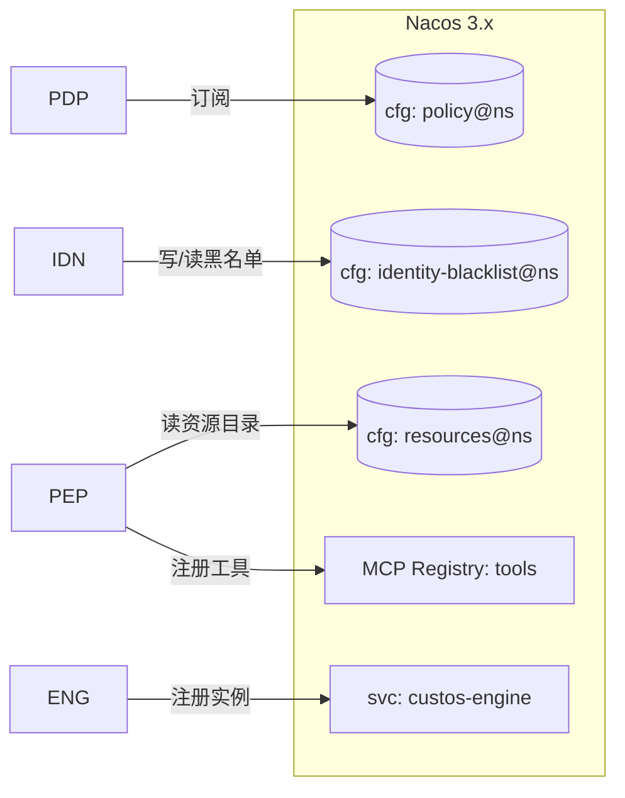
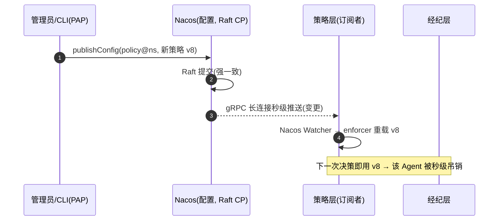

你正在 **refine** docs-cockpit module **M04 · 策略层（jCasbin RBAC + Nacos 秒级吊销）**(sprint v0.1)。

我已经写了这个 module 的 frontmatter + subtasks + linked docs · 现在需要你 **检查 anchor 精度** · 给出 YAML patch。

## 执行模式 · 二选一(先判断你是谁)

- **A · 你有文件编辑工具**(Claude Code / Cursor / Codex CLI · 即能用 Edit / Write 直接改本地文件):**直接动手** · 不要只输出 patch。优先 (1) 改 module MD 的 `## 待办` / `## 3 · 待办` body checklist 行 · 给每个 subtask 补 inline `@code:path[:lines]` 和 `@docs:path[#§N.M | :start-end]` annotation(parser 支持多次堆叠 · 见 plan §6.1)· 这是 diff 友好的首选;或 (2) 把 `subtasks:` 写进 frontmatter object schema · 给每个 subtask 显式 `code:` / `docs:` 字段。改完跑 `docs-cockpit build` 验证 anchor 落到 `state.json` 即可。**不要让用户复制粘贴 · Claude Code 的副驾价值就在不让人重复打字。**
- **B · 你没有文件编辑工具**(浏览器里的 ChatGPT / Claude.ai / 其它 web 端):输出 YAML patch · 用户会复制回 MD。

判断标准:如果你能调用 `Edit` / `Write` / `MultiEdit` 之类工具,就是 A;只能在 chat 框输出文本就是 B。

## 不要改的字段(out of scope)

- `id` · `title` · `sprint` · `status` · `progress` · `desc`
- subtask 的 `title` / `status` · 这些反映工作意图 · 不在 anchor 精度范畴

## 要 refine 的字段

- subtask 的 `code:` · 应该精确到 `path:start-end` 行号 · 不是 `directory/` 整目录
- subtask 的 `docs:` · 应该精确到 `path.md#§N.M` heading 或 `:start-end` 行号 · 不是整个 doc
- subtask 的 `docs:` · 检查是否漏了相关 plan / RFC 引用(`linked_docs` 列表里有但 subtask 没引用)

## 当前 module frontmatter

```yaml
id: M04
title: "策略层（jCasbin RBAC + Nacos 秒级吊销）"
status: done
sprint: "v0.1"
progress: 100
desc: "jCasbin RBAC 可解释 PDP（默认拒/deny 优先）· ControlPlane/Watcher 秒级吊销 · NacosControlPlane。4 单测全绿。"


subtasks:

  - id: M04-a9b43b
    title: "P4-T1 jCasbin RBAC 可解释 PDP"
    status: done


  - id: M04-67c13f
    title: "P4-T2 ControlPlane + PolicyWatcher 秒级吊销"
    status: done


  - id: M04-398be4
    title: "P4-T3 NacosControlPlane + 环境门控冒烟 IT"
    status: done


```

## 当前 linked docs(已 embed 摘要 · 完整 doc 在 repo)


### 策略层设计

`docs/design/04-authz-design.md`

# 04 · 策略层设计（AuthZ / PDP）

> **定位**：权限/系统权限管理——**RBAC + ABAC/PBAC**、**工具/动作级 scope（对齐 MCP SEP-835）**、**JIT + 人工审批**、**PDP/PEP 分离**、**可解释决策**。设计范式借 **Cerbos**（PDP 解耦 / Derived Roles+CEL / tracer 可解释 / Scopes），求值内核用 **jCasbin**（Apache-2.0，国产，Java 同栈），策略以 **Nacos 配置**承载实现秒级热更新。
>
> 前提：`00-synthesis.md`、`01`、`03`。

---

## 1. 设计取向：借 Cerbos 的"形"，用 jCasbin 的"魂"

| 维度 | 取自 Cerbos（设计） | 取自 jCasbin（落地） |
|---|---|---|
| 架构 | **PDP/PEP 解耦**、无状态 PDP | — |
| 模型 | Derived Roles + CEL 的结构化 ABAC 思路 | **PERM 元模型**承载 RBAC+ABAC |
| 可解释 | tracer：命中规则 + 原因 | 自研增强（jCasbin 默认弱） |
| 作用域 | Scopes 层级 | 对齐 Nacos namespace/group |
| 热更新 | 自身 loader | **Watcher → 自研 Nacos Watcher** |

> 一句话：**Custos PDP = jCasbin 求值内核 + Custos 服务壳（可解释 + Nacos 策略源 + 工具级 scope + JIT 审批）**。

---

## 2. 决策模型

### 2.1 决策请求（PDP 输入）
```
Decision Request {
  principal: { user, agent, scopes(来自 OBO 交集), risk },   // 来自身份层(03)
  resource:  { type, id, attrs, classification(分级) },
  action:    { tool, operation },                            // MCP 工具/动作
  context:   { time, ip, intent, env }
}
```

### 2.2 PERM 模型（jCasbin model.conf，Custos 定制）
```ini
[request_definition]
r = sub, agent, dom, obj, act, ctx
[policy_definition]
p = sub, agent, dom, obj, act, eft
[role_definition]
g = _, _, _          # 用户/Agent 角色继承(带 domain=namespace)
[policy_effect]
e = priority(p.eft) || deny     # 默认拒绝 + deny 优先（高危可显式 deny）
[matchers]
m = g(r.sub, p.sub, r.dom) && agentAllowed(r.agent, p.agent) \
    && keyMatch2(r.obj, p.obj) && actMatch(r.act, p.act) \
    && abac(r, p, r.ctx)        # ABAC/上下文（风险、分级、意图）
```
- **默认拒绝**（borrow OpenBao default-deny）；**deny 优先**（高危可硬禁）。
- `keyMatch2`/`globMatch` 承载**工具/动作级路径通配**（→ §3 SEP-835）。
- `abac()` 自定义函数：读 `ctx`（风险/分级/意图）做属性判定，等价 Cerbos 的 CEL 条件。

### 2.3 RBAC + ABAC + PBAC
- **RBAC**：用户/Agent ↔ 角色 ↔ 权限（带 domain=Nacos namespace 多租户）。
- **ABAC**：matcher 内按资源分级、风险分、上下文（时间/IP/意图）判定。
- **PBAC（策略）**：策略即 Nacos 配置，声明式、可版本、可热更。

---

## 3. 工具/动作级 scope（对齐 MCP SEP-835）

| 概念 | Custos 表达 |
|---|---|
| MCP 工具 | `obj = tool:<server>/<tool>`，如 `tool:db/query_orders` |
| 动作/操作 | `act = read|write|exec|...`（只读查询=read） |
| scope 通配 | jCasbin `keyMatch2`：`tool:db/*` 允许该 server 全部只读工具 |
| 与 OBO | 请求 scope = 用户∩Agent 交集（`03`），PDP 再按策略收窄 |

- SEP-835 的"工具级授权"= 把 MCP tool/action 映射为 PDP 的 obj/act，策略对其授权。
- 经纪层（PEP，`06`）把每次 MCP 工具调用转成一个 Decision Request 交 PDP。

---

## 4. 可解释决策（借 Cerbos tracer）

PDP 输出不只 allow/deny，而是结构化、可审计的解释：
```json
{
  "effect": "DENY",
  "matched_policy": "policy/db-readonly@v7",
  "matched_rule": "deny: action=write on classification=high",
  "reason": "Agent claude-prod 经用户 u123 请求 write，但策略仅允许 read；且资源分级=high 需审批",
  "obligations": ["require_human_approval"],   // 附加义务(JIT)
  "evaluated_at": "..."
}
```
- 决策与解释一并写入**哈希链审计**（`02` §11）。
- jCasbin 默认不给原因 → Custos 服务壳记录命中的 policy/rule 与求值轨迹补齐。

---

## 5. 资源分级 + Agent 自治等级 + JIT 人工审批

| 机制 | 设计 |
|---|---|
| **资源分级** | resource.classification：low/medium/high/critical（存 Nacos 资源目录） |
| **Agent 自治等级** | agent.autonomy：auto / confirm / approval —— 决定高危动作是否需人工 |
| **JIT + 人工审批** | PDP 对高危(分级×动作)返回 `effect=DENY/PENDING` + obligation `require_human_approval`；经纪层发起审批流（审批通过→签发一次性短 TTL 授权），全程审计 |



---

## 6. 策略存储与秒级热更新（与 `05` 联动）

| 项 | 设计 |
|---|---|
| 策略来源 | **Nacos 配置**（DataId=策略集，Raft CP 强一致） |
| 加载 | 自研 **Nacos Adapter**（jCasbin persist.Adapter 实现）从 Nacos 拉策略 |
| 热更新 | 自研 **Nacos Watcher**：监听配置变更（gRPC 长连接）→ 触发 enforcer 重载 → **秒级生效=秒级吊销** |
| 多租户 | domain=namespace；每 namespace 独立策略集 |

> 这是把 Casbin（无现成 Nacos Watcher）缝合到 Nacos 护城河的关键自研件。

---

## 7. 模块与接口（→ `08`）
```
authz/
  ├─ pdp/          # 决策入口(gRPC/内部 API), 可解释封装
  ├─ engine/       # jCasbin 封装: model + enforcer
  ├─ model/        # Custos PERM model.conf + scope/abac 自定义函数
  ├─ nacos/        # Adapter(策略源) + Watcher(热更新)
  ├─ approval/     # JIT 人工审批流
  └─ explain/      # tracer/决策解释 → 审计
```
| 接口 | 职责 |
|---|---|
| `Pdp.decide(DecisionRequest) → Decision(effect, explanation, obligations)` | 核心决策 |
| `PolicyAdapter`（jCasbin Adapter） | 从 Nacos 读策略 |
| `PolicyWatcher` | Nacos 变更 → 重载 |

---

## 8. 对 PRD 覆盖 + 待确认

| PRD | 覆盖 |
|---|---|
| A1 RBAC+ABAC/PBAC | §2 |
| A2 工具/动作级 scope（SEP-835） | §3 |
| A3 分级 + 自治等级 + JIT 审批 | §5 |
| A4 PDP/PEP 分离 + 可解释 | §1/§4 |

**待确认岔路口（已按推荐继续）**：
- 授权落地内核：**jCasbin（推荐，已在 `00` 钉死）** vs 自研 PERM vs 嵌 Cerbos——已选 jCasbin。
- 策略编写语言：**首版用 jCasbin policy(csv/行) + Custos 高层 YAML 包装**（向 Cerbos 风格靠拢）；若你更想直接用 Cerbos YAML 语义，可议。
- deny 优先 vs allow 优先：推荐 **默认拒绝 + deny 优先**（安全更稳）。

> **下一篇**：`05-nacos-integration.md`（注册 + 秒级吊销 + namespace + 服务发现）。


---

### Nacos 集成设计

`docs/design/05-nacos-integration.md`

# 05 · Nacos 控制面集成（差异化护城河）

> **定位**：Custos 把 Nacos 3.x 作控制面——**注册**（Agent/资源/策略/实例）、**配置热更新 = 秒级权限变更与吊销**、**namespace 隔离**、**服务发现**、**MCP/A2A 注册**。这是 Custos 区别于所有竞品的护城河。
>
> 源据：`../research/nacos.md`（源码佐证：`config/`、`consistency/`、`ai/`、`ai-registry-adaptor/`）。红线：**密钥绝不进 Nacos**。

---

## 1. 注册什么（N1）

| 注册对象 | 形态 | 一致性 | 说明 |
|---|---|---|---|
| **引擎/经纪/PDP 实例** | service instance（ephemeral） | Distro AP | 心跳保活，宕机自动摘除 |
| **Agent 身份 / 会话** | 配置 + 持久实例 | Raft CP | 可查询、可吊销（黑名单） |
| **受保护资源目录** | 配置（含分级 classification） | Raft CP | 资源→类型/动作/分级 |
| **权限策略** | 配置（DataId=策略集） | **Raft CP 强一致** | 策略不丢不脏（吊销可靠性基石） |
| **MCP 工具** | MCP/A2A Registry | — | 工具注册/发现/熔断 |



---

## 2. 配置热更新 = 秒级权限变更与吊销（N2，护城河核心）



| 要点 | 设计 |
|---|---|
| 传输 | Nacos 2.x+ **gRPC 长连接（9848）秒级推送**（非轮询） |
| 落地 | 自研 `PolicyWatcher`（jCasbin Adapter+Watcher，见 `04`）监听 → 重载 |
| 吊销路径 | ① 改策略；② 身份/会话黑名单（`identity-blacklist`）；③ 资源下线/工具熔断 → 全部秒级热推 |
| 可验证 | MVP 要端到端演示并测量"改策略→拒绝"延迟（PRD 吊销正确性 NFR）|

> **为何强一致重要**：策略走 Nacos **配置数据 = Raft/JRaft（CP）**，保证策略变更不丢不脏——吊销"说生效就生效、可验证"。

---

## 3. namespace / group 隔离（N3）

| 层 | 用途 |
|---|---|
| **Namespace（用 ID 引用）** | 环境（prod/test/dev）或团队/租户强隔离；对齐 `04` 的 domain |
| **Group** | 业务线/子系统逻辑分组 |
| 命名约定 | 策略 DataId：`custos-policy-<scope>.yaml`；资源：`custos-resources.yaml`；黑名单：`custos-identity-blacklist.yaml` |

- prod 独立 namespace + 独立账号 + 最小权限（借 `nacos.md` 最佳实践）。

---

## 4. 服务发现（N4）

- 引擎/经纪/PDP 注册为 service；组件间经服务名 + 客户端负载均衡发现调用。
- 实例 metadata 带版本/区域；可用权重做灰度（未来 AI 资产灰度底座）。

---

## 5. MCP / A2A Registry 集成

| 能力（源码：`ai/`、`ai-registry-adaptor/`）| Custos 用法 |
|---|---|
| MCP Server 动态注册（多 ns、版本） | 经纪层把受治理工具注册为 MCP（端口 9080） |
| 工具描述/参数热更新 | 运行时调整暴露面 |
| **工具动态开关（一键熔断）** | 高危工具秒级下线 = 运行时吊销（呼应 `04` JIT、PRD 秒级吊销）|
| A2A / agentspecs / skills | 后续：Agent 能力注册与发现对齐 Nacos AI 生态 |

---

## 6. 鉴权与安全边界

| 项 | 设计 |
|---|---|
| Nacos 鉴权 | 开启 `nacos.core.auth`；Custos 用独立账号 + 最小权限访问其 namespace |
| 端口 | 放通 8848 + **9848（gRPC，必需）**；MCP 9080（按需） |
| **红线** | **密钥/明文凭证绝不写入 Nacos**；只放策略/资源目录/黑名单等**非敏感**数据 |
| 降耦 | 抽象"控制面接口"（注册/订阅/热推），Nacos 为首选实现；但护城河定位 → **不可替换为其它注册中心**（PRD 硬约束） |

---

## 7. 模块与接口（→ `08`）
```
nacos/
  ├─ client/        # 封装 nacos-client / Spring Cloud Alibaba
  ├─ config/        # 策略/资源/黑名单 的发布与订阅
  ├─ watcher/       # 变更监听 → 回调 PDP/PEP 重载(秒级)
  ├─ discovery/     # 实例注册与发现
  └─ mcp/           # MCP/A2A Registry 注册与工具熔断
```

| 接口 | 职责 |
|---|---|
| `ControlPlane.publish/subscribe(dataId, ns)` | 配置发布/订阅 |
| `ControlPlane.onChange(cb)` | 秒级变更回调 |
| `ControlPlane.register/discover(service)` | 服务注册/发现 |
| `McpRegistry.registerTool / disableTool` | 工具注册/熔断 |

---

## 8. 对 PRD 覆盖 + 风险

| PRD | 覆盖 |
|---|---|
| N1 注册 | §1 |
| N2 秒级吊销 | §2 |
| N3 namespace 隔离 | §3 |
| N4 服务发现 | §4 |

| 风险 | 缓解 |
|---|---|
| Nacos 单点/可用性 | ≥3 节点集群 + 外置 MySQL；引擎本地缓存策略，Nacos 短暂不可用时按最后已知策略 fail-safe（高危默认拒）|
| 9848 未放通致推送失败 | 部署校验；监控长连接与推送成功率 |
| 强绑 Nacos | 抽象控制面接口（但护城河定位决定不可替换）|
| 版本兼容 | 锁定 Nacos 3.x；Spring Boot↔Cloud↔Alibaba 版本对齐（见 `08`）|

> **下一篇**：`06-secrets-broker.md`（动态凭证 + secretless 经纪 + 轮换）。


---

### 实现计划 4/5 · 策略 + Nacos

`docs/superpowers/plans/2026-06-09-custos-mvp-v0.1-authz-nacos.md`

# Custos MVP v0.1 — 策略层（jCasbin + Nacos 秒级吊销）Implementation Plan（计划 4/5）

> **For agentic workers:** REQUIRED SUB-SKILL: Use superpowers:subagent-driven-development (recommended) or superpowers:executing-plans to implement this plan task-by-task. Steps use checkbox (`- [ ]`) syntax for tracking.

**Goal:** 以 TDD 实现 MVP 策略层——jCasbin RBAC + 工具级 scope、默认拒绝/deny 优先、可解释决策（命中策略 + 原因），以及「策略变更 → Watcher 重载 → 决策即时翻转」的**秒级吊销**机制。

**Architecture:** 独立 `authz` 模块。jCasbin 承载 PERM 模型；`Pdp` 包一层产出可解释 `Decision`。策略源抽象为 `ControlPlane`（发布/订阅）：**吊销逻辑用内存 `ControlPlane` 做确定性单测**（快、无容器），真实 `NacosControlPlane`（nacos-client）单独实现并用环境变量门控的冒烟测试（在计划 5 的 docker-compose 环境跑）。

**Tech Stack:** Java 21 · org.casbin:jcasbin 1.55.0 · com.alibaba.nacos:nacos-client 2.3.2 · JUnit 5

> 前置：计划 1/5（父 POM）。对应 spec §3.8、§5(秒级吊销)、详设 `docs/design/04-authz-design.md`、`docs/design/05-nacos-integration.md` §2。

---

## File Structure

| 文件 | 职责 |
|---|---|
| `pom.xml` | 加 `authz` 到 modules |
| `authz/pom.xml` | jcasbin + nacos-client + JUnit |
| `authz/src/main/resources/custos-rbac-model.conf` | jCasbin PERM 模型 |
| `authz/src/main/java/io/custos/authz/DecisionRequest.java` | 决策请求 |
| `authz/src/main/java/io/custos/authz/Decision.java` | 决策结果（可解释）|
| `authz/src/main/java/io/custos/authz/Pdp.java` | PDP 接口 |
| `authz/src/main/java/io/custos/authz/CasbinPdp.java` | jCasbin 实现 + 策略重载 |
| `authz/src/main/java/io/custos/authz/ControlPlane.java` | 策略发布/订阅抽象 |
| `authz/src/main/java/io/custos/authz/InMemoryControlPlane.java` | 测试用内存实现 |
| `authz/src/main/java/io/custos/authz/PolicyWatcher.java` | 订阅变更 → 重载 |
| `authz/src/main/java/io/custos/authz/NacosControlPlane.java` | nacos-client 实现 |
| `authz/src/test/java/io/custos/authz/**` | 测试 |

---

## Task 1: authz 模块 + jCasbin RBAC 模型 + 可解释 PDP

**Files:**
- Modify: `pom.xml`（modules 加 `authz`）
- Create: `authz/pom.xml`
- Create: `authz/src/main/resources/custos-rbac-model.conf`
- Create: `authz/src/main/java/io/custos/authz/DecisionRequest.java`
- Create: `authz/src/main/java/io/custos/authz/Decision.java`
- Create: `authz/src/main/java/io/custos/authz/Pdp.java`
- Create: `authz/src/main/java/io/custos/authz/CasbinPdp.java`
- Test: `authz/src/test/java/io/custos/authz/CasbinPdpTest.java`

- [ ] **Step 1: modules 加 authz**

`pom.xml` 的 `<modules>`：
```xml
  <modules>
    <module>engine</module>
    <module>identity</module>
    <module>authz</module>
  </modules>
```

- [ ] **Step 2: authz POM**

`authz/pom.xml`:
```xml
<?xml version="1.0" encoding="UTF-8"?>
<project xmlns="http://maven.apache.org/POM/4.0.0"
         xmlns:xsi="http://www.w3.org/2001/XMLSchema-instance"
         xsi:schemaLocation="http://maven.apache.org/POM/4.0.0 http://maven.apache.org/xsd/maven-4.0.0.xsd">
  <modelVersion>4.0.0</modelVersion>
  <parent>
    <groupId>io.custos</groupId>
    <artifactId>custos-parent</artifactId>
    <version>0.1.0-SNAPSHOT</version>
  </parent>
  <artifactId>custos-authz</artifactId>
  <dependencies>
    <dependency>
      <groupId>org.casbin</groupId>
      <artifactId>jcasbin</artifactId>
      <version>1.55.0</version>
    </dependency>
    <dependency>
      <groupId>com.alibaba.nacos</groupId>
      <artifactId>nacos-client</artifactId>
      <version>2.3.2</version>
    </dependency>
    <dependency>
      <groupId>org.junit.jupiter</groupId>
      <artifactId>junit-jupiter</artifactId>
      <scope>test</scope>
    </dependency>
  </dependencies>
</project>
```

- [ ] **Step 3: jCasbin 模型（RBAC + 工具级 scope + deny 优先 + 默认拒绝）**

`authz/src/main/resources/custos-rbac-model.conf`:
```ini
[request_definition]
r = sub, obj, act

[policy_definition]
p = sub, obj, act, eft

[role_definition]
g = _, _

[policy_effect]
e = some(where (p.eft == allow)) && !some(where (p.eft == deny))

[matchers]
m = g(r.sub, p.sub) && keyMatch2(r.obj, p.obj) && (r.act == p.act || p.act == "*")
```

- [ ] **Step 4: 写失败测试（准/拒 + 可解释 + 默认拒绝）**

`authz/src/test/java/io/custos/authz/CasbinPdpTest.java`:
```java
package io.custos.authz;

import org.junit.jupiter.api.Test;

import static org.junit.jupiter.api.Assertions.*;

class CasbinPdpTest {

    // CSV 策略文本：reader 角色可只读 db 工具；claude-prod 属于 reader
    private static final String POLICY = """
            p, role:reader, tool:db/*, read, allow
            p, role:reader, tool:db/*, write, deny
            g, agent:claude-prod, role:reader
            """;

    private CasbinPdp pdp() {
        CasbinPdp pdp = new CasbinPdp();
        pdp.reload(POLICY);
        return pdp;
    }

    @Test
    void allowsReadForGrantedAgent() {
        Decision d = pdp().decide(new DecisionRequest("agent:claude-prod", "tool:db/query_orders", "read"));
        assertTrue(d.allowed());
        assertFalse(d.matchedPolicies().isEmpty(), "应给出命中策略");
    }

    @Test
    void deniesWriteEvenForGrantedAgent() {
        Decision d = pdp().decide(new DecisionRequest("agent:claude-prod", "tool:db/query_orders", "write"));
        assertFalse(d.allowed());
        assertNotNull(d.reason());
    }

    @Test
    v
… [truncated · 19836 chars total]

---


## Repo 根路径
`D:\harvey_work\custos`
当前分支:`main`


## 你的任务

1. **读 linked docs 的内容** · 理解每个 plan / RFC 的章节布局
2. **对每个 subtask** · 判断它在做什么 · 然后:
   - 找出 plan / RFC 里对应的具体 section(`#§N.M` heading slug 或 `:start-end` 行号)
   - 找出 repo 里对应的代码 file + 行号(如果 code 已经存在;新代码留 `code: <path>` 不带行号)
3. **按上面「执行模式」分支落地**:
   - **模式 A**:直接 Edit MD body checklist · 每行末尾追加 ` @code:path[:lines]` 和 ` @docs:path[#§N.M | :start-end]`(多个就堆叠空格分隔)· 完事跑 `docs-cockpit build` · 检查 `docs/state.json` 里对应 subtask 的 `code` / `docs` 字段。报告简短:每个 subtask 改了什么 + build 是否干净。
   - **模式 B**:输出下面格式的 YAML patch 给用户复制:

```yaml
subtasks:
  - id: <现有 subtask id>
    code: "<更精确的 code anchor · 或 list>"
    docs: ["<更精确的 docs anchor>", ...]
```

如果某个 subtask 在 linked docs 里找不到对应 section · 模式 A 留 `# TODO: ...` 注释行不写 anchor · 模式 B 在 patch 里输出 `# TODO: ...` 注释行 · **不要瞎猜 anchor**(driver-seat 信任来自精度 · 错 anchor 比缺 anchor 伤害更大)。
