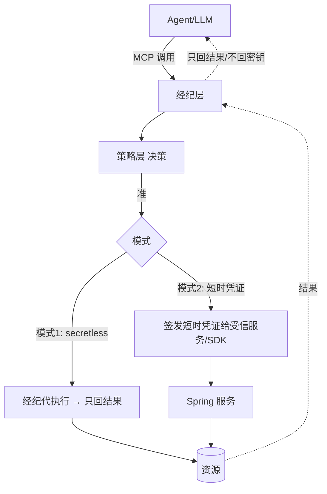
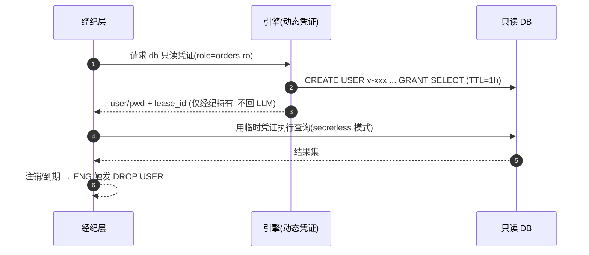

你正在 **refine** docs-cockpit module **M05 · 经纪层 + MCP + docker-compose demo**(sprint v0.1)。

我已经写了这个 module 的 frontmatter + subtasks + linked docs · 现在需要你 **检查 anchor 精度** · 给出 YAML patch。

## 执行模式 · 二选一(先判断你是谁)

- **A · 你有文件编辑工具**(Claude Code / Cursor / Codex CLI · 即能用 Edit / Write 直接改本地文件):**直接动手** · 不要只输出 patch。优先 (1) 改 module MD 的 `## 待办` / `## 3 · 待办` body checklist 行 · 给每个 subtask 补 inline `@code:path[:lines]` 和 `@docs:path[#§N.M | :start-end]` annotation(parser 支持多次堆叠 · 见 plan §6.1)· 这是 diff 友好的首选;或 (2) 把 `subtasks:` 写进 frontmatter object schema · 给每个 subtask 显式 `code:` / `docs:` 字段。改完跑 `docs-cockpit build` 验证 anchor 落到 `state.json` 即可。**不要让用户复制粘贴 · Claude Code 的副驾价值就在不让人重复打字。**
- **B · 你没有文件编辑工具**(浏览器里的 ChatGPT / Claude.ai / 其它 web 端):输出 YAML patch · 用户会复制回 MD。

判断标准:如果你能调用 `Edit` / `Write` / `MultiEdit` 之类工具,就是 A;只能在 chat 框输出文本就是 B。

## 不要改的字段(out of scope)

- `id` · `title` · `sprint` · `status` · `progress` · `desc`
- subtask 的 `title` / `status` · 这些反映工作意图 · 不在 anchor 精度范畴

## 要 refine 的字段

- subtask 的 `code:` · 应该精确到 `path:start-end` 行号 · 不是 `directory/` 整目录
- subtask 的 `docs:` · 应该精确到 `path.md#§N.M` heading 或 `:start-end` 行号 · 不是整个 doc
- subtask 的 `docs:` · 检查是否漏了相关 plan / RFC 引用(`linked_docs` 列表里有但 subtask 没引用)

## 当前 module frontmatter

```yaml
id: M05
title: "经纪层 + MCP + docker-compose demo"
status: done
sprint: "v0.1"
progress: 100
desc: "secretless 只读执行 · PEP 编排(verify→decide→issue→execute→revoke) · MCP query_db · Spring Boot 装配 · compose + AC1–AC8 runbook。4 IT 全绿。"


subtasks:

  - id: M05-c84c3d
    title: "P5-T1 SecretlessQueryExecutor 只读执行（IT）"
    status: done


  - id: M05-f49377
    title: "P5-T2 BrokerService PEP 编排（IT）"
    status: done


  - id: M05-0cb738
    title: "P5-T3 MCP query_db + Spring Boot app + docker-compose"
    status: done


  - id: M05-787b06
    title: "P5-T4 端到端 demo runbook（AC1–AC8）"
    status: done


```

## 当前 linked docs(已 embed 摘要 · 完整 doc 在 repo)


### 经纪层设计

`docs/design/06-secrets-broker.md`

# 06 · 经纪层设计（Secrets Broker / PEP）

> **定位**：经纪层是 PEP（执行点）——**动态 DB 凭证**、**secretless 经纪（MCP-native，密钥不进 LLM）**、**KV/AK-SK 轮换**。设计灵感：OpenBao/Vault 动态凭证与 Lease、Vault Transit「操作不暴露密钥」、Infisical「agents never see the secret」方向（均借思想不抄码）。
>
> 前提：`01`、`02`（引擎/租约）、`03`（身份）、`04`（决策）、`05`（吊销）。**铁律：密钥不进 LLM 上下文。**

---

## 1. 经纪层职责

| 职责 | 说明 |
|---|---|
| MCP-native 暴露 | 把"受治理工具"做成 MCP server/tool，Claude/Codex 标准接入（IF1） |
| 决策执行（PEP） | 每次工具调用 → 组装 Decision Request 调 PDP（`04`）→ 准则执行 |
| 动态凭证签发 | 调引擎现场签发短时只读凭证（S1） |
| **secretless 执行** | 经纪代执行、**只回结果**，凭证不返回 LLM（S2） |
| 轮换 | KV/AK-SK 签发与定期轮换（S3） |
| SDK 取凭证 | Spring 服务经 SDK 直取动态凭证、随租约续期/失效（S4） |

---

## 2. 两种经纪模式



| 模式 | 适用 | 密钥可见性 |
|---|---|---|
| **① secretless 经纪**（默认，对 LLM） | Claude/Codex 经 MCP 查库/调系统 | **Agent 永不见密钥**（最彻底，满足红线）|
| **② 短时凭证下发**（对受信服务） | Spring 服务/SDK 程序化取凭证 | 受信服务拿到带 TTL 的凭证（非 LLM）|

---

## 3. 动态 DB 只读凭证（S1）

借 OpenBao database engine 思路，自研实现：

| 项 | 设计 |
|---|---|
| 角色定义 | `creation_statements`（CREATE USER + GRANT SELECT）、`revocation_statements`（DROP USER）、`default_ttl=1h`、`max_ttl=4h`（PRD S1） |
| 签发 | 引擎现场连库建临时只读账号，登记 **lease**（`02` 租约） |
| 撤销 | 租约到期/主动吊销 → 执行 revocation（DROP USER）；与 `05` 秒级吊销联动 |
| 最小权限 | 只读、限库表（最小只读权限，合规 NFR） |



---

## 4. secretless 经纪（S2，密钥不进 LLM 的关键）

| 机制 | 设计 |
|---|---|
| 调用面 | LLM 只发"意图 + 参数"（如 query_orders(date=today)），**不接触连接串/密码** |
| 执行 | 经纪在 LLM 上下文之外取凭证、连资源、执行，**只把结果回给 LLM** |
| 结果脱敏 | 可选：对结果做字段级脱敏/行级过滤（结合 `04` 决策义务） |
| 审计 | 记录 user+agent+task+SQL摘要+决策（哈希链，`02`）；不记明文凭证 |
| 防注入 | 工具参数 schema 校验；只读语句白名单/解析，防 SQL 注入与越权语句 |

> 这是对 PRD 红线「密钥绝不进 LLM 上下文」的直接实现，也是相对 Vault（凭证仍到手）的差异化。

---

## 5. KV 与 AK/SK 轮换（S3）+ SDK 取凭证（S4）

| 能力 | 设计 |
|---|---|
| **KV 密钥** | 引擎 KV engine（Barrier 加密存储），按需读取（受 PDP 授权） |
| **AK/SK 签发 + 轮换** | 定期轮换静态云凭证；新旧并存过渡窗口；轮换事件审计 |
| **Spring SDK（S4）** | Spring Boot Starter：注解/配置取动态凭证，随租约自动续期/失效（借 Spring Cloud Vault 体验，自研实现）；凭证注入 DataSource，不落配置文件 |

```yaml
# 示意：业务服务用 Custos Starter 取动态只读库凭证
custos:
  broker:
    db:
      role: orders-ro
      auto-renew: true     # 随租约续期；失效自动重取
```

---

## 6. 与各层协作

| 协作 | 说明 |
|---|---|
| ← 身份层(`03`) | 携带 OBO 作用域令牌（user∩agent） |
| ← 策略层(`04`) | 每次调用先决策；高危走 JIT 审批；决策义务（脱敏/审批）在此执行 |
| ← 引擎(`02`) | 签发凭证 + 租约 + 审计；密钥内存清零 |
| ← Nacos(`05`) | 工具注册/熔断；吊销秒级生效 |

---

## 7. 模块与接口（→ `08`）
```
broker/
  ├─ mcp/           # MCP server/tool 暴露(IF1)
  ├─ pep/           # 决策执行: 调 PDP, 执行义务
  ├─ secretless/    # 代执行引擎(db/http/...), 只回结果
  ├─ creds/         # 动态凭证签发(调 engine), 租约管理
  ├─ rotate/        # KV/AK-SK 轮换
  └─ sdk-bridge/    # 给 Spring Starter 的取凭证接口
```
| 接口 | 职责 |
|---|---|
| `Tool.invoke(intent, params, token) → Result` | MCP 工具调用（secretless）|
| `Broker.issueCreds(role, token) → LeasedCred` | 短时凭证（受信服务）|
| `Rotator.rotate(secretRef)` | 轮换 |

---

## 8. 对 PRD 覆盖 + 待确认

| PRD | 覆盖 |
|---|---|
| S1 动态 DB 只读 1h/4h | §3 |
| S2 secretless 经纪 | §4 |
| S3 KV/AK-SK 轮换 | §5 |
| S4 Spring SDK 取凭证 | §5 |
| IF1 MCP-native | §1/§2 |

**待确认（已按推荐继续）**：
- 首版资源类型：推荐**只 MySQL 只读 DB engine**（一条纵向线），HTTP/内部系统经纪与 AK/SK 放 v0.2。
- secretless 结果脱敏：首版**可选、默认关**，由策略义务驱动。

> **下一篇**：`07-mvp-vertical-slice.md`（纵向线 → 模块 + WBS + 验收）。


---

### MVP 纵向线

`docs/design/07-mvp-vertical-slice.md`

# 07 · MVP 纵向线（v0.1）模块清单 + WBS + 验收

> **定位**：把 PRD §7 的一条端到端纵向线落成**可实现的模块清单 + 工作分解（WBS）+ 验收标准**。目标：用最薄链路证明「身份 + 权限 + 密钥 + Nacos 秒级吊销」四件事，且**密钥不进 LLM**。
>
> 前提：`01`~`06`。

---

## 1. MVP 目标与演示链路（复述 PRD §7）

1. Claude/Codex 代表某用户，请求查询一个**只读数据库**。
2. Custos 签发该 Agent 的 **per-task 身份（JWT）**。
3. 策略层（策略存 **Nacos**）校验 Agent ∩ 用户 ∩ 资源 ∩ 风险 → **准/拒并给原因**。
4. 经纪层用自研引擎现场签发 **1h 只读 DB 凭证**，**secretless 执行查询、只回结果**。
5. 全程**审计留痕**（Agent+用户+任务+SQL 摘要，哈希链）。
6. 在 Nacos 改策略 → 该 Agent 访问**秒级被吊销**（可演示的对 Vault 的优势）。

**v0.1 引擎最小集**：Barrier 加密 + Shamir 解封 + MySQL 存储 + 动态 DB engine + 租约/撤销 + 哈希链审计；认证 JWT；策略基础 RBAC（存 Nacos）；MCP-native 经纪。

---

## 2. MVP 范围裁剪（做什么 / 不做什么）

| 纳入 v0.1 | 推迟（v0.2+） |
|---|---|
| Barrier(AES-256-GCM) + Shamir 解封 + MySQL 存储 | KMS 自动解封、国密套件实测、Raft HA |
| 动态 MySQL 只读凭证(1h/4h) + 租约/撤销 | AK/SK engine、KV、HTTP/内部系统经纪 |
| JWT 认证 + per-session 身份 | OBO 完整委托链、SPIFFE、mTLS（v0.2 OBO）|
| 基础 RBAC（策略存 Nacos）+ 可解释准/拒 | 完整 ABAC/风险分级、JIT 人工审批（v0.2）|
| Nacos 策略热更新 = 秒级吊销 | namespace 多租户全特性、MCP A2A |
| 哈希链审计 + 导出 | 完整 SIEM 对接、签名 checkpoint |
| MCP-native 经纪 secretless 查询 | Spring Starter 完整、CLI 完整 |
| 单节点 | HA / 强一致 |

---

## 3. 模块清单（映射到仓库目录）

| 模块 | v0.1 交付内容 | 依赖文档 |
|---|---|---|
| `engine/barrier` | AES-256-GCM Barrier（CipherSuite 抽象，仅 Intl 套件落地） | `02` |
| `engine/seal` | Shamir 解封（5/3）+ 启动 sealed + 一键 seal；KMS 接口留桩 | `02` |
| `engine/storage` | 存储抽象 + MySQL 实现（全密文） | `02` |
| `engine/lease` | Expiration Manager：TTL/续约/撤销/前缀 | `02` |
| `engine/audit` | 哈希链审计 + `verify` + 导出 | `02` |
| `identity` | JWT 认证 + per-session 令牌签发/校验 + Nacos 注册 | `03` |
| `authz` | jCasbin 基础 RBAC + Nacos Adapter/Watcher + 可解释准/拒 | `04` |
| `broker` | MCP server + secretless 查询 + 调引擎签发动态凭证 | `06` |
| `nacos` | 配置发布/订阅 + 秒级变更回调 + 实例注册 | `05` |
| `examples` | docker-compose（Nacos+MySQL+Custos）+ demo 脚本 + MCP 客户端样例 | — |
| `cli`（最小） | `custos operator unseal` / `policy put` / `audit verify` | — |

---

## 4. WBS（工作分解）


| WBS | 任务 | 产出 | 依赖 |
|---|---|---|---|
| **0.1** 脚手架 | 多模块工程 + 构建 + CI（见 `08`） | 可构建骨架 | — |
| **0.2** CipherSuite | Intl 套件（AES-GCM/SHA-256/ECDSA）封装 BC | 加解密/签名可用 | `02` |
| **1.1** Barrier | 落盘前加密 + 格式(suite/版本/nonce) | 密文读写 | 0.2 |
| **1.2** Seal/Unseal | Shamir 5/3 + sealed 启动 | 解封流程 | 1.1 |
| **1.3** Storage(MySQL) | 存储抽象 + MySQL 全密文 | 持久化 | 1.1 |
| **1.4** Audit 哈希链 | 链式记录 + verify + 导出 | 防篡改审计 | 1.3 |
| **2.1** Lease | TTL/续约/撤销/到期回调 | 租约 | 1.3 |
| **2.2** 动态 DB engine | creation/revocation statements + 现场建/销账号 | 1h 只读凭证 | 2.1 |
| **3.1** 身份 JWT | 认证 + per-session 签发/校验 | 令牌 | 0.2 |
| **3.2** 经纪 secretless | MCP server + 代执行只回结果 | secretless 查询 | 2.2,3.1 |
| **4.1** Nacos 集成 | 配置发布/订阅 + 实例注册 | 控制面 | 0.1 |
| **4.2** 策略 RBAC | jCasbin + Nacos Adapter + 可解释准/拒 | 决策 | 4.1 |
| **5.1** 秒级吊销 | Nacos Watcher → enforcer 重载 + 端到端延迟测 | 吊销 | 4.2 |
| **5.2** 审计闭环 | 决策+访问全留痕 + 导出验证 | 审计 | 1.4,4.2 |
| **6.1** demo 编排 | docker-compose + 演示脚本 + 文档 | 可演示 | 全部 |

---

## 5. 验收标准（可测、对应演示链路）

| # | 验收项 | 通过标准 |
|---|---|---|
| AC1 | 引擎解封 | 启动 sealed；提供 3/5 Shamil 分片后 unsealed；缺片不可用 |
| AC2 | 落盘加密 | 直接读 MySQL 存储均为密文；改一字节 → 读取报完整性失败 |
| AC3 | 动态凭证 | 请求得 1h 只读账号；到期/吊销后该账号在 DB 被 DROP，无法再连 |
| AC4 | secretless | 全链路抓包/日志：**LLM 侧从不出现连接串/密码**，只见结果 |
| AC5 | 决策可解释 | 准/拒均返回命中策略 + 原因；拒绝可读 |
| AC6 | **秒级吊销** | 在 Nacos 改策略后，**≤ 数秒内**该 Agent 被拒（测量并记录 P95 延迟）|
| AC7 | 审计防篡改 | `custos audit verify` 通过；手工改一条历史 → verify 定位断链 |
| AC8 | demo 一键起 | `docker-compose up` 起 Nacos+MySQL+Custos，跑通演示脚本 |

> **MVP 成功定义**：演示链路全通，**AC6 秒级吊销可现场演示**（对 Vault 的可见优势），且 AC4 证明密钥不进 LLM。

---

## 6. 风险与缓解（MVP 局部）

| 风险 | 缓解 |
|---|---|
| 自研引擎缺陷 | 用 BC 库；1.x 里程碑加密/解封/审计单测 + 模糊测试；不赶进度跳安全 |
| Java 内存安全 | byte[] 清零 + mlock（`02` §8）；MVP 即落地基本内存卫生 |
| 秒级吊销不稳定 | 端到端延迟测试 + fail-safe（Nacos 不可用按最后策略，高危默认拒）|
| 范围蔓延 | 严格按 §2 裁剪，超出项进 v0.2 |

> **下一篇**：`08-repo-scaffold.md`（目录结构 / 选型 / 引擎语言 Java vs Go 论证 / CI / 依赖清单）。


---

### 实现计划 5/5 · 经纪 + MCP + demo

`docs/superpowers/plans/2026-06-09-custos-mvp-v0.1-broker-demo.md`

# Custos MVP v0.1 — 经纪层 + MCP + Demo Implementation Plan（计划 5/5）

> **For agentic workers:** REQUIRED SUB-SKILL: Use superpowers:subagent-driven-development (recommended) or superpowers:executing-plans to implement this plan task-by-task. Steps use checkbox (`- [ ]`) syntax for tracking.

**Goal:** 以 TDD 实现经纪层（PEP）——secretless 只读查询执行、`身份校验→PDP决策→签发动态凭证→执行→审计` 编排，并以 MCP server 暴露 `query_db` 工具；最后用 docker-compose（Nacos+MySQL+Custos）串起端到端 demo，验收 AC1–AC8。

**Architecture:** 独立 `broker` 模块依赖 engine/identity/authz。`SecretlessQueryExecutor` 用临时凭证执行只读查询、**只回行数据、绝不回凭证**。`BrokerService` 编排各层。MCP 暴露用 MCP Java SDK 的同步 server。`custos-app`（Spring Boot）装配并接 Nacos/MySQL。

**Tech Stack:** Java 21 · Spring Boot 3.x · MCP Java SDK · Testcontainers · docker-compose · JUnit 5

> 前置：计划 1–4 全部完成。对应 spec §3.9、§5、§9（AC）、详设 `docs/design/06-secrets-broker.md`、`docs/design/01` §4、`docs/design/07`。**铁律：密钥不进 LLM——返回结果绝不含凭证。**

---

## File Structure

| 文件 | 职责 |
|---|---|
| `pom.xml` | 加 `broker`、`app` 到 modules |
| `broker/pom.xml` | 依赖 engine/identity/authz + MCP SDK |
| `broker/src/main/java/io/custos/broker/QueryIntent.java` | 查询意图（工具 + 只读 SQL）|
| `broker/src/main/java/io/custos/broker/QueryResult.java` | 结果（行数据 / 拒绝原因；**无凭证**）|
| `broker/src/main/java/io/custos/broker/SecretlessQueryExecutor.java` | 用临时凭证执行只读查询 |
| `broker/src/main/java/io/custos/broker/BrokerService.java` | 编排 PEP |
| `broker/src/main/java/io/custos/broker/McpQueryToolServer.java` | MCP 暴露 query_db |
| `app/pom.xml`、`app/src/main/java/io/custos/app/CustosApplication.java`、`app/src/main/resources/application.yml` | Spring Boot 装配 |
| `examples/docker-compose.yml`、`examples/init/schema.sql`、`examples/demo.md` | demo 编排与 runbook |
| `broker/src/test/java/io/custos/broker/**` | 测试（Testcontainers）|

---

## Task 1: SecretlessQueryExecutor（只读执行，绝不回凭证）

**Files:**
- Modify: `pom.xml`（modules 加 `broker`）
- Create: `broker/pom.xml`
- Create: `broker/src/main/java/io/custos/broker/QueryIntent.java`
- Create: `broker/src/main/java/io/custos/broker/QueryResult.java`
- Create: `broker/src/main/java/io/custos/broker/SecretlessQueryExecutor.java`
- Test: `broker/src/test/java/io/custos/broker/SecretlessQueryExecutorIT.java`

- [ ] **Step 1: modules 加 broker；写 broker POM**

`pom.xml` 的 `<modules>` 追加 `<module>broker</module>`。

`broker/pom.xml`:
```xml
<?xml version="1.0" encoding="UTF-8"?>
<project xmlns="http://maven.apache.org/POM/4.0.0"
         xmlns:xsi="http://www.w3.org/2001/XMLSchema-instance"
         xsi:schemaLocation="http://maven.apache.org/POM/4.0.0 http://maven.apache.org/xsd/maven-4.0.0.xsd">
  <modelVersion>4.0.0</modelVersion>
  <parent>
    <groupId>io.custos</groupId>
    <artifactId>custos-parent</artifactId>
    <version>0.1.0-SNAPSHOT</version>
  </parent>
  <artifactId>custos-broker</artifactId>
  <dependencies>
    <dependency><groupId>io.custos</groupId><artifactId>custos-engine</artifactId><version>0.1.0-SNAPSHOT</version></dependency>
    <dependency><groupId>io.custos</groupId><artifactId>custos-identity</artifactId><version>0.1.0-SNAPSHOT</version></dependency>
    <dependency><groupId>io.custos</groupId><artifactId>custos-authz</artifactId><version>0.1.0-SNAPSHOT</version></dependency>
    <dependency>
      <groupId>io.modelcontextprotocol.sdk</groupId>
      <artifactId>mcp-core</artifactId>
      <!-- 注：MCP Java SDK 稳定 GA 为 1.1.3；2.0 尚处 RC（Maven Central 最新=2.0.0-RC1）。
           本计划用 2.0 新 API（已对照源码核准），故 pin RC1；GA 发布后改为 2.0.0。
           若团队只用稳定 GA，可改 1.1.3——其 tool 注册 API 与 2.0 略有差异，需按 1.x 调整。 -->
      <version>2.0.0-RC1</version>
    </dependency>
    <dependency>
      <groupId>io.modelcontextprotocol.sdk</groupId>
      <artifactId>mcp-json-jackson2</artifactId>
      <version>2.0.0-RC1</version>
    </dependency>
    <dependency><groupId>com.mysql</groupId><artifactId>mysql-connector-j</artifactId><version>8.4.0</version></dependency>
    <dependency><groupId>org.testcontainers</groupId><artifactId>mysql</artifactId><version>1.19.8</version><scope>test</scope></dependency>
    <dependency><groupId>org.testcontainers</groupId><artifactId>junit-jupiter</artifactId><version>1.19.8</version><scope>test</scope></dependency>
    <dependency><groupId>org.junit.jupiter</groupId><artifactId>junit-jupiter</artifactId><scope>test</scope></dependency>
  </dependencies>
</project>
```

- [ ] **Step 2: 写失败测试（只读查询返回行；拒绝非 SELECT；结果不含凭证）**

`broker/src/test/java/io/custos/broker/SecretlessQueryExecutorIT.java`:
```java
package io.custos.broker;

import io.custos.engine.secrets.IssuedCred;
import org.junit.jupiter.api.*;
import org.testcontainers.containers.MySQLContainer;
import org.testcontainers.junit.jupiter.Container;
import org.testcontainers.junit.jupiter.Testcontainers;

import java.sql.Connection;
import java.sql.DriverManager;
import java.sql.Statement;
import java.util.List;
import java.util.Map;

import static org.junit.jupiter.api.Assertions.*;

@Testcontainers
class SecretlessQueryExecutorIT {

    @Container
    static final MySQLContainer<?
… [truncated · 26739 chars total]

---

### Demo Runbook（AC1–AC8）

`examples/demo.md`

# Custos MVP v0.1 Demo Runbook

> 端到端演示与验收 AC1–AC8 的可执行步骤。`custos` CLI 即 `custos-cli` 模块（picocli），打 host 的 REST admin；
> 也可直接用 `curl`。核心能力（密文存储、解封、动态凭证、secretless、哈希链审计、jCasbin 决策、Nacos 秒级吊销）
> 均已在各模块单测/集成测试（含 `HostEndToEndIT`）中验证。

## 启动

```bash
docker compose -f examples/docker-compose.yml up -d --build
# 等 mysql/nacos/custos healthy；admin token = demo-token（见 compose）
export TOKEN=demo-token
```

CLI 构建：`mvn -pl cli -am -DskipTests package`，入口 `io.custos.cli.CustosCli`（或 `java -jar cli/target/custos-cli-*.jar`）。

## 1. 解封引擎（AC1）

```bash
# init 一次，记下 5 个 base64 分片；提交其中 3 个解封
custos --token $TOKEN operator init --shares 5 --threshold 3   # {"shares":["...","...",...]}（仅此一次）
custos --token $TOKEN operator unseal <share1>
custos --token $TOKEN operator unseal <share2>
custos --token $TOKEN operator unseal <share3>
custos --token $TOKEN operator status                          # {"sealed":false,...}
# 等价 curl：
# curl -s -XPOST localhost:8080/operator/init -H "Authorization: Bearer $TOKEN" -H 'Content-Type: application/json' -d '{"shares":5,"threshold":3}'
```

**通过标准**：缺片时 status 仍 sealed（progress<3）且查询被拒；满 3 片后 unsealed。
（实现/测试：`OperatorService` + `HostEndToEndIT`：init 后 sealed、满 3 片解封并装配运营组件。）

## 2. 写策略到 Nacos（允许 claude-prod 只读）

```bash
custos --token $TOKEN policy --content 'p, role:reader, default, tool:db/*, read, allow
g, agent:claude-prod, role:reader, default'
```
> 策略含 `dom` 列（=Nacos namespace，多租户隔离）；单租户演示用 `default`。

## 3. Agent 经 MCP / REST 查询（AC3/AC4/AC5）

- **MCP**：MCP 客户端（Claude/Codex）以 stdio 启动 custos-broker（`custos.transport.mcp-stdio=true` 且已解封），调用
  `query_db { tool:"db/query_orders", schema:"appdb", sql:"SELECT COUNT(*) AS n FROM appdb.orders", userToken:"<JWT>" }`。
- **REST**（等价，便于演示）：
```bash
curl -s -XPOST localhost:8080/query_db -H 'Content-Type: application/json' \
  -d '{"tool":"db/query_orders","schema":"appdb","sql":"SELECT COUNT(*) AS n FROM appdb.orders","userToken":"<JWT>"}'
# 期望 {"allowed":true,"rows":[{"n":3}],...}
```
- **CLI**（等价）：
```bash
custos query --tool db/query_orders --schema appdb --sql "SELECT COUNT(*) AS n FROM appdb.orders" --user-token <JWT>
# 一键重新密封（admin）：custos --token $TOKEN operator seal
```

**验收**：
- AC3 动态凭证：查询期间 MySQL 出现临时 `v_ro_*` 只读账号，查询后被 DROP（`SELECT user FROM mysql.user` 验证）。由 `DynamicDbCredentialsIT` 覆盖。
- AC4 secretless：抓 MCP/REST 往返报文，**无连接串/密码**，只见结果。由 `BrokerServiceIT`/`HostEndToEndIT` 断言结果不含 `v_ro_`/`password`。
- AC5 可解释：被拒时返回命中策略 + 原因。由 `CasbinPdpTest` 覆盖。

## 4. 秒级吊销（AC6）

```bash
# 改策略为拒绝，计时到下一次查询被拒
time custos --token $TOKEN policy --content 'p, role:reader, default, tool:db/*, read, deny
g, agent:claude-prod, role:reader, default'
# 立即重发 query_db → 期望 {"allowed":false,...}；记录从改策略到被拒的延迟（应 ≤ 数秒）
```

**通过标准**：AC6 延迟 ≤ 数秒（记录 P95）。逻辑由 `RevocationViaWatcherTest`（内存控制面，毫秒级翻转）验证；
真实 Nacos 推送由 `NacosControlPlaneSmokeIT` 在本 stack 起来后验证（见末尾）。

## 5. 审计防篡改（AC7）

```bash
custos --token $TOKEN audit verify                 # {"ok":true,...}
# 手工改一条历史：UPDATE custos_audit SET action='write' WHERE seq=1;
custos --token $TOKEN audit verify                 # {"ok":false,"brokenAtSeq":1}
```

（实现/测试：`HashChainAuditLog` + `HashChainAuditLogIT`，已验证篡改即断链并定位 seq。）

## 6. 落盘加密（AC2）

```bash
docker exec -it <mysql> mysql -uroot -prootpwd -e "SELECT HEX(svalue) FROM custos.custos_storage LIMIT 1"
```

**通过标准**：均为密文；改一字节后读取报完整性失败。（`JimmerStorageIT` 断言落盘密文、`IntlSuiteAeadTest` 验证 GCM tag 篡改即 IntegrityException。）

## 7. 一键起（AC8）

`docker compose up` 起 Nacos+MySQL+Custos，按上述脚本跑通即 AC8 通过。

## 附：验证真实 Nacos 秒级推送（计划 4 的环境门控 IT）

stack 起来后，本地对着 compose 暴露的 Nacos 跑：

```bash
NACOS_ADDR=127.0.0.1:8848 mvn -q -pl authz test -Dtest=NacosControlPlaneSmokeIT
```

期望 PASS（publish→get→subscribe 收到秒级变更推送）。无 `NACOS_ADDR` 时该 IT 自动跳过。


---


## Repo 根路径
`D:\harvey_work\custos`
当前分支:`main`


## 你的任务

1. **读 linked docs 的内容** · 理解每个 plan / RFC 的章节布局
2. **对每个 subtask** · 判断它在做什么 · 然后:
   - 找出 plan / RFC 里对应的具体 section(`#§N.M` heading slug 或 `:start-end` 行号)
   - 找出 repo 里对应的代码 file + 行号(如果 code 已经存在;新代码留 `code: <path>` 不带行号)
3. **按上面「执行模式」分支落地**:
   - **模式 A**:直接 Edit MD body checklist · 每行末尾追加 ` @code:path[:lines]` 和 ` @docs:path[#§N.M | :start-end]`(多个就堆叠空格分隔)· 完事跑 `docs-cockpit build` · 检查 `docs/state.json` 里对应 subtask 的 `code` / `docs` 字段。报告简短:每个 subtask 改了什么 + build 是否干净。
   - **模式 B**:输出下面格式的 YAML patch 给用户复制:

```yaml
subtasks:
  - id: <现有 subtask id>
    code: "<更精确的 code anchor · 或 list>"
    docs: ["<更精确的 docs anchor>", ...]
```

如果某个 subtask 在 linked docs 里找不到对应 section · 模式 A 留 `# TODO: ...` 注释行不写 anchor · 模式 B 在 patch 里输出 `# TODO: ...` 注释行 · **不要瞎猜 anchor**(driver-seat 信任来自精度 · 错 anchor 比缺 anchor 伤害更大)。
