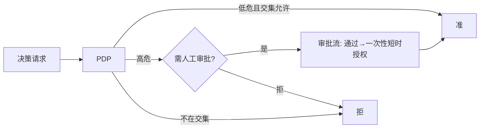

你正在 **refine** docs-cockpit module **M08 · ABAC / 风险分级 PDP**(sprint v0.2)。

我已经写了这个 module 的 frontmatter + subtasks + linked docs · 现在需要你 **检查 anchor 精度** · 给出 YAML patch。

## 执行模式 · 二选一(先判断你是谁)

- **A · 你有文件编辑工具**(Claude Code / Cursor / Codex CLI · 即能用 Edit / Write 直接改本地文件):**直接动手** · 不要只输出 patch。优先 (1) 改 module MD 的 `## 待办` / `## 3 · 待办` body checklist 行 · 给每个 subtask 补 inline `@code:path[:lines]` 和 `@docs:path[#§N.M | :start-end]` annotation(parser 支持多次堆叠 · 见 plan §6.1)· 这是 diff 友好的首选;或 (2) 把 `subtasks:` 写进 frontmatter object schema · 给每个 subtask 显式 `code:` / `docs:` 字段。改完跑 `docs-cockpit build` 验证 anchor 落到 `state.json` 即可。**不要让用户复制粘贴 · Claude Code 的副驾价值就在不让人重复打字。**
- **B · 你没有文件编辑工具**(浏览器里的 ChatGPT / Claude.ai / 其它 web 端):输出 YAML patch · 用户会复制回 MD。

判断标准:如果你能调用 `Edit` / `Write` / `MultiEdit` 之类工具,就是 A;只能在 chat 框输出文本就是 B。

## 不要改的字段(out of scope)

- `id` · `title` · `sprint` · `status` · `progress` · `desc`
- subtask 的 `title` / `status` · 这些反映工作意图 · 不在 anchor 精度范畴

## 要 refine 的字段

- subtask 的 `code:` · 应该精确到 `path:start-end` 行号 · 不是 `directory/` 整目录
- subtask 的 `docs:` · 应该精确到 `path.md#§N.M` heading 或 `:start-end` 行号 · 不是整个 doc
- subtask 的 `docs:` · 检查是否漏了相关 plan / RFC 引用(`linked_docs` 列表里有但 subtask 没引用)

## 当前 module frontmatter

```yaml
id: M08
title: "ABAC / 风险分级 PDP"
status: done
sprint: "v0.2"
progress: 100
desc: "RBAC 升级带 domain(=Nacos namespace)多租户 · AbacPdp 装饰链(越密级硬约束 + RiskScorer 评分 + 三态分级 + JIT 钩子) · 决策三态 Effect{ALLOW/DENY/REQUIRE_APPROVAL}+risk。authz 15 单测全绿。"


subtasks:

  - id: M08-39cd2f
    title: "M08-T1 RBAC domain 多租户 + DecisionRequest/Decision 富化(effect+risk) + 回归"
    status: done


  - id: M08-f5e4ed
    title: "M08-T2 AbacPolicy + RiskScorer SPI + 确定性 DefaultRiskScorer"
    status: done


  - id: M08-6d9df3
    title: "M08-T3 ApprovalHook + AbacPdp 三态装饰链(越密级/风险分级/JIT)"
    status: done


```

## 当前 linked docs(已 embed 摘要 · 完整 doc 在 repo)


### ABAC 设计 spec

`docs/superpowers/specs/2026-06-09-custos-abac-design.md`

# Custos ABAC / 风险分级 PDP 设计规格

> **类型**：生产架构路线图子项目 **M08 / P-ABAC**（v0.2）设计。在 authz 模块的 RBAC PDP 之上叠加 domain 多租户 + ABAC 属性/风险/上下文判定。
> **校订**：2026-06-09 · **状态**：评审中 · **许可**：Apache-2.0
> **配套**：生产架构 spec `2026-06-09-custos-production-architecture-spec.md` §7；详设 `docs/design/04-authz-design.md`。

---

## 1. 目标与范围

在已交付的可解释 RBAC PDP（M04）之上：① **RBAC 加 domain**（=Nacos namespace）做多租户隔离；② **ABAC**——在决策中按 资源分级 / 风险分 / 上下文(时间·IP·意图) 收紧；③ 高危动作走 **JIT 审批钩子**；④ 三态决策（ALLOW / DENY / REQUIRE_APPROVAL）+ 风险分，且仍可解释。

- **纳入**：`Effect` 三态、`RequestContext` 属性包、`DecisionRequest`/`Decision` 富化、`RiskScorer` SPI + 默认实现、`AbacPolicy` 阈值配置、`ApprovalHook` SPI + 默认保守实现、`AbacPdp`（装饰 CasbinPdp）、`CasbinPdp` 升级为带 domain 的 RBAC。纯 Java、可单测。
- **非目标（留后续）**：完整 JIT 人工审批工作流（M08 只给钩子 + 默认实现）；ABAC 规则的可视化编辑；机器学习风险模型。准/拒最终由本 PDP 给出，PEP（broker）消费三态结果。
- **落地方式（已定）**：**装饰链 + Java 风险逻辑**（非 casbin-native 对象 matcher）；三态 `Effect`+risk；**dom 作策略列 + 请求携 dom**。

---

## 2. 架构与数据流（装饰链）

```
DecisionRequest(sub, dom, obj, act, ctx)
        │  Pdp.decide
        ▼
AbacPdp（装饰）
  ① Decision rbac = delegate.decide(req)          // CasbinPdp：RBAC + domain 粗筛
     若 !rbac.allowed() → 直接返回 DENY（带 RBAC 原因）
  ② 硬约束：ctx.resourceLevel > ctx.clearance → DENY（越密级）
  ③ int risk = riskScorer.score(req)              // 资源分级 × 动作危险 × 上下文异常
  ④ 分级：
       risk ≥ policy.denyThreshold        → DENY
       risk ≥ policy.approvalThreshold     → ApprovalHook.approve(req,risk) ? ALLOW : REQUIRE_APPROVAL
       else                                → ALLOW
        ▼
Decision(effect, allowed=(effect==ALLOW), matchedPolicies, risk, reason)
        │  PEP(broker) 按 effect 消费：ALLOW 放行 / DENY 拒 / REQUIRE_APPROVAL 转审批
        ▼
```
依赖方向遵循解耦铁律：`AbacPdp` 依赖 `Pdp`(delegate) + `RiskScorer` + `ApprovalHook` + `AbacPolicy` 接口/值对象；`CasbinPdp` 不依赖 ABAC 任何类。

---

## 3. 组件与契约

`authz/src/main/java/io/custos/authz/`：

```java
public enum Effect { ALLOW, DENY, REQUIRE_APPROVAL }

/** 决策上下文属性包（ABAC 用）。键约定：clearance/resourceLevel(int)、hour(0-23)、ipTrusted(true/false)、intentSuspicious(true/false) 等。 */
public record RequestContext(java.util.Map<String, String> attributes) {
    public static RequestContext empty() { return new RequestContext(java.util.Map.of()); }
    public String attr(String k) { return attributes.get(k); }
    public int intAttr(String k, int dflt) { /* parse 或 dflt */ }
    public boolean boolAttr(String k) { /* "true".equals */ }
}

/** 富化：加 dom(=namespace) + ctx。向后兼容工厂 of(sub,obj,act)。 */
public record DecisionRequest(String sub, String dom, String obj, String act, RequestContext ctx) {
    public static DecisionRequest of(String sub, String obj, String act) {
        return new DecisionRequest(sub, "default", obj, act, RequestContext.empty());
    }
}

/** 富化：加 effect 三态 + risk。allowed()=（effect==ALLOW）。 */
public record Decision(Effect effect, boolean allowed, java.util.List<String> matchedPolicies, int risk, String reason) {
    public static Decision allow(java.util.List<String> matched, int risk, String reason) { return new Decision(Effect.ALLOW, true, matched, risk, reason); }
    public static Decision deny(java.util.List<String> matched, int risk, String reason) { return new Decision(Effect.DENY, false, matched, risk, reason); }
    public static Decision requireApproval(java.util.List<String> matched, int risk, String reason) { return new Decision(Effect.REQUIRE_APPROVAL, false, matched, risk, reason); }
}

/** 风险评分 SPI：0..100。 */
public interface RiskScorer { int score(DecisionRequest req); }

/** ABAC 阈值/参数（PBAC：可由 Nacos 配置热更）。 */
public record AbacPolicy(int approvalThreshold, int denyThreshold, int workStartHour, int workEndHour) {
    public static AbacPolicy defaults() { return new AbacPolicy(50, 80, 9, 18); }
}

/** 高危 JIT 审批钩子 SPI。默认 DenyApprovalHook 保守返回 false（未接审批前高危一律 REQUIRE_APPROVAL）。 */
public interface ApprovalHook { boolean approve(DecisionRequest req, int risk); }
public final class DenyApprovalHook implements ApprovalHook { public boolean approve(DecisionRequest r, int risk) { return false; } }

/** ABAC PDP：装饰 RBAC PDP，叠加越密级硬约束 + 风险分级 + JIT 钩子。 */
public final class AbacPdp implements Pdp {
    public AbacPdp(Pdp delegate, RiskScorer scorer, ApprovalHook hook, AbacPolicy policy) { ... }
    public Decision decide(DecisionRequest req) { /* §2 四步 */ }
    public void reload(String policyCsv) { delegate.reload(policyCsv); }   // RBAC 策略热更透传
    public void reloadAbacPolicy(AbacPolicy p) { /* 原子替换阈值（PBAC 热更 ABAC 参数）*/ }
}
```

**默认 `DefaultRiskScorer.score(req)`**（确定性、可单测）：
```
base = { read:10, write:40, delete:70, admin:90 }.getOrDefault(req.act(), 30)
+ ctx.intAttr("resourceLevel",0) * 15
+ (ctx.intAttr("hour",12) < workStart || hour >= workEnd ? 20 : 0)      // 非工作时段
+ ("false".equals(ctx.attr("ipTrusted")) ? 20 : 0)                       // 仅显式不信任来源 +20
+ (ctx.boolAttr("intentSuspicious") ? 25 : 0)                           // 可疑意图
→ clamp 0..100
```
> 注：`ipTrusted` 缺省（无此属性）按"已知/可信"处理（+0），仅显式 `"false"` 才 +20，避免空 ctx 把一切判高危。`workStart/workEnd` 取自 `AbacPo
… [truncated · 7502 chars total]

---

### ABAC 实现计划

`docs/superpowers/plans/2026-06-09-custos-abac.md`

# Custos ABAC / 风险分级 PDP（M08）Implementation Plan

> **For agentic workers:** REQUIRED SUB-SKILL: Use superpowers:subagent-driven-development (recommended) or superpowers:executing-plans to implement this plan task-by-task. Steps use checkbox (`- [ ]`) syntax for tracking.

**Goal:** 在 authz 的 RBAC PDP 上叠加 domain 多租户 + ABAC（资源分级/风险/上下文）+ 三态决策（ALLOW/DENY/REQUIRE_APPROVAL）+ 高危 JIT 钩子，装饰链实现、可解释、纯单元可测。

**Architecture:** `CasbinPdp` 升级为带 `dom` 的 RBAC；`DecisionRequest`/`Decision` 富化（dom+ctx / effect+risk，带向后兼容工厂）；新增 `AbacPdp` 装饰 `CasbinPdp`，叠加越密级硬约束 + `RiskScorer` 评分 + 阈值分级 + `ApprovalHook`。

**Tech Stack:** Java 21 · org.casbin:jcasbin 1.55.0 · JUnit 5（沿用 authz 现有依赖，无新依赖）

> 前置：M04（CasbinPdp/ControlPlane/PolicyWatcher 已存在）。对应 spec `docs/superpowers/specs/2026-06-09-custos-abac-design.md`。
> **波及面**：Task 1 改 DecisionRequest/Decision/CasbinPdp，需同步更新调用点（BrokerService / CasbinPdpTest / RevocationViaWatcherTest / BrokerServiceIT / HostEndToEndIT / demo.md）并回归保绿。
> **依赖约定**：authz 无 custos 依赖，`mvn -pl authz test` 可独立跑；跨模块回归用根 `mvn -B verify`（reactor 从源码构建）。

---

## File Structure

| 文件 | 职责 |
|---|---|
| `authz/src/main/java/io/custos/authz/Effect.java` | 三态枚举 |
| `authz/src/main/java/io/custos/authz/RequestContext.java` | ABAC 属性包 |
| `authz/src/main/java/io/custos/authz/DecisionRequest.java` | 富化（+dom+ctx+of 工厂）|
| `authz/src/main/java/io/custos/authz/Decision.java` | 富化（+effect+risk+工厂）|
| `authz/src/main/java/io/custos/authz/CasbinPdp.java` | 升级带 domain |
| `authz/src/main/java/io/custos/authz/AbacPolicy.java` | 阈值/工作时段配置 |
| `authz/src/main/java/io/custos/authz/RiskScorer.java` + `DefaultRiskScorer.java` | 风险评分 SPI + 默认实现 |
| `authz/src/main/java/io/custos/authz/ApprovalHook.java` + `DenyApprovalHook.java` | 高危 JIT 钩子 SPI + 默认 |
| `authz/src/main/java/io/custos/authz/AbacPdp.java` | 装饰 CasbinPdp 的 ABAC PDP |
| `broker/.../BrokerService.java` | `DecisionRequest.of(...)` |
| 各测试 + `examples/demo.md` | dom 列策略 + `.of` |

---

## Task 1: domain 升级 + DecisionRequest/Decision 富化（含回归保绿）

**Files:**
- Create: `authz/src/main/java/io/custos/authz/Effect.java`
- Create: `authz/src/main/java/io/custos/authz/RequestContext.java`
- Modify: `authz/src/main/java/io/custos/authz/DecisionRequest.java`
- Modify: `authz/src/main/java/io/custos/authz/Decision.java`
- Modify: `authz/src/main/java/io/custos/authz/CasbinPdp.java`
- Modify: `authz/src/test/java/io/custos/authz/CasbinPdpTest.java`
- Modify: `authz/src/test/java/io/custos/authz/RevocationViaWatcherTest.java`
- Modify: `broker/src/main/java/io/custos/broker/BrokerService.java`
- Modify: `broker/src/test/java/io/custos/broker/BrokerServiceIT.java`
- Modify: `app/src/test/java/io/custos/app/HostEndToEndIT.java`
- Modify: `examples/demo.md`

- [ ] **Step 1: 写 Effect + RequestContext**

`authz/src/main/java/io/custos/authz/Effect.java`:
```java
package io.custos.authz;

/** 决策结果三态。 */
public enum Effect { ALLOW, DENY, REQUIRE_APPROVAL }
```

`authz/src/main/java/io/custos/authz/RequestContext.java`:
```java
package io.custos.authz;

import java.util.Map;

/** ABAC 决策上下文属性包。键约定：clearance/resourceLevel(int)、hour(0-23)、ipTrusted(true/false)、intentSuspicious(true/false)。 */
public record RequestContext(Map<String, String> attributes) {
    public static RequestContext empty() { return new RequestContext(Map.of()); }
    public String attr(String k) { return attributes.get(k); }
    public int intAttr(String k, int dflt) {
        String v = attributes.get(k);
        if (v == null) return dflt;
        try { return Integer.parseInt(v.trim()); } catch (NumberFormatException e) { return dflt; }
    }
    public boolean boolAttr(String k) { return "true".equals(attributes.get(k)); }
}
```

- [ ] **Step 2: 富化 DecisionRequest（+dom+ctx+of 工厂）**

`authz/src/main/java/io/custos/authz/DecisionRequest.java`（整体替换）:
```java
package io.custos.authz;

/** 决策请求：sub=主体，dom=租户域(=Nacos namespace)，obj=工具，act=动作，ctx=ABAC 上下文。 */
public record DecisionRequest(String sub, String dom, String obj, String act, RequestContext ctx) {
    /** 向后兼容工厂：dom="default"、ctx 空。 */
    public static DecisionRequest of(String sub, String obj, String act) {
        return new DecisionRequest(sub, "default", obj, act, RequestContext.empty());
    }
}
```

- [ ] **Step 3: 富化 Decision（+effect+risk+工厂）**

`authz/src/main/java/io/custos/authz/Decision.java`（整体替换）:
```java
package io.custos.authz;

import java.util.List;

/** 可解释决策：effect 三态 + allowed(=ALLOW) + 命中策略 + risk(0..100) + 原因。 */
public record Decision(Effect effect, boolean allowed, List<String> matchedPolicies, int risk, String reason) {
    public static Decision allow(List<String> matched, int risk, String reason) { return new Decision(Effect.ALLOW, true, matched, risk, reason); }
    public static Decision deny(List<String> matched, int risk, String reason) { return new Decision(Effect.DENY, false, matched, risk, reason); }
    public static Decision requireApproval(List<String> matched, int risk, String reason) { return new Decision(Effect.REQUIRE_APPROVAL, f
… [truncated · 21887 chars total]

---

### 策略层设计

`docs/design/04-authz-design.md`

# 04 · 策略层设计（AuthZ / PDP）

> **定位**：权限/系统权限管理——**RBAC + ABAC/PBAC**、**工具/动作级 scope（对齐 MCP SEP-835）**、**JIT + 人工审批**、**PDP/PEP 分离**、**可解释决策**。设计范式借 **Cerbos**（PDP 解耦 / Derived Roles+CEL / tracer 可解释 / Scopes），求值内核用 **jCasbin**（Apache-2.0，国产，Java 同栈），策略以 **Nacos 配置**承载实现秒级热更新。
>
> 前提：`00-synthesis.md`、`01`、`03`。

---

## 1. 设计取向：借 Cerbos 的"形"，用 jCasbin 的"魂"

| 维度 | 取自 Cerbos（设计） | 取自 jCasbin（落地） |
|---|---|---|
| 架构 | **PDP/PEP 解耦**、无状态 PDP | — |
| 模型 | Derived Roles + CEL 的结构化 ABAC 思路 | **PERM 元模型**承载 RBAC+ABAC |
| 可解释 | tracer：命中规则 + 原因 | 自研增强（jCasbin 默认弱） |
| 作用域 | Scopes 层级 | 对齐 Nacos namespace/group |
| 热更新 | 自身 loader | **Watcher → 自研 Nacos Watcher** |

> 一句话：**Custos PDP = jCasbin 求值内核 + Custos 服务壳（可解释 + Nacos 策略源 + 工具级 scope + JIT 审批）**。

---

## 2. 决策模型

### 2.1 决策请求（PDP 输入）
```
Decision Request {
  principal: { user, agent, scopes(来自 OBO 交集), risk },   // 来自身份层(03)
  resource:  { type, id, attrs, classification(分级) },
  action:    { tool, operation },                            // MCP 工具/动作
  context:   { time, ip, intent, env }
}
```

### 2.2 PERM 模型（jCasbin model.conf，Custos 定制）
```ini
[request_definition]
r = sub, agent, dom, obj, act, ctx
[policy_definition]
p = sub, agent, dom, obj, act, eft
[role_definition]
g = _, _, _          # 用户/Agent 角色继承(带 domain=namespace)
[policy_effect]
e = priority(p.eft) || deny     # 默认拒绝 + deny 优先（高危可显式 deny）
[matchers]
m = g(r.sub, p.sub, r.dom) && agentAllowed(r.agent, p.agent) \
    && keyMatch2(r.obj, p.obj) && actMatch(r.act, p.act) \
    && abac(r, p, r.ctx)        # ABAC/上下文（风险、分级、意图）
```
- **默认拒绝**（borrow OpenBao default-deny）；**deny 优先**（高危可硬禁）。
- `keyMatch2`/`globMatch` 承载**工具/动作级路径通配**（→ §3 SEP-835）。
- `abac()` 自定义函数：读 `ctx`（风险/分级/意图）做属性判定，等价 Cerbos 的 CEL 条件。

### 2.3 RBAC + ABAC + PBAC
- **RBAC**：用户/Agent ↔ 角色 ↔ 权限（带 domain=Nacos namespace 多租户）。
- **ABAC**：matcher 内按资源分级、风险分、上下文（时间/IP/意图）判定。
- **PBAC（策略）**：策略即 Nacos 配置，声明式、可版本、可热更。

---

## 3. 工具/动作级 scope（对齐 MCP SEP-835）

| 概念 | Custos 表达 |
|---|---|
| MCP 工具 | `obj = tool:<server>/<tool>`，如 `tool:db/query_orders` |
| 动作/操作 | `act = read|write|exec|...`（只读查询=read） |
| scope 通配 | jCasbin `keyMatch2`：`tool:db/*` 允许该 server 全部只读工具 |
| 与 OBO | 请求 scope = 用户∩Agent 交集（`03`），PDP 再按策略收窄 |

- SEP-835 的"工具级授权"= 把 MCP tool/action 映射为 PDP 的 obj/act，策略对其授权。
- 经纪层（PEP，`06`）把每次 MCP 工具调用转成一个 Decision Request 交 PDP。

---

## 4. 可解释决策（借 Cerbos tracer）

PDP 输出不只 allow/deny，而是结构化、可审计的解释：
```json
{
  "effect": "DENY",
  "matched_policy": "policy/db-readonly@v7",
  "matched_rule": "deny: action=write on classification=high",
  "reason": "Agent claude-prod 经用户 u123 请求 write，但策略仅允许 read；且资源分级=high 需审批",
  "obligations": ["require_human_approval"],   // 附加义务(JIT)
  "evaluated_at": "..."
}
```
- 决策与解释一并写入**哈希链审计**（`02` §11）。
- jCasbin 默认不给原因 → Custos 服务壳记录命中的 policy/rule 与求值轨迹补齐。

---

## 5. 资源分级 + Agent 自治等级 + JIT 人工审批

| 机制 | 设计 |
|---|---|
| **资源分级** | resource.classification：low/medium/high/critical（存 Nacos 资源目录） |
| **Agent 自治等级** | agent.autonomy：auto / confirm / approval —— 决定高危动作是否需人工 |
| **JIT + 人工审批** | PDP 对高危(分级×动作)返回 `effect=DENY/PENDING` + obligation `require_human_approval`；经纪层发起审批流（审批通过→签发一次性短 TTL 授权），全程审计 |



---

## 6. 策略存储与秒级热更新（与 `05` 联动）

| 项 | 设计 |
|---|---|
| 策略来源 | **Nacos 配置**（DataId=策略集，Raft CP 强一致） |
| 加载 | 自研 **Nacos Adapter**（jCasbin persist.Adapter 实现）从 Nacos 拉策略 |
| 热更新 | 自研 **Nacos Watcher**：监听配置变更（gRPC 长连接）→ 触发 enforcer 重载 → **秒级生效=秒级吊销** |
| 多租户 | domain=namespace；每 namespace 独立策略集 |

> 这是把 Casbin（无现成 Nacos Watcher）缝合到 Nacos 护城河的关键自研件。

---

## 7. 模块与接口（→ `08`）
```
authz/
  ├─ pdp/          # 决策入口(gRPC/内部 API), 可解释封装
  ├─ engine/       # jCasbin 封装: model + enforcer
  ├─ model/        # Custos PERM model.conf + scope/abac 自定义函数
  ├─ nacos/        # Adapter(策略源) + Watcher(热更新)
  ├─ approval/     # JIT 人工审批流
  └─ explain/      # tracer/决策解释 → 审计
```
| 接口 | 职责 |
|---|---|
| `Pdp.decide(DecisionRequest) → Decision(effect, explanation, obligations)` | 核心决策 |
| `PolicyAdapter`（jCasbin Adapter） | 从 Nacos 读策略 |
| `PolicyWatcher` | Nacos 变更 → 重载 |

---

## 8. 对 PRD 覆盖 + 待确认

| PRD | 覆盖 |
|---|---|
| A1 RBAC+ABAC/PBAC | §2 |
| A2 工具/动作级 scope（SEP-835） | §3 |
| A3 分级 + 自治等级 + JIT 审批 | §5 |
| A4 PDP/PEP 分离 + 可解释 | §1/§4 |

**待确认岔路口（已按推荐继续）**：
- 授权落地内核：**jCasbin（推荐，已在 `00` 钉死）** vs 自研 PERM vs 嵌 Cerbos——已选 jCasbin。
- 策略编写语言：**首版用 jCasbin policy(csv/行) + Custos 高层 YAML 包装**（向 Cerbos 风格靠拢）；若你更想直接用 Cerbos YAML 语义，可议。
- deny 优先 vs allow 优先：推荐 **默认拒绝 + deny 优先**（安全更稳）。

> **下一篇**：`05-nacos-integration.md`（注册 + 秒级吊销 + namespace + 服务发现）。


---


## Repo 根路径
`D:\harvey_work\custos`
当前分支:`main`


## 你的任务

1. **读 linked docs 的内容** · 理解每个 plan / RFC 的章节布局
2. **对每个 subtask** · 判断它在做什么 · 然后:
   - 找出 plan / RFC 里对应的具体 section(`#§N.M` heading slug 或 `:start-end` 行号)
   - 找出 repo 里对应的代码 file + 行号(如果 code 已经存在;新代码留 `code: <path>` 不带行号)
3. **按上面「执行模式」分支落地**:
   - **模式 A**:直接 Edit MD body checklist · 每行末尾追加 ` @code:path[:lines]` 和 ` @docs:path[#§N.M | :start-end]`(多个就堆叠空格分隔)· 完事跑 `docs-cockpit build` · 检查 `docs/state.json` 里对应 subtask 的 `code` / `docs` 字段。报告简短:每个 subtask 改了什么 + build 是否干净。
   - **模式 B**:输出下面格式的 YAML patch 给用户复制:

```yaml
subtasks:
  - id: <现有 subtask id>
    code: "<更精确的 code anchor · 或 list>"
    docs: ["<更精确的 docs anchor>", ...]
```

如果某个 subtask 在 linked docs 里找不到对应 section · 模式 A 留 `# TODO: ...` 注释行不写 anchor · 模式 B 在 patch 里输出 `# TODO: ...` 注释行 · **不要瞎猜 anchor**(driver-seat 信任来自精度 · 错 anchor 比缺 anchor 伤害更大)。
