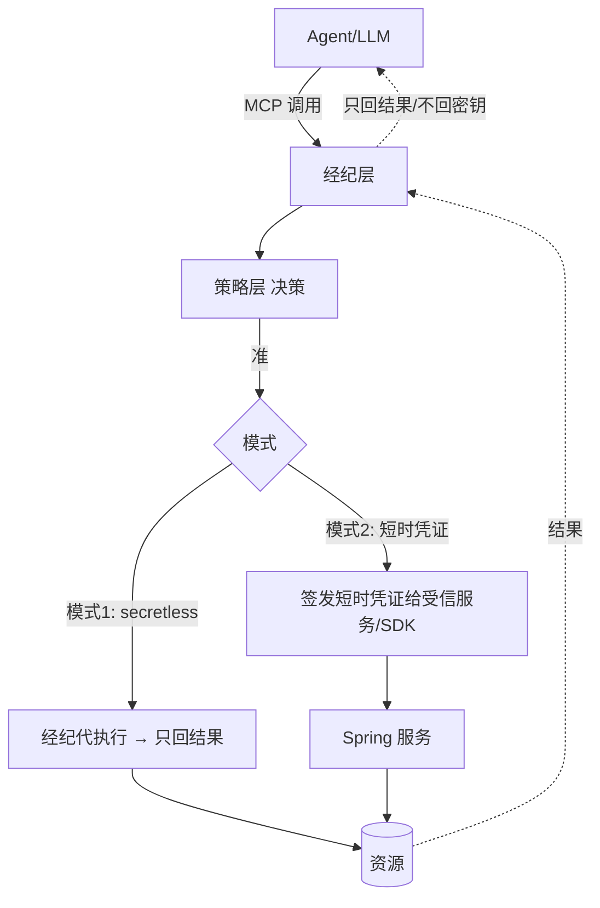
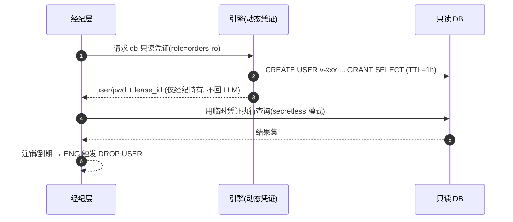

你正在 **refine** docs-cockpit module **M09 · AK·SK secrets engine + 轮换**(sprint v0.2)。

我已经写了这个 module 的 frontmatter + subtasks + linked docs · 现在需要你 **检查 anchor 精度** · 给出 YAML patch。

## 执行模式 · 二选一(先判断你是谁)

- **A · 你有文件编辑工具**(Claude Code / Cursor / Codex CLI · 即能用 Edit / Write 直接改本地文件):**直接动手** · 不要只输出 patch。优先 (1) 改 module MD 的 `## 待办` / `## 3 · 待办` body checklist 行 · 给每个 subtask 补 inline `@code:path[:lines]` 和 `@docs:path[#§N.M | :start-end]` annotation(parser 支持多次堆叠 · 见 plan §6.1)· 这是 diff 友好的首选;或 (2) 把 `subtasks:` 写进 frontmatter object schema · 给每个 subtask 显式 `code:` / `docs:` 字段。改完跑 `docs-cockpit build` 验证 anchor 落到 `state.json` 即可。**不要让用户复制粘贴 · Claude Code 的副驾价值就在不让人重复打字。**
- **B · 你没有文件编辑工具**(浏览器里的 ChatGPT / Claude.ai / 其它 web 端):输出 YAML patch · 用户会复制回 MD。

判断标准:如果你能调用 `Edit` / `Write` / `MultiEdit` 之类工具,就是 A;只能在 chat 框输出文本就是 B。

## 不要改的字段(out of scope)

- `id` · `title` · `sprint` · `status` · `progress` · `desc`
- subtask 的 `title` / `status` · 这些反映工作意图 · 不在 anchor 精度范畴

## 要 refine 的字段

- subtask 的 `code:` · 应该精确到 `path:start-end` 行号 · 不是 `directory/` 整目录
- subtask 的 `docs:` · 应该精确到 `path.md#§N.M` heading 或 `:start-end` 行号 · 不是整个 doc
- subtask 的 `docs:` · 检查是否漏了相关 plan / RFC 引用(`linked_docs` 列表里有但 subtask 没引用)

## 当前 module frontmatter

```yaml
id: M09
title: "AK·SK secrets engine + 轮换"
status: done
sprint: "v0.2"
progress: 100
desc: "SecretsEngine SPI 第二实现：AkSkProvider SPI + 内存模拟 · AkSkSecretsEngine issue/revoke 复用 LeaseManager · rotate 支持 grace 多版本过渡/硬轮换。engine 27 单测全绿（纯单元无 Docker）。"


subtasks:

  - id: M09-71198b
    title: "M09-T1 AkSkPair + AkSkProvider SPI + InMemoryAkSkProvider"
    status: done


  - id: M09-914e6f
    title: "M09-T2 AkSkSecretsEngine（issue/revoke/rotate with grace）"
    status: done


```

## 当前 linked docs(已 embed 摘要 · 完整 doc 在 repo)


### AK·SK 设计 spec

`docs/superpowers/specs/2026-06-09-custos-aksk-design.md`

# Custos AK·SK secrets engine + 轮换 设计规格

> **类型**：生产架构路线图子项目 **M09 / P-AKSK**（v0.2）设计。SecretsEngine SPI 的第二实现：动态 AK·SK 凭证 + 轮换。
> **校订**：2026-06-09 · **状态**：评审中 · **许可**：Apache-2.0
> **配套**：生产架构 spec `2026-06-09-custos-production-architecture-spec.md` §3/§7；经纪层设计 `docs/design/06-secrets-broker.md`。

---

## 1. 目标与范围

为 SecretsEngine SPI 提供第二实现，证明引擎可扩展性：动态签发短时 **AK·SK（云访问密钥对）**、TTL 到期自动撤销、支持**多版本过渡轮换**。

- **纳入**：`AkSkPair`、`AkSkProvider` SPI + `InMemoryAkSkProvider`、`AkSkSecretsEngine`（issue/revoke/rotate）。复用 `LeaseManager`（TTL/撤销）+ `IssuedCred` + `SecretsEngineRegistry`。纯 Java、可单测。
- **非目标（留后续）**：真实 AWS STS / 阿里云 RAM 对接（作 `AkSkProvider` 未来实现）；AK·SK 权限策略下发（云侧 IAM）；跨区域。
- **决策（已定）**：**内存模拟 Provider + SPI**；**复用 engine LeaseManager**；**轮换支持 grace 多版本过渡**。
- **secretless 红线**：SK 仅在 `issue/rotate` 返回值出现，绝不进 LLM/日志（与经纪层一致）。

---

## 2. 架构与数据流

```
AkSkSecretsEngine implements SecretsEngine（type="ak-sk"）
  issue(path, ttl):
     AkSkPair p = provider.mint(path)                         // 现场铸 (accessKeyId, secretKey)
     Lease lease = leases.register("aksk/"+path, ttl,
                                   l -> provider.revoke(p.accessKeyId()))   // 到期/撤销→吊销 AK
     return new IssuedCred(p.accessKeyId(), p.secretKey(), lease.leaseId(), lease.expireAt())
  revoke(leaseId):
     leases.revoke(leaseId)                                    // 触发 Revoker → provider.revoke(akId)
  rotate(oldLeaseId, path, newTtl, grace):
     IssuedCred fresh = issue(path, newTtl)                    // 新一份
     grace.isZero() ? leases.revoke(oldLeaseId)                // 硬轮换：立即撤销旧
                    : leases.renew(oldLeaseId, grace)          // 多版本过渡：旧存活 grace 后后台扫描自动撤销
     return fresh
```
依赖：`AkSkSecretsEngine` 依赖 `AkSkProvider` + `LeaseManager` 接口；不依赖云 SDK。

---

## 3. 组件与契约

`engine/src/main/java/io/custos/engine/secrets/`：

```java
/** 云访问密钥对。 */
public record AkSkPair(String accessKeyId, String secretKey) {}

/** AK·SK 后端 SPI：现场铸/吊销。未来加 AwsStsProvider / AliyunRamProvider。 */
public interface AkSkProvider {
    AkSkPair mint(String mount);
    void revoke(String accessKeyId);
}

/** 内存模拟 Provider（计划后续接真实云只换实现）。 */
public final class InMemoryAkSkProvider implements AkSkProvider {
    public AkSkPair mint(String mount);           // AK="AKIA"+12hex, SK=32hex；记入活跃集
    public void revoke(String accessKeyId);        // 从活跃集移除
    public boolean isActive(String accessKeyId);   // 供测试断言
}

/** AK·SK 动态凭证引擎（SecretsEngine 第二实现）。 */
public final class AkSkSecretsEngine implements SecretsEngine {
    public AkSkSecretsEngine(AkSkProvider provider, LeaseManager leases);
    public String type();                          // "ak-sk"
    public IssuedCred issue(String path, Duration ttl);
    public void revoke(String leaseId);
    /** 轮换：发新一份；grace=0 立即撤旧，grace>0 旧续到 grace 后自动撤。返回新凭证。 */
    public IssuedCred rotate(String oldLeaseId, String path, Duration newTtl, Duration grace);
}
```
> `IssuedCred(username=accessKeyId, password=secretKey, leaseId, expireAt)`——复用既有记录，AK 当 username、SK 当 password，与 SecretsEngine SPI 契约一致。

---

## 4. 轮换语义（多版本过渡）

- `grace > 0`：发新凭证；`leases.renew(oldLeaseId, grace)` 把旧租约到期改为 `now+grace`。旧 AK 在 grace 窗口内仍有效（消费方平滑切换），窗口后由 `DefaultLeaseManager` 后台扫描触发旧租约的 Revoker → `provider.revoke(oldAkId)`。
- `grace == 0`：硬轮换，`leases.revoke(oldLeaseId)` 立即吊销旧 AK。
- 新旧 leaseId 不同；轮换不复用旧 AK。

---

## 5. 错误处理

| 场景 | 处理 |
|---|---|
| provider.mint 失败 | 抛 IllegalStateException（内存实现不抛；真实云实现自负） |
| revoke 未知 leaseId | LeaseManager.revoke 对未知 id 安全返回（不抛） |
| rotate 的 oldLeaseId 不存在 | renew/revoke 对未知 id 安全无操作；新凭证照常返回 |

---

## 6. 测试策略（TDD，纯单元，无 Docker）

- `InMemoryAkSkProvider`：mint 产唯一 AK 且 isActive=true；revoke 后 isActive=false。
- `AkSkSecretsEngine.issue`：返回 IssuedCred，accessKeyId 活跃；`revoke(leaseId)` 后该 AK 不活跃。
- `rotate(grace=0)`：旧 AK 立即不活跃、新 AK 活跃、新旧 leaseId 不同。
- `rotate(grace>0)`：旧 AK 仍活跃（窗口内）、新 AK 活跃、旧租约 expireAt 缩短到约 now+grace。
- `SecretsEngineRegistry`：挂到 "aksk" mount 后 `require("aksk").type()=="ak-sk"`。
- 复用 `DefaultLeaseManager`（内存 JSqlClient？）——见下注。

> **租约测试注**：`DefaultLeaseManager` 依赖 `JSqlClient`（MySQL）。为保持 M09 **纯单元无 Docker**，AkSkSecretsEngine 测试用一个**轻量内存 `LeaseManager` 测试替身**（实现 `register/renew/revoke/revokePrefix`，内存 Map），聚焦 Ak·Sk 引擎逻辑；真实 Jimmer 租约的 DB 行为已由 M02 的 `DefaultLeaseManagerIT` 覆盖。引擎生产装配时注入 `DefaultLeaseManager`。

---

## 7. 非目标 / YAGNI

- 不接真实云 STS/RAM（SPI 留缝）。
- 不做云侧 IAM 策略下发、跨区域、AK·SK 权限收窄（超出本增量）。
- 不在 M09 做后台扫描的实时性测试（时间相关）；轮换的确定性效果（立即撤旧 / 旧租约 expireAt 缩短）即测试边界。


---

### AK·SK 实现计划

`docs/superpowers/plans/2026-06-09-custos-aksk.md`

# Custos AK·SK secrets engine + 轮换（M09）Implementation Plan

> **For agentic workers:** REQUIRED SUB-SKILL: Use superpowers:subagent-driven-development (recommended) or superpowers:executing-plans to implement this plan task-by-task. Steps use checkbox (`- [ ]`) syntax for tracking.

**Goal:** 为 SecretsEngine SPI 提供第二实现 `AkSkSecretsEngine`：内存 Provider 动态签发 AK·SK、复用 LeaseManager 做 TTL/撤销、rotate 支持 grace 多版本过渡。

**Architecture:** `AkSkProvider` SPI（内存模拟实现，真实云留缝）现场铸/吊销 AK·SK；`AkSkSecretsEngine` 用 `LeaseManager` 登记租约（到期/撤销→吊销 AK），返回 `IssuedCred`（AK=username、SK=password）；rotate 发新一份后按 grace 立即撤旧或续旧到 grace。

**Tech Stack:** Java 21 · JUnit 5（沿用 engine 现有依赖，无新依赖）

> 前置：engine.secrets（SecretsEngine/SecretsEngineRegistry/IssuedCred 已存在，PF-T1）+ engine.lease（LeaseManager/Lease/Revoker 已存在，M02）。对应 spec `docs/superpowers/specs/2026-06-09-custos-aksk-design.md`。
> **纯单元、无 Docker**：AkSkSecretsEngine 测试用内存 `LeaseManager` 替身（避开 DefaultLeaseManager 的 MySQL 依赖；真实租约 DB 行为已由 M02 `DefaultLeaseManagerIT` 覆盖）。

---

## File Structure

| 文件 | 职责 |
|---|---|
| `engine/src/main/java/io/custos/engine/secrets/AkSkPair.java` | (accessKeyId, secretKey) |
| `engine/src/main/java/io/custos/engine/secrets/AkSkProvider.java` | 后端 SPI（mint/revoke）|
| `engine/src/main/java/io/custos/engine/secrets/InMemoryAkSkProvider.java` | 内存模拟实现 + isActive |
| `engine/src/main/java/io/custos/engine/secrets/AkSkSecretsEngine.java` | SecretsEngine 第二实现（issue/revoke/rotate）|
| `engine/src/test/java/io/custos/engine/secrets/InMemoryAkSkProviderTest.java` | Provider 测试 |
| `engine/src/test/java/io/custos/engine/secrets/AkSkSecretsEngineTest.java` | 引擎测试（含 FakeLeaseManager 替身）|

---

## Task 1: AkSkPair + AkSkProvider + InMemoryAkSkProvider

**Files:**
- Create: `engine/src/main/java/io/custos/engine/secrets/AkSkPair.java`
- Create: `engine/src/main/java/io/custos/engine/secrets/AkSkProvider.java`
- Create: `engine/src/main/java/io/custos/engine/secrets/InMemoryAkSkProvider.java`
- Test: `engine/src/test/java/io/custos/engine/secrets/InMemoryAkSkProviderTest.java`

- [ ] **Step 1: 写 AkSkPair + AkSkProvider SPI**

`engine/src/main/java/io/custos/engine/secrets/AkSkPair.java`:
```java
package io.custos.engine.secrets;

/** 云访问密钥对。 */
public record AkSkPair(String accessKeyId, String secretKey) {}
```

`engine/src/main/java/io/custos/engine/secrets/AkSkProvider.java`:
```java
package io.custos.engine.secrets;

/** AK·SK 后端 SPI：现场铸/吊销。未来加 AwsStsProvider / AliyunRamProvider。 */
public interface AkSkProvider {
    AkSkPair mint(String mount);
    void revoke(String accessKeyId);
}
```

- [ ] **Step 2: 写失败测试**

`engine/src/test/java/io/custos/engine/secrets/InMemoryAkSkProviderTest.java`:
```java
package io.custos.engine.secrets;

import org.junit.jupiter.api.Test;

import static org.junit.jupiter.api.Assertions.*;

class InMemoryAkSkProviderTest {

    @Test
    void mintProducesActiveDistinctPairs() {
        InMemoryAkSkProvider p = new InMemoryAkSkProvider();
        AkSkPair a = p.mint("aksk/app");
        AkSkPair b = p.mint("aksk/app");
        assertTrue(a.accessKeyId().startsWith("AKIA"));
        assertNotEquals(a.accessKeyId(), b.accessKeyId(), "AK 应唯一");
        assertFalse(a.secretKey().isBlank());
        assertTrue(p.isActive(a.accessKeyId()));
        assertTrue(p.isActive(b.accessKeyId()));
    }

    @Test
    void revokeDeactivates() {
        InMemoryAkSkProvider p = new InMemoryAkSkProvider();
        AkSkPair a = p.mint("aksk/app");
        p.revoke(a.accessKeyId());
        assertFalse(p.isActive(a.accessKeyId()));
    }
}
```

- [ ] **Step 3: 运行测试，确认失败**

Run: `mvn -q -pl engine test -Dtest=InMemoryAkSkProviderTest`
Expected: 编译失败（InMemoryAkSkProvider 未定义）。

- [ ] **Step 4: 写 InMemoryAkSkProvider**

`engine/src/main/java/io/custos/engine/secrets/InMemoryAkSkProvider.java`:
```java
package io.custos.engine.secrets;

import java.security.SecureRandom;
import java.util.HexFormat;
import java.util.Set;
import java.util.concurrent.ConcurrentHashMap;

/** 内存模拟 AK·SK 后端（计划后续接真实 AWS STS / 阿里云 RAM 只换实现）。 */
public final class InMemoryAkSkProvider implements AkSkProvider {

    private final Set<String> active = ConcurrentHashMap.newKeySet();
    private final SecureRandom random = new SecureRandom();

    @Override
    public AkSkPair mint(String mount) {
        String ak = "AKIA" + hex(6);   // 12 hex
        String sk = hex(16);           // 32 hex
        active.add(ak);
        return new AkSkPair(ak, sk);
    }

    @Override
    public void revoke(String accessKeyId) {
        active.remove(accessKeyId);
    }

    /** 供测试断言。 */
    public boolean isActive(String accessKeyId) {
        return active.contains(accessKeyId);
    }

    private String hex(int bytes) {
        byte[] b = new byte[bytes];
        random.nextBytes(b);
        return HexFormat.of().formatHex(b);
    }
}
```

- [ ] **Step 5: 运行测试，确认通过**

Run: `mvn -q -pl engine test -Dtest=InMemoryAkSkProviderTest`
Expected: PASS（2 个用例）。

- [ ] **Step 6: 提交**
```bash
git add engine/src/main
… [truncated · 12729 chars total]

---

### 经纪层设计

`docs/design/06-secrets-broker.md`

# 06 · 经纪层设计（Secrets Broker / PEP）

> **定位**：经纪层是 PEP（执行点）——**动态 DB 凭证**、**secretless 经纪（MCP-native，密钥不进 LLM）**、**KV/AK-SK 轮换**。设计灵感：OpenBao/Vault 动态凭证与 Lease、Vault Transit「操作不暴露密钥」、Infisical「agents never see the secret」方向（均借思想不抄码）。
>
> 前提：`01`、`02`（引擎/租约）、`03`（身份）、`04`（决策）、`05`（吊销）。**铁律：密钥不进 LLM 上下文。**

---

## 1. 经纪层职责

| 职责 | 说明 |
|---|---|
| MCP-native 暴露 | 把"受治理工具"做成 MCP server/tool，Claude/Codex 标准接入（IF1） |
| 决策执行（PEP） | 每次工具调用 → 组装 Decision Request 调 PDP（`04`）→ 准则执行 |
| 动态凭证签发 | 调引擎现场签发短时只读凭证（S1） |
| **secretless 执行** | 经纪代执行、**只回结果**，凭证不返回 LLM（S2） |
| 轮换 | KV/AK-SK 签发与定期轮换（S3） |
| SDK 取凭证 | Spring 服务经 SDK 直取动态凭证、随租约续期/失效（S4） |

---

## 2. 两种经纪模式



| 模式 | 适用 | 密钥可见性 |
|---|---|---|
| **① secretless 经纪**（默认，对 LLM） | Claude/Codex 经 MCP 查库/调系统 | **Agent 永不见密钥**（最彻底，满足红线）|
| **② 短时凭证下发**（对受信服务） | Spring 服务/SDK 程序化取凭证 | 受信服务拿到带 TTL 的凭证（非 LLM）|

---

## 3. 动态 DB 只读凭证（S1）

借 OpenBao database engine 思路，自研实现：

| 项 | 设计 |
|---|---|
| 角色定义 | `creation_statements`（CREATE USER + GRANT SELECT）、`revocation_statements`（DROP USER）、`default_ttl=1h`、`max_ttl=4h`（PRD S1） |
| 签发 | 引擎现场连库建临时只读账号，登记 **lease**（`02` 租约） |
| 撤销 | 租约到期/主动吊销 → 执行 revocation（DROP USER）；与 `05` 秒级吊销联动 |
| 最小权限 | 只读、限库表（最小只读权限，合规 NFR） |



---

## 4. secretless 经纪（S2，密钥不进 LLM 的关键）

| 机制 | 设计 |
|---|---|
| 调用面 | LLM 只发"意图 + 参数"（如 query_orders(date=today)），**不接触连接串/密码** |
| 执行 | 经纪在 LLM 上下文之外取凭证、连资源、执行，**只把结果回给 LLM** |
| 结果脱敏 | 可选：对结果做字段级脱敏/行级过滤（结合 `04` 决策义务） |
| 审计 | 记录 user+agent+task+SQL摘要+决策（哈希链，`02`）；不记明文凭证 |
| 防注入 | 工具参数 schema 校验；只读语句白名单/解析，防 SQL 注入与越权语句 |

> 这是对 PRD 红线「密钥绝不进 LLM 上下文」的直接实现，也是相对 Vault（凭证仍到手）的差异化。

---

## 5. KV 与 AK/SK 轮换（S3）+ SDK 取凭证（S4）

| 能力 | 设计 |
|---|---|
| **KV 密钥** | 引擎 KV engine（Barrier 加密存储），按需读取（受 PDP 授权） |
| **AK/SK 签发 + 轮换** | 定期轮换静态云凭证；新旧并存过渡窗口；轮换事件审计 |
| **Spring SDK（S4）** | Spring Boot Starter：注解/配置取动态凭证，随租约自动续期/失效（借 Spring Cloud Vault 体验，自研实现）；凭证注入 DataSource，不落配置文件 |

```yaml
# 示意：业务服务用 Custos Starter 取动态只读库凭证
custos:
  broker:
    db:
      role: orders-ro
      auto-renew: true     # 随租约续期；失效自动重取
```

---

## 6. 与各层协作

| 协作 | 说明 |
|---|---|
| ← 身份层(`03`) | 携带 OBO 作用域令牌（user∩agent） |
| ← 策略层(`04`) | 每次调用先决策；高危走 JIT 审批；决策义务（脱敏/审批）在此执行 |
| ← 引擎(`02`) | 签发凭证 + 租约 + 审计；密钥内存清零 |
| ← Nacos(`05`) | 工具注册/熔断；吊销秒级生效 |

---

## 7. 模块与接口（→ `08`）
```
broker/
  ├─ mcp/           # MCP server/tool 暴露(IF1)
  ├─ pep/           # 决策执行: 调 PDP, 执行义务
  ├─ secretless/    # 代执行引擎(db/http/...), 只回结果
  ├─ creds/         # 动态凭证签发(调 engine), 租约管理
  ├─ rotate/        # KV/AK-SK 轮换
  └─ sdk-bridge/    # 给 Spring Starter 的取凭证接口
```
| 接口 | 职责 |
|---|---|
| `Tool.invoke(intent, params, token) → Result` | MCP 工具调用（secretless）|
| `Broker.issueCreds(role, token) → LeasedCred` | 短时凭证（受信服务）|
| `Rotator.rotate(secretRef)` | 轮换 |

---

## 8. 对 PRD 覆盖 + 待确认

| PRD | 覆盖 |
|---|---|
| S1 动态 DB 只读 1h/4h | §3 |
| S2 secretless 经纪 | §4 |
| S3 KV/AK-SK 轮换 | §5 |
| S4 Spring SDK 取凭证 | §5 |
| IF1 MCP-native | §1/§2 |

**待确认（已按推荐继续）**：
- 首版资源类型：推荐**只 MySQL 只读 DB engine**（一条纵向线），HTTP/内部系统经纪与 AK/SK 放 v0.2。
- secretless 结果脱敏：首版**可选、默认关**，由策略义务驱动。

> **下一篇**：`07-mvp-vertical-slice.md`（纵向线 → 模块 + WBS + 验收）。


---


## Repo 根路径
`D:\harvey_work\custos`
当前分支:`main`


## 你的任务

1. **读 linked docs 的内容** · 理解每个 plan / RFC 的章节布局
2. **对每个 subtask** · 判断它在做什么 · 然后:
   - 找出 plan / RFC 里对应的具体 section(`#§N.M` heading slug 或 `:start-end` 行号)
   - 找出 repo 里对应的代码 file + 行号(如果 code 已经存在;新代码留 `code: <path>` 不带行号)
3. **按上面「执行模式」分支落地**:
   - **模式 A**:直接 Edit MD body checklist · 每行末尾追加 ` @code:path[:lines]` 和 ` @docs:path[#§N.M | :start-end]`(多个就堆叠空格分隔)· 完事跑 `docs-cockpit build` · 检查 `docs/state.json` 里对应 subtask 的 `code` / `docs` 字段。报告简短:每个 subtask 改了什么 + build 是否干净。
   - **模式 B**:输出下面格式的 YAML patch 给用户复制:

```yaml
subtasks:
  - id: <现有 subtask id>
    code: "<更精确的 code anchor · 或 list>"
    docs: ["<更精确的 docs anchor>", ...]
```

如果某个 subtask 在 linked docs 里找不到对应 section · 模式 A 留 `# TODO: ...` 注释行不写 anchor · 模式 B 在 patch 里输出 `# TODO: ...` 注释行 · **不要瞎猜 anchor**(driver-seat 信任来自精度 · 错 anchor 比缺 anchor 伤害更大)。
