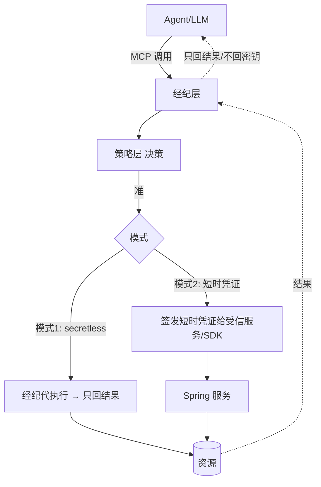
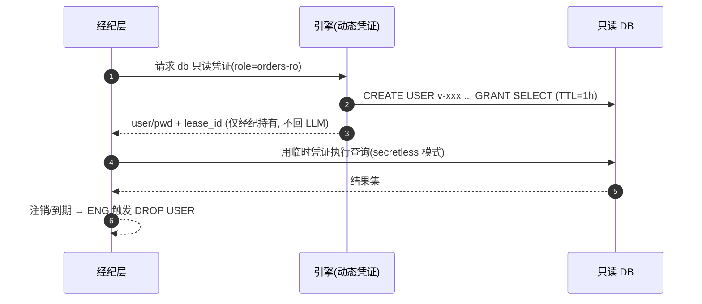

你正在 **refine** docs-cockpit module **M10 · KV / 更多 secrets engine**(sprint v0.3)。

我已经写了这个 module 的 frontmatter + subtasks + linked docs · 现在需要你 **检查 anchor 精度** · 给出 YAML patch。

## 执行模式 · 二选一(先判断你是谁)

- **A · 你有文件编辑工具**(Claude Code / Cursor / Codex CLI · 即能用 Edit / Write 直接改本地文件):**直接动手** · 不要只输出 patch。优先 (1) 改 module MD 的 `## 待办` / `## 3 · 待办` body checklist 行 · 给每个 subtask 补 inline `@code:path[:lines]` 和 `@docs:path[#§N.M | :start-end]` annotation(parser 支持多次堆叠 · 见 plan §6.1)· 这是 diff 友好的首选;或 (2) 把 `subtasks:` 写进 frontmatter object schema · 给每个 subtask 显式 `code:` / `docs:` 字段。改完跑 `docs-cockpit build` 验证 anchor 落到 `state.json` 即可。**不要让用户复制粘贴 · Claude Code 的副驾价值就在不让人重复打字。**
- **B · 你没有文件编辑工具**(浏览器里的 ChatGPT / Claude.ai / 其它 web 端):输出 YAML patch · 用户会复制回 MD。

判断标准:如果你能调用 `Edit` / `Write` / `MultiEdit` 之类工具,就是 A;只能在 chat 框输出文本就是 B。

## 不要改的字段(out of scope)

- `id` · `title` · `sprint` · `status` · `progress` · `desc`
- subtask 的 `title` / `status` · 这些反映工作意图 · 不在 anchor 精度范畴

## 要 refine 的字段

- subtask 的 `code:` · 应该精确到 `path:start-end` 行号 · 不是 `directory/` 整目录
- subtask 的 `docs:` · 应该精确到 `path.md#§N.M` heading 或 `:start-end` 行号 · 不是整个 doc
- subtask 的 `docs:` · 检查是否漏了相关 plan / RFC 引用(`linked_docs` 列表里有但 subtask 没引用)

## 当前 module frontmatter

```yaml
id: M10
title: "KV / 更多 secrets engine"
status: done
sprint: "v0.3"
progress: 100
desc: "版本化 KvEngine（落 Storage 永远密文，meta/#v{n} 键布局）+ PostgresDynamicCredentials（SecretsEngine 第三实现，CREATE ROLE/GRANT SELECT/DROP ROLE）。KV 4 单测 + PG IT 2 用例全绿。"


subtasks:

  - id: M10-1e4a9d
    title: "M10-T1 KvEngine 接口 + StorageKvEngine（版本化，纯单元）"
    status: done


  - id: M10-dbf62a
    title: "M10-T2 PostgresDynamicCredentials（Testcontainers PG IT）"
    status: done


```

## 当前 linked docs(已 embed 摘要 · 完整 doc 在 repo)


### KV 设计 spec

`docs/superpowers/specs/2026-06-10-custos-kv-design.md`

# Custos KV / 更多 secrets engine 设计规格（M10）

> **类型**：路线图子项目 **M10 / P-KV**（v0.3）设计。版本化 KV 引擎 + PostgreSQL 动态凭证（SecretsEngine 第三实现）。
> **校订**：2026-06-10 · **状态**：评审中 · **许可**：Apache-2.0
> **配套**：生产架构 spec §3/§7；`docs/design/06-secrets-broker.md`。前置：M02(Storage/Barrier)、PF-T1(SecretsEngine SPI)、M09(AkSk 模式)。

---

## 1. 目标与范围

两件事：① **版本化 KV 引擎**——静态机密（API key、证书、配置密文）的密文存取，带版本历史；② **PostgreSQL 动态只读凭证**——`SecretsEngine` 第三实现，证明 DB 类引擎可按方言扩展。

- **纳入**：`KvEngine` 接口 + `StorageKvEngine`（落 `Storage`，永远 Barrier 密文）；`PostgresDynamicCredentials implements SecretsEngine`（Testcontainers PG 验证）。
- **非目标**：Oracle（镜像/许可重，推迟）；KV 的 TTL/租约（静态机密无租约语义）；KV 的 Web UI。

## 2. KvEngine（版本化 KV，密文落盘）

**KV 与 SecretsEngine 动词不同**（put/get/版本 vs issue/revoke），故独立接口；底层复用 `Storage` SPI——天然继承"值列全密文"。

```java
public interface KvEngine {
    long put(String path, byte[] value);                 // 写新版本，返回版本号(从1起)
    java.util.Optional<byte[]> get(String path);          // 最新版本
    java.util.Optional<byte[]> get(String path, long version);
    long currentVersion(String path);                     // 0 = 不存在
    void delete(String path);                             // 删全部版本+元数据
}

/** 键布局：kv/{path}#meta → 8字节BE当前版本；kv/{path}#v{n} → 数据。 */
public final class StorageKvEngine implements KvEngine {
    public StorageKvEngine(io.custos.engine.storage.Storage storage) { ... }
}
```
- 并发：单写者假设（宿主层串行化同 path 写），meta 读-增-写无锁；冲突治理留 HA(M11) 的 Raft 线性化。
- 测试：内存 `Storage` 替身（Map），纯单元——put 递增版本、get 最新/指定版本、delete 清空、密文性由 Storage 已有 IT 保证。

## 3. PostgresDynamicCredentials（SecretsEngine 第三实现）

镜像 `DynamicDbCredentials`（MySQL）的形态，type=`"db-readonly-postgres"`：
- issue：`CREATE ROLE v_ro_<hex> LOGIN PASSWORD '<hex>'` + `GRANT SELECT ON ALL TABLES IN SCHEMA public TO ...`，登记 `LeaseManager` 租约（撤销 → `DROP ROLE`）。
- revoke：经租约触发 `REASSIGN/DROP ROLE IF EXISTS`。
- 标识符仅 `[0-9a-f]`（防注入，同 MySQL 实现）。
- 测试：Testcontainers `postgres:16`（`org.testcontainers:postgresql:1.19.8`），IT 断言可查不可写、撤销后无法登录；engine pom 已钉 `api.version=1.40`。

## 4. 错误处理

| 场景 | 处理 |
|---|---|
| get 不存在 path/version | `Optional.empty()` |
| put 首版 | meta 不存在视为 0 → 写 v1 |
| PG CREATE/DROP 失败 | 抛 `IllegalStateException`（同 MySQL 实现） |

## 5. 测试策略

KV：纯单元（内存 Storage 替身）5+ 用例。PG：Testcontainers IT 2 用例（同 `DynamicDbCredentialsIT` 模式，连 PG 时默认库即目标库，无 MySQL 的 test 库陷阱）。

## 6. YAGNI

不做 KV 租约/TTL、不做 CAS 多写者、不做 Oracle、不做 KV REST 端点（宿主接线归 transport 后续）。


---

### KV 实现计划

`docs/superpowers/plans/2026-06-10-custos-kv.md`

# Custos KV / PostgreSQL 动态凭证（M10）Implementation Plan

> **For agentic workers:** REQUIRED SUB-SKILL: Use superpowers:subagent-driven-development (recommended) or superpowers:executing-plans to implement this plan task-by-task. Steps use checkbox (`- [ ]`) syntax for tracking.

**Goal:** 版本化 KV 引擎（落 Storage、永远密文）+ PostgreSQL 动态只读凭证（SecretsEngine 第三实现）。

**Architecture:** `StorageKvEngine` 在 `Storage` SPI 上做版本化键布局（`kv/{path}#meta` 存 8 字节 BE 当前版本、`kv/{path}#v{n}` 存数据），密文性由 Storage/Barrier 既有保证；`PostgresDynamicCredentials` 镜像 MySQL 实现（CREATE ROLE/GRANT SELECT/DROP ROLE + LeaseManager 租约）。

**Tech Stack:** Java 21 · JUnit 5 · Testcontainers postgresql 1.19.8 + org.postgresql:postgresql 42.7.3（仅 Task 3）

> 前置：M02(Storage)、PF-T1(SecretsEngine SPI)、M02-T4(LeaseManager)。对应 spec `docs/superpowers/specs/2026-06-10-custos-kv-design.md`。
> 跨模块依赖解析约定与 Docker 钉版（api.version=1.40）同既有计划。

---

## File Structure

| 文件 | 职责 |
|---|---|
| `engine/src/main/java/io/custos/engine/kv/KvEngine.java` | 版本化 KV 接口 |
| `engine/src/main/java/io/custos/engine/kv/StorageKvEngine.java` | Storage 落地实现 |
| `engine/src/test/java/io/custos/engine/kv/StorageKvEngineTest.java` | 纯单元（内存 Storage 替身）|
| `engine/pom.xml` | 加 postgresql 驱动 + testcontainers postgresql（Task 3）|
| `engine/src/main/java/io/custos/engine/secrets/PostgresDynamicCredentials.java` | SecretsEngine 第三实现 |
| `engine/src/test/java/io/custos/engine/secrets/PostgresDynamicCredentialsIT.java` | Testcontainers PG IT |

---

## Task 1: KvEngine 接口 + StorageKvEngine（TDD）

**Files:**
- Create: `engine/src/main/java/io/custos/engine/kv/KvEngine.java`
- Create: `engine/src/main/java/io/custos/engine/kv/StorageKvEngine.java`
- Test: `engine/src/test/java/io/custos/engine/kv/StorageKvEngineTest.java`

- [ ] **Step 1: 写 KvEngine 接口**

```java
package io.custos.engine.kv;

import java.util.Optional;

/** 版本化 KV：静态机密的密文存取（底层 Storage 已是 Barrier 密文）。 */
public interface KvEngine {
    long put(String path, byte[] value);                // 写新版本，返回版本号(从1起)
    Optional<byte[]> get(String path);                   // 最新版本
    Optional<byte[]> get(String path, long version);
    long currentVersion(String path);                    // 0 = 不存在
    void delete(String path);                            // 删全部版本+元数据
}
```

- [ ] **Step 2: 写失败测试（内存 Storage 替身）**

```java
package io.custos.engine.kv;

import io.custos.engine.storage.Storage;
import org.junit.jupiter.api.Test;

import java.util.*;

import static org.junit.jupiter.api.Assertions.*;

class StorageKvEngineTest {

    /** 内存 Storage 替身（无 DB/Barrier；密文性由 Storage 实现自身的 IT 保证）。 */
    static final class MemStorage implements Storage {
        final Map<String, byte[]> m = new HashMap<>();
        public Optional<byte[]> get(String k) { return Optional.ofNullable(m.get(k)); }
        public void put(String k, byte[] v) { m.put(k, v.clone()); }
        public void delete(String k) { m.remove(k); }
        public List<String> list(String p) { return m.keySet().stream().filter(k -> k.startsWith(p)).sorted().toList(); }
    }

    private final KvEngine kv = new StorageKvEngine(new MemStorage());

    @Test
    void putIncrementsVersionAndGetLatest() {
        assertEquals(1, kv.put("app/api-key", "v1".getBytes()));
        assertEquals(2, kv.put("app/api-key", "v2".getBytes()));
        assertArrayEquals("v2".getBytes(), kv.get("app/api-key").orElseThrow());
        assertEquals(2, kv.currentVersion("app/api-key"));
    }

    @Test
    void getSpecificVersion() {
        kv.put("p", "a".getBytes());
        kv.put("p", "b".getBytes());
        assertArrayEquals("a".getBytes(), kv.get("p", 1).orElseThrow());
        assertArrayEquals("b".getBytes(), kv.get("p", 2).orElseThrow());
        assertTrue(kv.get("p", 3).isEmpty());
    }

    @Test
    void absentPathBehaviour() {
        assertTrue(kv.get("nope").isEmpty());
        assertEquals(0, kv.currentVersion("nope"));
    }

    @Test
    void deleteRemovesAllVersions() {
        kv.put("d", "1".getBytes());
        kv.put("d", "2".getBytes());
        kv.delete("d");
        assertTrue(kv.get("d").isEmpty());
        assertTrue(kv.get("d", 1).isEmpty());
        assertEquals(0, kv.currentVersion("d"));
    }
}
```

- [ ] **Step 3: 运行确认失败**

Run: `mvn -q -pl engine test -Dtest=StorageKvEngineTest` → 编译失败（StorageKvEngine 未定义）。

- [ ] **Step 4: 写 StorageKvEngine**

```java
package io.custos.engine.kv;

import io.custos.engine.storage.Storage;

import java.nio.ByteBuffer;
import java.util.Optional;

/** 键布局：kv/{path}#meta → 8字节BE当前版本；kv/{path}#v{n} → 数据。单写者假设（宿主串行化同 path 写）。 */
public final class StorageKvEngine implements KvEngine {

    private final Storage storage;

    public StorageKvEngine(Storage storage) { this.storage = storage; }

    @Override
    public long put(String path, byte[] value) {
        long next = currentVersion(path) + 1;
        storage.put(dataKey(path, next), value);
        storage.put(metaKey(path), ByteBuffer.allocate(8).putLong(next).array());
        return next;
    
… [truncated · 12519 chars total]

---

### 经纪层设计

`docs/design/06-secrets-broker.md`

# 06 · 经纪层设计（Secrets Broker / PEP）

> **定位**：经纪层是 PEP（执行点）——**动态 DB 凭证**、**secretless 经纪（MCP-native，密钥不进 LLM）**、**KV/AK-SK 轮换**。设计灵感：OpenBao/Vault 动态凭证与 Lease、Vault Transit「操作不暴露密钥」、Infisical「agents never see the secret」方向（均借思想不抄码）。
>
> 前提：`01`、`02`（引擎/租约）、`03`（身份）、`04`（决策）、`05`（吊销）。**铁律：密钥不进 LLM 上下文。**

---

## 1. 经纪层职责

| 职责 | 说明 |
|---|---|
| MCP-native 暴露 | 把"受治理工具"做成 MCP server/tool，Claude/Codex 标准接入（IF1） |
| 决策执行（PEP） | 每次工具调用 → 组装 Decision Request 调 PDP（`04`）→ 准则执行 |
| 动态凭证签发 | 调引擎现场签发短时只读凭证（S1） |
| **secretless 执行** | 经纪代执行、**只回结果**，凭证不返回 LLM（S2） |
| 轮换 | KV/AK-SK 签发与定期轮换（S3） |
| SDK 取凭证 | Spring 服务经 SDK 直取动态凭证、随租约续期/失效（S4） |

---

## 2. 两种经纪模式



| 模式 | 适用 | 密钥可见性 |
|---|---|---|
| **① secretless 经纪**（默认，对 LLM） | Claude/Codex 经 MCP 查库/调系统 | **Agent 永不见密钥**（最彻底，满足红线）|
| **② 短时凭证下发**（对受信服务） | Spring 服务/SDK 程序化取凭证 | 受信服务拿到带 TTL 的凭证（非 LLM）|

---

## 3. 动态 DB 只读凭证（S1）

借 OpenBao database engine 思路，自研实现：

| 项 | 设计 |
|---|---|
| 角色定义 | `creation_statements`（CREATE USER + GRANT SELECT）、`revocation_statements`（DROP USER）、`default_ttl=1h`、`max_ttl=4h`（PRD S1） |
| 签发 | 引擎现场连库建临时只读账号，登记 **lease**（`02` 租约） |
| 撤销 | 租约到期/主动吊销 → 执行 revocation（DROP USER）；与 `05` 秒级吊销联动 |
| 最小权限 | 只读、限库表（最小只读权限，合规 NFR） |



---

## 4. secretless 经纪（S2，密钥不进 LLM 的关键）

| 机制 | 设计 |
|---|---|
| 调用面 | LLM 只发"意图 + 参数"（如 query_orders(date=today)），**不接触连接串/密码** |
| 执行 | 经纪在 LLM 上下文之外取凭证、连资源、执行，**只把结果回给 LLM** |
| 结果脱敏 | 可选：对结果做字段级脱敏/行级过滤（结合 `04` 决策义务） |
| 审计 | 记录 user+agent+task+SQL摘要+决策（哈希链，`02`）；不记明文凭证 |
| 防注入 | 工具参数 schema 校验；只读语句白名单/解析，防 SQL 注入与越权语句 |

> 这是对 PRD 红线「密钥绝不进 LLM 上下文」的直接实现，也是相对 Vault（凭证仍到手）的差异化。

---

## 5. KV 与 AK/SK 轮换（S3）+ SDK 取凭证（S4）

| 能力 | 设计 |
|---|---|
| **KV 密钥** | 引擎 KV engine（Barrier 加密存储），按需读取（受 PDP 授权） |
| **AK/SK 签发 + 轮换** | 定期轮换静态云凭证；新旧并存过渡窗口；轮换事件审计 |
| **Spring SDK（S4）** | Spring Boot Starter：注解/配置取动态凭证，随租约自动续期/失效（借 Spring Cloud Vault 体验，自研实现）；凭证注入 DataSource，不落配置文件 |

```yaml
# 示意：业务服务用 Custos Starter 取动态只读库凭证
custos:
  broker:
    db:
      role: orders-ro
      auto-renew: true     # 随租约续期；失效自动重取
```

---

## 6. 与各层协作

| 协作 | 说明 |
|---|---|
| ← 身份层(`03`) | 携带 OBO 作用域令牌（user∩agent） |
| ← 策略层(`04`) | 每次调用先决策；高危走 JIT 审批；决策义务（脱敏/审批）在此执行 |
| ← 引擎(`02`) | 签发凭证 + 租约 + 审计；密钥内存清零 |
| ← Nacos(`05`) | 工具注册/熔断；吊销秒级生效 |

---

## 7. 模块与接口（→ `08`）
```
broker/
  ├─ mcp/           # MCP server/tool 暴露(IF1)
  ├─ pep/           # 决策执行: 调 PDP, 执行义务
  ├─ secretless/    # 代执行引擎(db/http/...), 只回结果
  ├─ creds/         # 动态凭证签发(调 engine), 租约管理
  ├─ rotate/        # KV/AK-SK 轮换
  └─ sdk-bridge/    # 给 Spring Starter 的取凭证接口
```
| 接口 | 职责 |
|---|---|
| `Tool.invoke(intent, params, token) → Result` | MCP 工具调用（secretless）|
| `Broker.issueCreds(role, token) → LeasedCred` | 短时凭证（受信服务）|
| `Rotator.rotate(secretRef)` | 轮换 |

---

## 8. 对 PRD 覆盖 + 待确认

| PRD | 覆盖 |
|---|---|
| S1 动态 DB 只读 1h/4h | §3 |
| S2 secretless 经纪 | §4 |
| S3 KV/AK-SK 轮换 | §5 |
| S4 Spring SDK 取凭证 | §5 |
| IF1 MCP-native | §1/§2 |

**待确认（已按推荐继续）**：
- 首版资源类型：推荐**只 MySQL 只读 DB engine**（一条纵向线），HTTP/内部系统经纪与 AK/SK 放 v0.2。
- secretless 结果脱敏：首版**可选、默认关**，由策略义务驱动。

> **下一篇**：`07-mvp-vertical-slice.md`（纵向线 → 模块 + WBS + 验收）。


---


## Repo 根路径
`D:\harvey_work\custos`
当前分支:`main`


## 你的任务

1. **读 linked docs 的内容** · 理解每个 plan / RFC 的章节布局
2. **对每个 subtask** · 判断它在做什么 · 然后:
   - 找出 plan / RFC 里对应的具体 section(`#§N.M` heading slug 或 `:start-end` 行号)
   - 找出 repo 里对应的代码 file + 行号(如果 code 已经存在;新代码留 `code: <path>` 不带行号)
3. **按上面「执行模式」分支落地**:
   - **模式 A**:直接 Edit MD body checklist · 每行末尾追加 ` @code:path[:lines]` 和 ` @docs:path[#§N.M | :start-end]`(多个就堆叠空格分隔)· 完事跑 `docs-cockpit build` · 检查 `docs/state.json` 里对应 subtask 的 `code` / `docs` 字段。报告简短:每个 subtask 改了什么 + build 是否干净。
   - **模式 B**:输出下面格式的 YAML patch 给用户复制:

```yaml
subtasks:
  - id: <现有 subtask id>
    code: "<更精确的 code anchor · 或 list>"
    docs: ["<更精确的 docs anchor>", ...]
```

如果某个 subtask 在 linked docs 里找不到对应 section · 模式 A 留 `# TODO: ...` 注释行不写 anchor · 模式 B 在 patch 里输出 `# TODO: ...` 注释行 · **不要瞎猜 anchor**(driver-seat 信任来自精度 · 错 anchor 比缺 anchor 伤害更大)。
