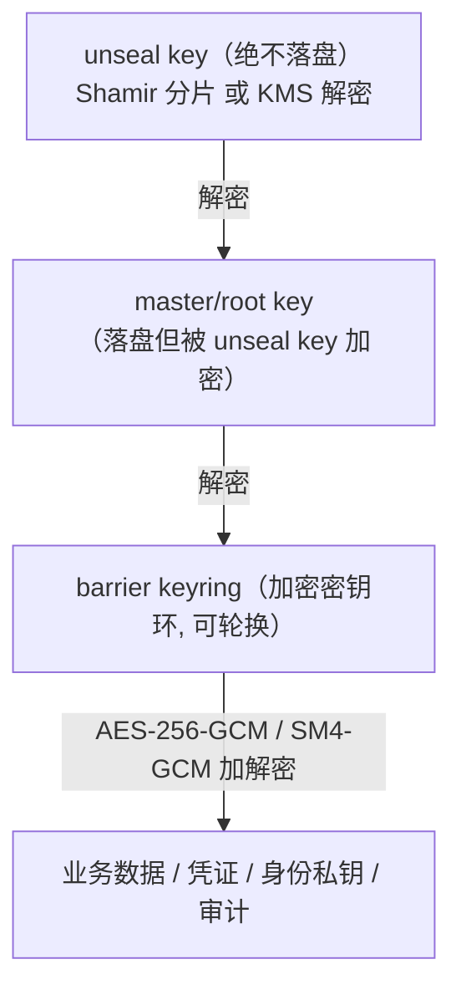

你正在 **refine** docs-cockpit module **M11 · HA · Raft/JRaft 强一致**(sprint v0.3)。

我已经写了这个 module 的 frontmatter + subtasks + linked docs · 现在需要你 **检查 anchor 精度** · 给出 YAML patch。

## 执行模式 · 二选一(先判断你是谁)

- **A · 你有文件编辑工具**(Claude Code / Cursor / Codex CLI · 即能用 Edit / Write 直接改本地文件):**直接动手** · 不要只输出 patch。优先 (1) 改 module MD 的 `## 待办` / `## 3 · 待办` body checklist 行 · 给每个 subtask 补 inline `@code:path[:lines]` 和 `@docs:path[#§N.M | :start-end]` annotation(parser 支持多次堆叠 · 见 plan §6.1)· 这是 diff 友好的首选;或 (2) 把 `subtasks:` 写进 frontmatter object schema · 给每个 subtask 显式 `code:` / `docs:` 字段。改完跑 `docs-cockpit build` 验证 anchor 落到 `state.json` 即可。**不要让用户复制粘贴 · Claude Code 的副驾价值就在不让人重复打字。**
- **B · 你没有文件编辑工具**(浏览器里的 ChatGPT / Claude.ai / 其它 web 端):输出 YAML patch · 用户会复制回 MD。

判断标准:如果你能调用 `Edit` / `Write` / `MultiEdit` 之类工具,就是 A;只能在 chat 框输出文本就是 B。

## 不要改的字段(out of scope)

- `id` · `title` · `sprint` · `status` · `progress` · `desc`
- subtask 的 `title` / `status` · 这些反映工作意图 · 不在 anchor 精度范畴

## 要 refine 的字段

- subtask 的 `code:` · 应该精确到 `path:start-end` 行号 · 不是 `directory/` 整目录
- subtask 的 `docs:` · 应该精确到 `path.md#§N.M` heading 或 `:start-end` 行号 · 不是整个 doc
- subtask 的 `docs:` · 检查是否漏了相关 plan / RFC 引用(`linked_docs` 列表里有但 subtask 没引用)

## 当前 module frontmatter

```yaml
id: M11
title: "HA · Raft/JRaft 强一致"
status: not-started
sprint: "v0.3"
progress: 0
desc: "SOFAJRaft 复制状态机：RaftStorage/RaftSealStore/RaftLeaseManager（leader-only 租约扫描），进程内多节点测试。含 API 核准 gate（Task 0）。spec/plan 已备好。"


subtasks:

  - id: M11-9291bb
    title: "M11-T0 JRaft API 源码核准 gate（gitee 克隆逐一核准并回写计划）"
    status: not-started


  - id: M11-693062
    title: "M11-T1 KvOp + 状态机 + Server/Client（单节点往返+快照）"
    status: not-started


  - id: M11-e4ccf7
    title: "M11-T2 3 节点复制 + leader failover 测试"
    status: not-started


  - id: M11-2a12ef
    title: "M11-T3 RaftStorage/RaftSealStore/RaftLeaseManager（leader-only sweeper）"
    status: not-started


```

## 当前 linked docs(已 embed 摘要 · 完整 doc 在 repo)


### HA Raft 设计 spec

`docs/superpowers/specs/2026-06-10-custos-ha-raft-design.md`

# Custos HA · Raft/JRaft 强一致 设计规格（M11）

> **类型**：路线图子项目 **M11 / P-HA**（v0.3）设计。存储/租约/解封配置的 Raft 强一致集群化。
> **校订**：2026-06-10 · **状态**：评审中 · **许可**：Apache-2.0
> **配套**：生产架构 spec §3/§7（ADR-3：MySQL → Raft HA）；`docs/design/02-engine-crypto-design.md` §7。

---

## 1. 目标与范围

单节点 Custos 的三个有状态组件集群化，强一致、不丢不重：
① `RaftStorage implements Storage`（密文 KV 复制状态机）；② `RaftSealStore implements SealStore`（解封配置复制，节点各自内存解封）；③ `RaftLeaseManager implements LeaseManager`（租约为状态机条目，仅 leader 跑到期扫描）。

- **选型**：**SOFAJRaft**（`com.alipay.sofa:jraft-core`，Apache-2.0、国产、纯 JVM 可进程内多节点测试）——符合自主可控约束。
- **非目标**：跨数据中心、动态扩缩容运维工具、Learner 只读副本、Multi-Raft 分片（单 group 起步）。

## 2. 架构

```
Storage/SealStore/LeaseManager 调用
        ▼
RaftKvClient（leader 写：put/delete Op 序列化为 Task；读：leader ReadIndex / MVP 先 leader-local）
        ▼ JRaft 复制
RaftKvStateMachine（onApply：维护内存 Map<String,byte[]>；onSnapshotSave/Load：全量快照）
```
- **加密边界不变**：状态机存的是 **Barrier 密文**（调用方仍先 seal 再 put），Raft 层不接触明文与密钥。
- **解封协调**：master/keyring 永不复制、永不落盘——每个节点独立用分片解封（操作员对每节点 unseal，或后续 KMS 自动解封）；`RaftSealStore` 只复制 `wrapped_barrier/threshold/shares` 密文配置，使任意节点可加入并解封。
- **租约**：租约行进状态机；到期扫描只在 leader 执行（`Node.isLeader()` 守卫），failover 后新 leader 接管扫描——保证"不重"（单扫描者）+"不丢"（状态机持久）。

## 3. 接口契约

```java
public final class RaftKvStateMachine extends StateMachineAdapter { /* onApply/onSnapshotSave/onSnapshotLoad */ }
public final class RaftKvServer { /* 起一个 RaftGroupService 节点：groupId, serverId, initialConf, dataPath */ }
public final class RaftKvClient { byte[] get(String k); void put(String k, byte[] v); void delete(String k); java.util.List<String> list(String prefix); }
public final class RaftStorage implements io.custos.engine.storage.Storage { /* 委托 RaftKvClient + Barrier 在调用方 */ }
public final class RaftSealStore implements io.custos.engine.seal.SealStore { /* get/put 经 RaftKvClient */ }
public final class RaftLeaseManager implements io.custos.engine.lease.LeaseManager { /* 租约条目 + leader-only sweeper */ }
```
> 上述签名为契约级；JRaft 具体 API（`Node`/`Task`/`Closure`/`RouteTable`/CliService）**必须先源码核准**（见 plan Task 0）再实现——本项目铁律：未经核准的第三方 API 不写实现。

## 4. 测试策略（纯 JVM，无 Docker）

JRaft 支持进程内多节点（不同端口 + 本地数据目录）：
- 单节点 group：put→get 往返、快照保存/加载。
- 3 节点：leader 写入 → follower 状态机可见（apply 后）；kill leader → 新 leader 当选 → 继续读写（failover）。
- `RaftLeaseManager`：leader-only 扫描（非 leader 不扫）、failover 后新 leader 接管。
- 临时数据目录用 JUnit `@TempDir`。

## 5. 风险

| 风险 | 应对 |
|---|---|
| JRaft API 记忆失真 | plan Task 0 先 gitee 克隆核准（gitee.com/sofastack/sofa-jraft），逐一修正计划代码再开工 |
| 进程内 3 节点端口冲突 | 测试动态选可用端口 |
| 读一致性 | MVP leader-local 读 + 注明；ReadIndex 列入计划可选步 |

## 6. YAGNI

单 Raft group；不做分片/迁移；不做跨机房；CLI 集群运维命令留 M13 之后。


---

### HA Raft 实现计划（含 JRaft API 核准 gate）

`docs/superpowers/plans/2026-06-10-custos-ha-raft.md`

# Custos HA · Raft/JRaft（M11）Implementation Plan

> **For agentic workers:** REQUIRED SUB-SKILL: Use superpowers:subagent-driven-development (recommended) or superpowers:executing-plans to implement this plan task-by-task. Steps use checkbox (`- [ ]`) syntax for tracking.

**Goal:** 用 SOFAJRaft 把 Storage/SealStore/LeaseManager 集群化（复制状态机 + leader-only 租约扫描），进程内多节点测试验证复制与 failover。

**Architecture:** `RaftKvStateMachine`（内存 Map + 快照）承载密文 KV；`RaftKvClient` 走 leader 提交写 Task、读取走 leader-local（ReadIndex 列为可选强化）；`RaftStorage/RaftSealStore/RaftLeaseManager` 三个既有 SPI 落到该 KV 上。加密边界不变：状态机只见 Barrier 密文。

**Tech Stack:** Java 21 · com.alipay.sofa:jraft-core 1.3.14 · JUnit 5（进程内多节点，无 Docker）

> 前置：M02（Storage/SealStore/LeaseManager SPI）。对应 spec `docs/superpowers/specs/2026-06-10-custos-ha-raft-design.md`。
> **铁律 gate**：Task 0 未完成（JRaft API 逐一源码核准并修正本计划代码）前，禁止进入 Task 1+。本计划中 JRaft 相关代码段是**契约草图**，以核准结果为准——这是本项目从 jjwt/jCasbin/MCP 核准流程沿袭的规矩。

---

## File Structure

| 文件 | 职责 |
|---|---|
| `engine/pom.xml` | 加 jraft-core 1.3.14 |
| `engine/src/main/java/io/custos/engine/raft/KvOp.java` | put/delete 操作（序列化进 raft log）|
| `engine/src/main/java/io/custos/engine/raft/RaftKvStateMachine.java` | 状态机（apply/snapshot）|
| `engine/src/main/java/io/custos/engine/raft/RaftKvServer.java` | 起一个 raft 节点 |
| `engine/src/main/java/io/custos/engine/raft/RaftKvClient.java` | get/put/delete/list |
| `engine/src/main/java/io/custos/engine/raft/RaftStorage.java` | Storage SPI 落地 |
| `engine/src/main/java/io/custos/engine/raft/RaftSealStore.java` | SealStore SPI 落地 |
| `engine/src/main/java/io/custos/engine/raft/RaftLeaseManager.java` | LeaseManager（leader-only 扫描）|
| `engine/src/test/java/io/custos/engine/raft/*` | 单节点/3 节点/failover/租约测试 |

---

## Task 0: JRaft API 源码核准 gate（必须先做）

- [ ] **Step 1: 克隆并核准 API**

```bash
git clone --depth 1 https://gitee.com/sofastack/sofa-jraft research/sofa-jraft
```
逐一核准并把结果写回本计划（修正后续代码段）：
1. `RaftGroupService(groupId, PeerId, NodeOptions)` 构造与 `start()` 返回 `Node` 的签名；
2. `NodeOptions`：`setFsm/setLogUri/setRaftMetaUri/setSnapshotUri/setInitialConf` 的当前名称；
3. `StateMachineAdapter.onApply(Iterator)` 中 `iter.getData()`（ByteBuffer）与 `iter.done()`/`done.run(Status)` 约定；
4. 快照：`onSnapshotSave(SnapshotWriter, Closure)` / `onSnapshotLoad(SnapshotReader)` 的文件写入/注册（`writer.addFile`）；
5. 客户端路由：`RouteTable.getInstance().updateConfiguration/refreshLeader/selectLeader` + `CliClientServiceImpl`；或进程内直接持 `Node` 引用提交 `Task`（测试态最简路径——**优先核准此路径**）；
6. `Task(data, done)` 提交：`node.apply(task)`；
7. leader 判定：`node.isLeader()`；
8. 多节点进程内组网：同 JVM 多 `RaftGroupService` 不同端口/数据目录是否受支持（官方 test 用法）。

- [ ] **Step 2: 把核准差异回写本计划（Edit 本文件），然后才进 Task 1**

- [ ] **Step 3: 提交计划修正**
```bash
git add docs/superpowers/plans/2026-06-10-custos-ha-raft.md
git commit -m "docs(plan): verify JRaft API against source and correct M11 plan"
```

---

## Task 1: KvOp + RaftKvStateMachine + RaftKvServer/Client（单节点往返）

**Files:** Create 上表 raft 包前 5 个文件；Test `RaftKvSingleNodeTest.java`

- [ ] **Step 1: 写失败测试（单节点 put→get 往返 + 重启快照恢复）**

```java
// 契约草图（以 Task 0 核准修正为准）
@Test void singleNodePutGetRoundTrips(@TempDir Path dir) {
    RaftKvServer server = RaftKvServer.start("custos-kv", "127.0.0.1:18091", "127.0.0.1:18091", dir);
    RaftKvClient client = server.localClient();          // 进程内直连 Node
    awaitLeader(server);                                  // 轮询 node.isLeader()
    client.put("k1", "v1".getBytes());
    assertArrayEquals("v1".getBytes(), client.get("k1"));
    client.delete("k1");
    assertNull(client.get("k1"));
    server.shutdown();
}
```

- [ ] **Step 2: 实现 KvOp（type+key+value 的简单二进制序列化，避免引第三方序列化库）**
- [ ] **Step 3: 实现 StateMachine（onApply 维护 `ConcurrentHashMap`；快照=全量 map 序列化到文件）**
- [ ] **Step 4: 实现 Server/Client（写经 `node.apply(Task)` 同步等 done；读 leader-local 从状态机 map）**
- [ ] **Step 5: 跑测试绿 → 提交** `feat(engine): JRaft single-node replicated KV (state machine + snapshot)`

---

## Task 2: 3 节点复制 + failover 测试

**Files:** Test `RaftKvClusterTest.java`

- [ ] **Step 1: 写失败测试**

```java
// 契约草图：三节点 127.0.0.1:18091/18092/18093，initialConf 互联
@Test void replicatesToFollowersAndSurvivesLeaderFailover(@TempDir Path dir) {
    List<RaftKvServer> nodes = RaftKvServer.startCluster("custos-kv", PEERS, dir);
    RaftKvServer leader = awaitLeaderOf(nodes);
    leader.localClient().put("k", "v".getBytes());
    awaitApplied(nodes, "k");                                  // 三个状态机都可见
    leader.shutdown();                                          // kill leader
    RaftKvServer newLeader = awaitLeaderOf(remaining(nodes));   // 新 leader 当选
    assertArrayEquals("v".getBytes(), newLeader.localClient().get("k"));
    newLeader.localClient().put("k2", "v2".getBytes());         // 继续可写
}
```

- [ ] **Step 2: 实现 startCluster + 测试工具（动态端口探测避免冲突）→ 绿 → 提交** `test(engine): 3-node raft replication and leader failover`

---

## Task 3: RaftStorage + RaftSealStore + RaftLeaseManager

**Files:** Create 三个 SPI 落地类；Test `RaftSpiAdaptersTest.java`

- [ ] **Step 1: 写失败测试**
  - `Raft
… [truncated · 5860 chars total]

---

### 引擎加密设计（存储 ADR-3）

`docs/design/02-engine-crypto-design.md`

# 02 · 引擎内核：威胁模型与密码学设计（重中之重）

> **定位**：本文是 Custos 安全的基石——给出引擎内核的**威胁模型**与**密码学设计**：密钥层级、Barrier 加密、Seal/Unseal（Shamir/KMS）、存储加密、内存安全、**哈希链防篡改审计**、**国密 SM2/SM3/SM4 可切换套件**，并明确所用**密码库与标准算法**。
>
> **铁律**：① **不自创密码学**——只用经过审计的密码库实现**标准算法**；② **master key 不明文落盘**；③ **数据落盘前 Barrier 加密**；④ **审计防篡改**；⑤ **密钥内存用完清零、禁 swap**；⑥ **吊销/租约可靠传播**。
>
> 设计灵感来源：OpenBao / Vault 的 Barrier·Seal·Lease 概念、SPIRE 的 KeyManager 思路（均**只借思想、不抄码**，见 `00-synthesis.md` 许可证表）。**本文为防御性安全软件的设计文档。**

---

## 1. 为什么这是重中之重

Custos 是**持有密钥**的系统：一旦引擎内核设计有误，等于把企业所有凭证一次性暴露。PRD 风险表把"自研密钥引擎安全风险"列为 🔴 极高。因此本文遵循"**先威胁建模、后密码设计、上生产前外部审计（v0.4）**"的顺序，并在每个安全决策处标注风险与缓解。

---

## 2. 资产与信任边界

### 2.1 受保护资产（按敏感度）
| 资产 | 敏感度 | 失陷后果 |
|---|---|---|
| **master key / root key** | 🔴 最高 | 全盘沦陷（可解密一切） |
| **barrier key（keyring）** | 🔴 | 解密所有落盘数据 |
| 业务密钥 / 动态凭证 | 🟠 | 单资源泄漏（有 TTL，窗口小） |
| 身份签名私钥 | 🟠 | 可伪造 Agent 身份 |
| 审计日志 | 🟡 | 篡改可掩盖入侵 |
| 策略（Nacos 配置） | 🟡 | 非密钥，但篡改可越权 |

### 2.2 信任边界
- **解封后的引擎进程内存** = 唯一持有 master/barrier key 明文之处（可信，但需内存防护）。
- **存储后端、网络、LLM 上下文、Nacos 配置** = 不可信。

---

## 3. 威胁模型（STRIDE + 显式边界）

### 3.1 在威胁模型内（必须防护）
| 类别(STRIDE) | 威胁 | 缓解 |
|---|---|---|
| **S 伪造** | 伪造 Agent/用户身份 | 身份签名（ECDSA/SM2）、短 TTL、OBO 交集；mTLS |
| **T 篡改** | 篡改落盘数据 / 审计日志 | Barrier AEAD（GCM tag 检测）；**审计哈希链**（任一条被改则链断） |
| **R 抵赖** | 否认访问行为 | 每次"决策+访问"留痕（用户+Agent+任务+资源+结果），审计先于返回密钥 |
| **I 信息泄露** | 窃听通信 / 读存储 / **密钥进 LLM** | TLS + 落盘前加密（只见密文）；**secretless 经纪（密钥不进 LLM）** |
| **D 拒绝服务** | 引擎不可用 → 业务断 | 首版单节点（可用性受限，已知）；后续 Raft HA |
| **E 提权** | 越权访问资源 | 默认拒绝 ACL；最小权限；JIT+审批；**Nacos 秒级吊销** |

### 3.2 明确**不在**威胁模型内（声明边界，借 OpenBao 实践）
- **对存储后端的任意控制**（可删可回滚）：攻击者若能任意写存储，可致数据丢失/回滚，难以完全防护（缓解：存储访问控制 + 备份 + Raft 多副本）。
- **运行中进程的完整内存转储**：若攻击者能 dump 解封态进程内存，机密性受损（缓解：内存清零 + 禁 swap + 最小存活，**缩小**而非消除）。
- **宿主机 root / 任意代码执行**：等同失守（缓解：最小权限部署、不 root 跑、镜像加固）。
- **被攻陷的合法客户端**：持其凭证可在其权限内访问（缓解：短 TTL + 行为审计 + 秒级吊销）。
- **管理员注入恶意策略/配置**：属内部恶意（缓解：策略变更审计 + 审批 + 四眼）。

> **原则**：像 OpenBao 一样**显式声明边界**——不假装能防一切，把有限的防护资源投在最高价值资产（master key、审计完整性、密钥不进 LLM）。

---

## 4. 密钥层级（Key Hierarchy）

借鉴 OpenBao 四层，落到 Custos：



| 层 | 存放 | 加密者 | 说明 |
|---|---|---|---|
| **unseal key** | **不落盘** | Shamir 分片 / KMS | 只用于解封；分片不能直接请求 |
| **master/root key** | 落盘（密文） | unseal key | 启动后解密得到 |
| **barrier key（keyring）** | 落盘（密文） | master key | 支持轮换（多版本 keyring） |
| **数据加密密钥/数据** | 落盘（密文） | barrier key | 业务密钥、动态凭证元数据、身份私钥、审计链 |

- **轮换**：barrier key 可在线轮换（新写用新版本，旧数据按版本号解密），master key/unseal key 经管理操作轮换；轮换不停服（除 seal 迁移）。

---

## 5. Barrier 加密层

| 项 | 设计 |
|---|---|
| **算法（默认）** | **AES-256-GCM**，96-bit 随机 nonce（每对象独立随机），GCM 认证标签做完整性校验（AEAD：机密性+抗篡改一体） |
| **算法（国密套件）** | **SM4-GCM**（128-bit 分组）或 SM4-CTR+SM3-HMAC（视库支持），可切换 |
| **格式** | `[suite_id][key_version][nonce][ciphertext+tag]`——suite_id 标识算法套件，key_version 标识 keyring 版本，支持平滑轮换与套件迁移 |
| **读路径** | 解密时校验 GCM tag/HMAC；失败即视为篡改，**中止处理** |
| **实现** | 调审计库（见 §9），**不自写分组密码/GCM 模式** |

---

## 6. Seal / Unseal

- 启动默认 **sealed**：知道存储位置，但无 master key，无法解密；除"解封/查状态"外几乎不可操作。
- **解封流程**：提供 unseal key → 解密 master key → 解密 keyring → 进入 unsealed → 加载审计/认证/策略。
- **检测入侵一键 seal**：丢弃内存中 master/barrier key，立即锁库。

### 决策点 ① 解封默认方式（请你拍板）

| 选项 | 机制 | 优点 | 缺点 |
|---|---|---|---|
| **A. Shamir 分片（默认）** ⭐推荐 | unseal key 用 Shamir 切 N 片取 M 片重建（默认 5/3） | 不依赖外部、不信任单人、契合自主可控、可演示 | 解封手动，自动化运维不便 |
| **B. KMS/HSM 自动解封** | 启动调云 KMS/HSM 解密 master key，用 recovery key 做高危授权 | 运维省心、自动重启 | 强生命周期依赖（KMS key 删=不可恢复）、依赖外部信任、国内需信创 KMS |
| **C. 两者皆备，按部署选** | 同时实现，配置切换 | 灵活 | 实现/测试成本高 |

> **推荐**：**首版 A（Shamir）为默认 + 预留 KMS 接口（C 的接口形态）**。理由：① 自主可控、不绑外部 KMS；② 可演示 two-person rule；③ 接口预留，企业有信创 KMS（如阿里 KMS、华为 DEW）时可切 B。**KMS 自动解封若启用，文档须显著告警"KMS key 删除=集群不可恢复"并强制备份策略。**

---

## 7. 存储加密

- **落盘前一律 Barrier 加密**，存储后端只见密文（存储不可信）。
- 存储抽象接口（`engine/storage`）：`get/put/delete/list`，全部走 Barrier。

### 决策点 ② 存储后端（请你拍板）

| 选项 | 说明 | 优点 | 缺点 |
|---|---|---|---|
| **A. MySQL（首版默认）** ⭐推荐 | 企业已有，全密文存储 | 国内企业普遍在用、运维熟、PRD 指定 | 自身非强一致 HA（靠主从），HA 需额外方案 |
| **B. 嵌入式（RocksDB/H2）** | 单机自带 | 零外部依赖、起步快 | 不适合集群、生产受限 |
| **C. Raft 集成存储** | 自带强一致 HA（借 JRaft 思路） | 强一致、租约不丢不重 | 自研成本高，放 v0.3 HA |

> **推荐**：**首版 A（MySQL，全密文）**作默认 + 抽象存储接口；**v0.3 引入 C（Raft/JRaft）做强一致 HA**（呼应"租约不丢不重"）。B 仅用于本地 dev。

---

## 8. 内存安全（Java 的挑战与对策）

> 这是 Java 引擎相较 Go 的**主要短板**，必须正面设计（也是 `08` 引擎语言论证的关键输入）。

| 风险 | Java 的问题 | 对策 |
|---|---|---|
| 明文密钥驻留 | `String` 不可变、入常量池，无法清零 | **一律用 `byte[]`/`char[]`/`javax.crypto.SecretKey`**，用完 `Arrays.fill(buf,(byte)0)` 显式清零；禁止把密钥转 `String` |
| GC 复制残留 | GC 移动对象，明文可能在堆里留多份副本 | 关键密钥材料放**堆外内存（DirectByteBuffer / JNA malloc）**，手动清零；最小化明文存活时间 |
| 换页到磁盘（swap） | 内存被换出 → 密钥落盘 | **mlock**：用 JNA 调 `mlock`/`VirtualLock` 锁定敏感内存页禁 swap；部署层禁用 swap |
| 核心转储 | crash dump 含密钥 | 关闭 core dump（`ulimit -c 0`）、容器禁 dump |
| 日志泄漏 | 误把密钥打日志 | 审计/日志层强制对密钥字段 HMAC 脱敏；代码评审红线 |

- **明文存活最小化**：动态
… [truncated · 9107 chars total]

---


## Repo 根路径
`D:\harvey_work\custos`
当前分支:`main`


## 你的任务

1. **读 linked docs 的内容** · 理解每个 plan / RFC 的章节布局
2. **对每个 subtask** · 判断它在做什么 · 然后:
   - 找出 plan / RFC 里对应的具体 section(`#§N.M` heading slug 或 `:start-end` 行号)
   - 找出 repo 里对应的代码 file + 行号(如果 code 已经存在;新代码留 `code: <path>` 不带行号)
3. **按上面「执行模式」分支落地**:
   - **模式 A**:直接 Edit MD body checklist · 每行末尾追加 ` @code:path[:lines]` 和 ` @docs:path[#§N.M | :start-end]`(多个就堆叠空格分隔)· 完事跑 `docs-cockpit build` · 检查 `docs/state.json` 里对应 subtask 的 `code` / `docs` 字段。报告简短:每个 subtask 改了什么 + build 是否干净。
   - **模式 B**:输出下面格式的 YAML patch 给用户复制:

```yaml
subtasks:
  - id: <现有 subtask id>
    code: "<更精确的 code anchor · 或 list>"
    docs: ["<更精确的 docs anchor>", ...]
```

如果某个 subtask 在 linked docs 里找不到对应 section · 模式 A 留 `# TODO: ...` 注释行不写 anchor · 模式 B 在 patch 里输出 `# TODO: ...` 注释行 · **不要瞎猜 anchor**(driver-seat 信任来自精度 · 错 anchor 比缺 anchor 伤害更大)。
