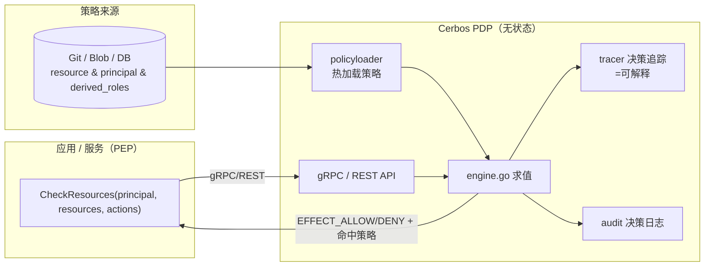

# Cerbos — 解耦式授权策略引擎（PDP），可解释决策

> **一句话定位**：Cerbos 是一个**独立部署的授权 PDP（Policy Decision Point）**——把授权逻辑从应用里彻底解耦，以 gRPC/REST 服务形态对外提供"这个 principal 能不能对这个 resource 做这个 action"的决策，并给出**可解释**结果。**Apache-2.0**，是 Custos 权限层"PDP/PEP 分离 + 可解释"的头号设计范本。
>
> 本笔记基于本地克隆 `research/cerbos`（`internal/engine/`、`schema/jsonschema/`、`deploy/.../policies/`）。

---

## 1. 它解决什么问题 & 核心架构

应用里散落的 `if user.role == ...` 难治理、难审计、改一次要重新发版。Cerbos 把授权抽成**版本化的策略文件 + 一个无状态 PDP 服务**：应用在执行点（PEP）发一个 CheckResources 请求，PDP 返回每个 action 的 `EFFECT_ALLOW/EFFECT_DENY` 及命中策略。



无状态 + 策略外置（Git/Blob/DB）+ 热加载（`internal/engine/policyloader/`）→ **改策略不动应用**。

---

## 2. 关键机制如何实现（含源码定位）

### 2.1 三类策略 + 条件（CEL）
- **Resource Policy**：针对某资源类型（如 `album`），为每个 action 列 `roles` / `derivedRoles` 与 `condition`。
- **Principal Policy**：针对某具体主体的特例覆盖。
- **Derived Roles（派生角色）**（样例 `deploy/.../derived_roles/derived_roles_01.yaml`）：在 `parentRoles` 之上叠加**上下文条件**派生出动态角色，如：
  ```yaml
  - name: employee_that_owns_the_record
    parentRoles: ["employee"]
    condition: { match: { expr: "R.attr.owner == P.id" } }   # CEL：R=resource, P=principal
  ```
  → 这正是 **ABAC（按属性/上下文判定）** 的优雅表达：把"owner==自己"这种上下文条件结构化，而非塞进一个大 matcher 字符串。
- **条件用 CEL**（Common Expression Language）：`R.attr.*`、`P.attr.*`、`request.*` 都可入条件——天然支持"按意图/上下文/风险"判定（对齐 Custos A1 的 ABAC/PBAC）。

### 2.2 评估引擎与可解释（`internal/engine/engine.go` + `tracer/`）
- 引擎对 `principal × resource × action` 求值，输出每个 action 的 effect + **命中的策略/规则**。
- **`internal/engine/tracer/`** 提供决策追踪：能回答"**为什么 allow/deny、命中了哪条规则**"——这是 Custos A4「可解释决策」的直接范本。
- **Scopes（作用域）**：策略可分层作用域（如 `acme.hr.uk`），支持继承与层级覆盖——适合多租户/多环境。

### 2.3 Schema 校验 & 标准对齐（`schema/jsonschema/`）
- 对 principal/resource 的属性可挂 **JSON Schema 校验**，保证输入属性合法。
- 内置 **AuthZEN**（`schema/jsonschema/authzen/...`）支持——对齐 OpenID 的授权 API 标准；说明 Cerbos 紧跟授权标准化（对 Custos 对齐 MCP SEP-835/标准化有借鉴）。

### 2.4 审计 / 决策日志（`internal/engine/audit/`、`schema/.../audit/v1/DecisionLogEntry`）
- 结构化 **Decision Log**（CheckResources / PlanResources 决策留痕），可对接外部存储。
- **Query Planner（PlanResources）**：能把"某 principal 对某资源类型可做什么"编译成数据层过滤条件（如 SQL where），用于列表场景——一个进阶亮点。

---

## 3. 在 AI Agent 场景下的不足 / 与 Nacos 生态的脱节

| 维度 | Cerbos 的局限（站在 Custos 立场） |
|---|---|
| **只做授权 PDP** | 不签身份、不发密钥、无 secretless 经纪、无 OBO/JIT 审批——只覆盖 Custos 三层的"策略层" |
| **无 Agent / 工具语义** | 不懂 MCP SEP-835 的"工具/动作级 scope"；需把 MCP tool/action 映射成它的 resource/action |
| **策略来源不含 Nacos** | 策略走 Git/Blob/DB + 自身热加载，**没有 Nacos 集成**——拿不到"Nacos 配置热更新=秒级吊销"护城河 |
| **非国产、海外治理** | 与"国产组件优先/自主可控"诉求有距离（对比 Casbin） |
| **Go 实现、独立服务** | 与 Custos 倾向的 Java 引擎不同栈；作为独立 PDP sidecar 集成可行，但增加运维面 |

---

## 4. 可借鉴的设计 vs 要避免的坑

| ✅ 借鉴（Apache-2.0，思想可深度借鉴） | ⚠️ 要避免 / 改造 |
|---|---|
| **PDP/PEP 彻底解耦**：无状态 PDP + 应用在执行点请求决策 → Custos A4 的架构骨架 | 不直接把 Cerbos 当 Custos 内核（Go/海外/非 Nacos）；**借其设计，用 jCasbin 落地**（见 `casbin.md`） |
| **Derived Roles + CEL 条件**：把 ABAC 上下文结构化（`R.attr.owner==P.id`），比纯 matcher 字符串可治理 | — |
| **可解释决策（tracer：命中规则 + 原因）** → Custos A4 必抄 | 直接依赖其 Go 服务会增加跨栈运维 |
| **Scopes 层级作用域** → 对齐 Nacos namespace/group 多租户 | — |
| **Decision Log + Query Planner（PlanResources）** | 策略来源改为 **Nacos 配置**（自研 loader），实现秒级热更新 |
| **Schema 校验 + AuthZEN 标准对齐**的工程态度 → Custos 对齐 MCP SEP-835 | — |

**Cerbos vs Casbin（Custos 权限层选型预判，详见 `04-authz-design.md`）**：

| | Cerbos | Casbin（jCasbin） |
|---|---|---|
| 形态 | 独立 PDP 服务（Go） | 嵌入式库（有 Java 实现） |
| 可解释 | **强**（tracer 命中规则+原因） | 弱（需自研增强） |
| 模型表达 | 结构化策略 + CEL（治理性好） | PERM matcher（灵活但可读性弱） |
| 自主可控 | 海外治理 | **国产**，更契合诉求 |
| 与 Java 引擎契合 | 跨栈 sidecar | **同栈直接依赖** |
| Nacos 集成 | 无（自研 loader） | 无现成，但 Watcher 抽象可缝合 |
| **Custos 取向** | **借鉴其设计**（解耦/可解释/CEL/scope） | **作为落地内核**（jCasbin + 自研服务化/可解释/Nacos Watcher） |

---

## 5. 许可证与对 Custos 的约束

| 项 | 内容 |
|---|---|
| **许可证** | **Apache-2.0**（`research/cerbos/LICENSE`）——与 Custos 同许可，设计可放心借鉴，理论上也可依赖；但**栈与自主可控考量**使我们倾向"借设计、不直依赖"。 |
| **应对** | 把 Cerbos 当**权限层设计的标杆**：PDP/PEP 解耦、可解释决策、Derived Roles+CEL、Scopes、Decision Log 这些**设计模式**写进 Custos `04-authz-design.md`；**落地用 jCasbin（国产、Java 同栈）**，由 Custos 自研 PDP 服务壳补齐可解释与 Nacos 热更新。 |

> **结论**：Cerbos 定义了"现代解耦授权 PDP"的样貌——**无状态 PDP/PEP 分离、Derived Roles + CEL 的结构化 ABAC、可解释决策（tracer）、Scopes 作用域、Decision Log**，这些**设计模式**是 Custos 权限层的直接蓝本。但出于**自主可控 + Java 同栈 + Nacos 原生**考量，Custos 倾向"**借 Cerbos 的设计、用 Casbin/jCasbin 落地**"，并自研 Nacos 策略加载与秒级热更新吊销。
