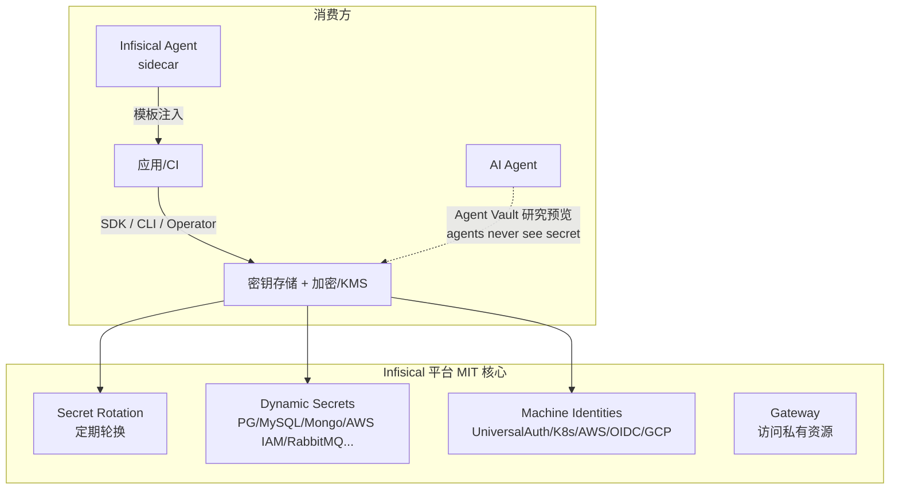

# Infisical — 开发者友好的密钥管理平台（SecretOps）

> **一句话定位**：Infisical 是一个**开发者友好的密钥管理平台（SecretOps）**：集中存储、环境隔离、版本化、定期轮换，并对部分数据库支持按需动态凭证；**核心 MIT 纯开源**（无 BSL 顾虑），控制台体验好。PRD 把它的「**Infisical Agent Vault**（研究预览，"agents never see the secret"）」列为 Custos 的**直接同方向竞品**之一。
>
> **来源说明**：本笔记基于**完整源码**（`research/infisical`，经 Gitee 镜像 `gitee.com/mirrors/infisical` 克隆，12231 文件）+ 密钥竞品对比资料 + PRD 描述。**已做关键源码级核实**，并据此对原"许可证"判断做了**重大更正**（见 §5：动态密钥/轮换在 `ee/` 商业许可下，非 MIT）。

---

## 1. 它解决什么问题 & 核心架构

把团队散落的密钥（DB 密码、API key、AK/SK）集中到一个**好用的平台**：分环境（dev/staging/prod）管理、版本化、按计划轮换，并通过 SDK / CLI / K8s Operator / Agent 注入到应用——**开发者体验**是它的核心卖点。

---

## 2. 关键机制（站在 Custos 立场）

### 2.1 集中管理 + 定期轮换（主打）
- 静态凭证（PostgreSQL / MySQL / AWS IAM 等）**按计划自动轮换**——这是它最扎实的能力。
- 环境隔离 + 密钥版本化 + 审计日志 + 细粒度访问控制。

### 2.2 动态密钥（Dynamic Secrets）
- **源码佐证**：`backend/src/ee/services/dynamic-secret/providers/` 下后端其实**相当广**——sql-database、mongo-db/mongo-atlas、aws-iam/aws-elasticache/aws-memorydb、gcp-iam、azure-sql/azure-entra-id、cassandra、clickhouse、couchbase、elastic-search、kubernetes、ldap、rabbit-mq、redis、sap-hana/sap-ase、snowflake、ssh、totp、vertica 等 20+。生成**带 TTL 的 ephemeral 凭证**，配套 `dynamic-secret-lease` 做租约回收。
- ⚠️ **但这些后端全部位于 `backend/src/ee/`（企业版商业许可，非 MIT）**——见 §5。即"动态密钥"这一对 Custos 最相关的能力**不在 MIT 范围内**。

### 2.3 Machine Identities + 多认证
- 面向非人类身份的认证：Universal Auth（client id/secret）、**Kubernetes**、AWS IAM、GCP、**OIDC** 等——与 Custos 身份层 ID2 多认证方法的思路一致。

### 2.4 Infisical Agent 与「Agent Vault」(PRD 关注点)
- **Infisical Agent**：类似 Vault Agent 的 **sidecar**，认证后拉取密钥、按模板写入文件/环境，应用直接消费——降低应用直接调 API 的复杂度。
- **Agent Vault（研究预览，"agents never see the secret"）**：面向 **AI Agent** 的**凭证代理**方向——让 agent 不直接看到密钥，由代理在上下文之外注入。**这是与 Custos 经纪层（secretless）最接近的竞品能力**，但据 PRD 仍是"研究预览"。

### 2.5 加密 / KMS 与集成
- 平台对密钥做加密存储，自带 KMS 能力。
- 集成面广：**K8s Operator**、CI/CD、SDK（多语言）——开发者体验出色。
- **Gateway**：安全访问私有网络资源。

---

## 3. 在 AI Agent 场景下的不足 / 与 Nacos 生态的脱节

| 维度 | Infisical 的局限（站在 Custos 立场） |
|---|---|
| **secretless 仍在路上** | Agent Vault「agents never see the secret」是**研究预览**，成熟度与覆盖未知；不是稳态的 secretless 会话代理（不像 Teleport 那样代理转发） |
| **动态密钥广度有限** | 不及 Vault；极端动态/广覆盖场景不够 |
| **无 OBO / 工具级 scope** | 无"用户∩Agent 取最小"委托；不懂 MCP SEP-835 工具/动作级授权 |
| **与 Nacos 脱节** | 自带平台/控制台，不消费 Nacos 注册/配置——**拿不到"Nacos 热更新=秒级吊销"护城河** |
| **非国产、SaaS 优先** | 海外项目、商业 SaaS 为主，自托管社区版能力边界需逐一核实；与"自主可控"诉求有距离 |
| **授权可解释弱** | 以 RBAC/项目权限为主，缺 Cerbos 式可解释决策 |

---

## 4. 可借鉴的设计 vs 要避免的坑

| ✅ 借鉴 | ⚠️ 要避免 / 注意 |
|---|---|
| **开发者体验**：好用的控制台 + SDK + K8s Operator + CLI —— Custos 也要"装上即用" | **许可证陷阱**：核心 MIT，但部分高级特性可能在其 **EE/商业许可**目录下——借鉴前**逐 feature 核实许可**，绝不混入代码 |
| **Agent sidecar 注入**模式（拉密钥→模板注入）——可作为 Custos SDK/Starter 的一种交付形态 | 不照搬其动态密钥广度（首版做窄做深，只 DB 只读） |
| **Machine Identities + 多认证**（K8s/OIDC）——对齐 Custos ID2 | "研究预览"的 Agent Vault 能力不可假设成熟 |
| **「agents never see the secret」方向**正确——印证 Custos secretless 经纪的价值主张 | 它非 Nacos-native、非 OBO、非 MCP scope——Custos 的差异化正在这里 |
| **定期轮换**扎实——对齐 Custos S3（AK/SK 轮换） | SaaS 优先；自托管能力边界要核实 |

**Infisical vs Custos 的差异化定位**：Infisical 证明了"密钥平台 + 面向 Agent 不见密钥"是真需求，但它**不建在 Nacos 上、不做 Agent per-session 身份 + OBO、不做 MCP 工具级 scope、不自研可国密切换的引擎内核**。Custos 的护城河正是这几点的交集（Nacos-native + 身份/密钥/权限一体 + 国密 + 秒级吊销）。

---

## 5. 许可证与对 Custos 的约束

| 项 | 内容 |
|---|---|
| **许可证（已源码核实）** | **双轨**：根 `LICENSE` 明确——`ee/` 目录下内容用 `ee/LICENSE.md`（**Infisical 企业版商业许可，需 Infisical license**），其余为 **MIT Expat**（README:134 亦确认）。**关键**：`backend/src/ee/services/{dynamic-secret, dynamic-secret-lease, secret-rotation-v2}` 全在 **EE 商业许可**下——即"动态密钥/轮换"**不是 MIT**。MIT 范围主要是密钥存储 + `backend/src/services/identity-*-auth`（machine identities，含 **`identity-alicloud-auth` 阿里云**）。 |
| **应对** | ① **EE 目录（动态密钥/轮换）代码严禁触碰**，连参考实现都不引用，只看公开文档讲的"概念"；② MIT 部分（machine identity、密钥存储思路）可作设计参考但仍不抄码；③ Custos 引擎/经纪 **100% 自研**。这条比预想更严——恰恰说明"自研引擎"对规避同类项目商业许可纠缠的必要性。 |
| **自主可控视角** | 海外项目 + SaaS 优先，与"国产组件优先、Nacos-native、自主可控"定位有距离——这本身是 Custos 对国内 Java 企业的差异化卖点。 |

> **结论**：Infisical 是 Custos 在"面向 Agent 的密钥访问"方向上**最贴近的竞品**——它的 DX、轮换、machine identity，尤其「agents never see the secret」的产品方向值得借鉴与对标。但其 secretless 仍是研究预览、动态密钥广度有限、**与 Nacos 脱节、无 OBO/无 MCP 工具级 scope、非自主可控**。Custos 不与它拼"通用密钥平台"，而是钉死 **Nacos-native + 身份/密钥/权限一体 + 国密 + 秒级吊销** 的差异化。借鉴务必先核实其 MIT vs EE 许可边界。
