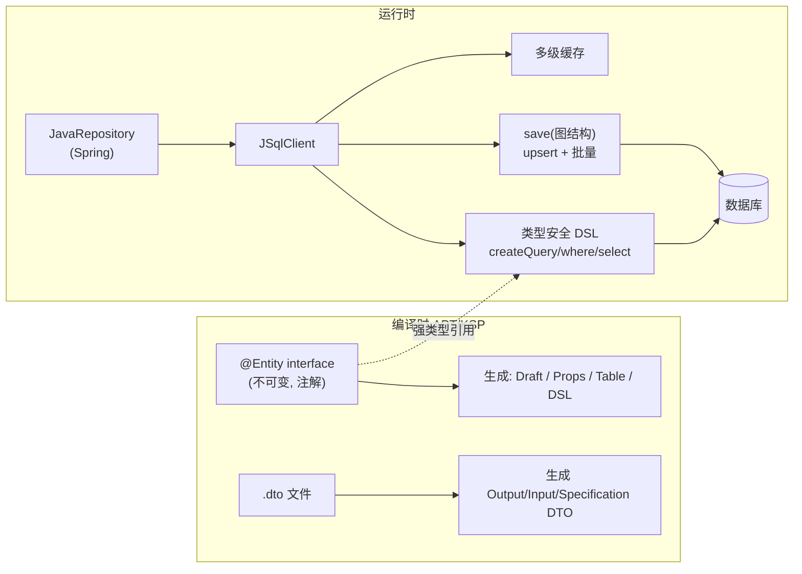

# Jimmer — JVM 上的不可变实体 ORM（持久化框架选型）

> **一句话定位**：Jimmer 是面向 Java & Kotlin 的现代 ORM——以**不可变实体 + 编译时代码生成（APT/KSP）**为核心，强类型 SQL DSL、**无 N+1**、DTO 语言、强大多级缓存。**Apache-2.0**、国内作者（babyfish-ct）活跃维护。是 Custos **持久化层**相对裸 JDBC / JPA 的候选框架。
>
> 本笔记基于本地克隆 `research/jimmer`（Gitee 镜像，Apache-2.0）：`README_zh_CN.md`、`project/jimmer-sql`、`project/jimmer-spring-boot-starter` 源码精读。这是**框架选型评估**（非竞品），结构略调整。

---

## 1. 它解决什么问题 & 核心理念

传统 ORM（JPA/Hibernate）以「POJO 实体」为中心，查询/保存「任意形状的数据图」很别扭（EntityGraph 复杂、DTO 退化成无关联的 OM、update 改全列、N+1）。Jimmer 的核心理念：**把"任意形状的数据结构"作为整体读写**——

- 实体**不是 POJO**，而是**不可变接口**（`@Entity interface`），编译时生成实现；可表达"残缺/任意层级"的数据结构。
- **读**：Jimmer 按你要的形状（Fetcher/DTO）构造数据图给你；**写**：你构造任意形状的数据图交给 Jimmer 整体保存（upsert merge、批量 DML）。



---

## 2. 关键机制（源码佐证）

### 2.1 不可变实体（`@Entity` 接口）
样例（`jimmer-sql/.../arrays/ArrayModel.java`）：
```java
@Entity
public interface ArrayModel {
    @Id @GeneratedValue(generatorType = UUIDIdGenerator.class) UUID id();
    String[] strings();
    @Serialized Byte[] serializedArr();   // 自定义序列化
}
```
- 实体是**接口**，属性是**方法**；编译时（`jimmer-apt`/`jimmer-ksp`）生成 Draft（构造可变草稿）、Props 元数据、Table（DSL 用）。
- 不可变 → 线程安全、天然适合"残缺对象"（只设置部分属性即可保存部分列）。

### 2.2 类型安全 DSL & SQL 优化（`jimmer-sql`）
- `sqlClient.createQuery(table).where(table.foo().eq(x)).select(table).execute()`——**编译期类型检查**。
- 可混入原生 SQL 表达式；支持 Derived Table / CTE / Recursive-CTE。
- **自动 SQL 优化**：去除无用 join、合并逻辑等价 join/隐式子查询、分页自动生成并优化 count 查询。

### 2.3 对象图读写：无 N+1（核心卖点）
- **读**：Object Fetcher 控制返回实体的"形状"（哪些属性/关联/层级），或用 DTO 直接投影；**任意层级、无 N+1**。
- **写**：保存任意形状的图结构，利用数据库 upsert merge，每层批量 DML，自动翻译约束冲突异常；**可保存残缺对象**（不像 JPA update 改全列）。

### 2.4 DTO 语言（`jimmer-dto-compiler`）
- 独立 `.dto` 文件声明 Output/Input/Specification DTO，编译时生成；与 ORM 无缝集成，**唯一支持基于 DTO 的嵌套投影的 ORM**。

### 2.5 Spring 集成（`jimmer-spring-boot-starter`）
- `JavaRepository<E, ID>` 接口（源码确认）：`findById(id[, fetcher/viewType])`、`findByIds`、`findAll(sortedProps)`、`save(entity) → SimpleSaveResult<E>` 等；自定义 repo 继承它并用 `sql()`（JSqlClient）写复杂查询。
- `@EnableJimmerRepositories`；配置项 `jimmer.dialect`、`jimmer.database-validation`、`jimmer.show-sql` 等。
- 多级缓存（对象/关联/计算值/多视图）+ 自动缓存一致性；GraphQL 快速支持；按文档注释生成 OpenAPI/TypeScript 客户端契约。

### 2.6 注意：编译时框架
- 依赖 **APT（Java）/ KSP（Kotlin）**；改实体/Controller 后需触发一次编译生成代码（IDE Run 即可）；仅改 `.dto` 时需 DTO 插件或全量编译。团队需了解 APT 工作方式。

---

## 3. 对 Custos 的适配与边界（关键）

Custos 持久化分两类，**Jimmer 只接管第一类**：

| 数据 | 用 Jimmer? | 说明 |
|---|---|---|
| **Custos 自身元数据**：`custos_storage`(密文 KV)、`custos_seal_config`、`custos_lease`、`custos_audit`、`custos_dyn_role` | ✅ **是** | 实体 + repository，类型安全、无手写 SQL；`byte[]` 列存 Barrier 密文（加解密在 service 层，Jimmer 只存已加密字节）|
| **目标库的 DDL / 用户管理**：`CREATE/DROP USER`、`GRANT` | ❌ 否 | ORM 不做 DDL/账号管理；动态凭证签发/撤销保留**裸 JDBC admin 连接** |
| **目标库的 secretless 任意 SELECT** | ❌ 否 | 经纪层用临时凭证执行用户的任意只读 SQL，非实体 CRUD，保留**裸 JDBC** |

**加密边界保持清晰**：Jimmer 实体的 `svalue/wrapped_*` 属性是 `byte[]`，**进库前已被 Barrier 加密、出库后由 service 解密**；Jimmer 完全不碰明文密钥。→ 既享 ORM 便利，又不破坏「落盘前加密」红线。

**APT 对引擎模块的影响**：engine 模块引入 `jimmer-apt`（编译时），运行时依赖 `jimmer-sql`/starter。属可接受的成熟依赖。

---

## 4. 可借鉴/采用 vs 要注意的坑

| ✅ 采用 / 收益 | ⚠️ 注意 / 坑 |
|---|---|
| 不可变实体 + 残缺对象保存 → `update` 只改设定列，契合"按版本写 keyring/部分更新 lease" | **编译时框架**：团队需懂 APT/KSP；CI 需触发 annotation processing（IDE/构建都支持，但要配置）|
| 类型安全 DSL + 无 N+1 → audit `verify()` 按 seq 排序遍历、lease 前缀查询都强类型、无手写 SQL 拼接（降注入面）| 学习曲线（DSL/Fetcher/DTO 理念与 JPA 不同）|
| `JavaRepository` + Spring Boot Starter → 与 Custos 的 Spring 栈天然一致（ADR-1 Java 全栈）| 不做 DDL/账号管理 → 动态凭证、secretless 执行**仍需裸 JDBC**（边界清晰即可）|
| Apache-2.0 + 国内作者活跃 → 契合自主可控、社区可达（中文文档/视频/QQ 群）| 多级缓存/GraphQL/客户端生成等高级特性 MVP 用不到，避免过度引入 |
| DTO 语言 + OpenAPI/TS 生成 → 未来 Custos 控制台/SDK 受益 | 锁定 Jimmer 版本；APT 生成物纳入构建管理 |

---

## 5. 许可证与对 Custos 的约束

| 项 | 内容 |
|---|---|
| **许可证** | **Apache-2.0**（`research/jimmer/LICENSE` 确认）——与 Custos 同许可，**可放心作运行时依赖**。 |
| **自主可控** | 国内作者（babyfish-ct）主导、中文社区活跃，契合"国产组件优先 / 自主可控"；对外依赖清晰（加入依赖清单）。 |
| **采纳建议** | **采用 Jimmer 作为 Custos 持久化框架**，接管自身元数据表的实体/repository；**裸 JDBC 仅保留在"目标库 DDL/用户管理"与"secretless 任意 SELECT"两处非 ORM 场景**。加密边界（Barrier）维持在 service 层，Jimmer 只存密文字节。 |

> **结论**：Jimmer 是 Custos 持久化层相对裸 JDBC / JPA 的更优选型——不可变实体 + 类型安全 DSL + 无 N+1 + Spring Boot Starter + DTO 生成，且 Apache-2.0、国内活跃、契合 Java 全栈与自主可控。采用它接管 Custos **自身元数据**的持久化，同时把"目标库 DDL/账号管理"与"secretless 任意 SELECT"这两类**非 ORM**操作显式留给裸 JDBC，并保持 Barrier 加密边界在 service 层。集成落地见 `docs/design/08-repo-scaffold.md`（ADR-8）与实现计划 `2026-06-09-custos-mvp-v0.1-engine-persistence.md`。
