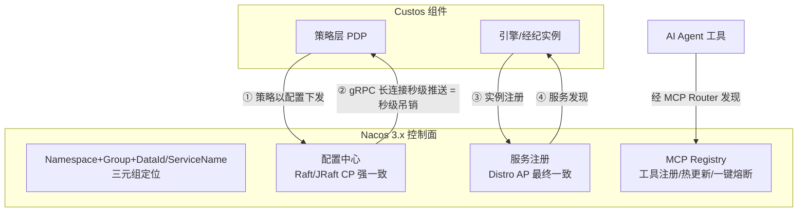

# Nacos — 注册/配置中心 + MCP Registry（Custos 的差异化护城河）

> **一句话定位**：Nacos（阿里开源，**Apache-2.0**）是国内 Java/Spring Cloud 生态最主流的**服务发现 + 动态配置中心**，3.x 起扩展出 **MCP Registry（AI 工具注册中枢）** 与零信任安全。Custos 把它当**控制面**——这是别的竞品（Vault/OpenBao/SPIRE/Cerbos/Infisical）**都没有**的差异化护城河。
>
> **来源说明**：本笔记基于**完整源码**（`research/nacos`，经 Gitee 镜像 `gitee.com/mirrors/Nacos` 克隆，6187 文件，Maven 多模块）+ **官方文档** + 本地整理的 `brief/nacos-dev-reference.md`。Nacos 对 Custos 是**外部控制面依赖**，关注其对外**机制与契约**；已对关键模块（`config/`、`consistency/`、`auth/`、`ai/`、`ai-registry-adaptor/`、`plugin/ai`）做源码级定位佐证。

---

## 1. 它解决什么问题 & 核心架构

Nacos 同时是「注册中心」+「配置中心」，并在 3.x 升级为云原生 AI 能力中枢。对 Custos 而言，它提供四样关键能力：**注册 / 配置热更新 / 多租户隔离 / 服务发现**——正好对应 PRD 的 N1–N4。

**架构分层**（自底向上）：存储层（MySQL）→ 一致性协议层（Distro/Raft）→ 核心能力层（Naming/Config）→ 接入层（OpenAPI / SDK / Console）。

---

## 2. 关键机制如何实现（对 Custos 的价值）

### 2.1 双一致性协议：策略数据走 Raft/JRaft（CP 强一致）—— 吊销可靠性的基石
| 协议 | 模式 | 用于 | 对 Custos 的含义 |
|---|---|---|---|
| **Distro** | AP（最终一致） | 临时实例、服务发现 | Custos 引擎/经纪实例注册（ephemeral，心跳保活、宕机自动摘除） |
| **Raft / JRaft** | **CP（强一致）** | 持久化实例、**配置数据** | **Custos 策略存配置 → 走 Raft 强一致 → 策略不丢不脏**，直接支撑 PRD「吊销正确性」NFR |

> 关键：把**权限策略存为 Nacos 配置**，就天然获得 Raft 强一致的可靠分发——这是 Custos「秒级吊销可验证」的底层保证。

### 2.2 配置热更新 = 秒级权限变更与吊销（Custos N2 的命门）
- 2.x 起客户端经 **gRPC 长连接（9848）订阅配置变更，秒级推送**（取代 1.x HTTP 长轮询）。
- Spring Cloud 侧 `@RefreshScope` / `@ConfigurationProperties` 自动刷新。
- **映射到 Custos**：管理员在 Nacos 改一条策略 → gRPC 秒级推送到所有 PDP/PEP → **该 Agent 的访问被秒级吊销**。这正是 PRD 第 7 节 MVP 要演示的「对 Vault 的可见优势」。

### 2.3 多租户/环境隔离（Custos N3）
- 三元组 **Namespace + Group + DataId/ServiceName** 唯一定位资源。
- **Namespace = 最强隔离**（互不可见，按环境 prod/test/dev 或团队/租户）；**Group = 逻辑分组**（业务线）。
- ⚠️ Namespace 用 **ID（非名称）** 引用——Custos 配置 namespace 时要用 ID。
- → Custos 直接复用：每团队/环境一个 namespace 隔离 Agent/策略/资源目录。

### 2.4 服务发现（Custos N4）
- 引擎/经纪组件以实例注册（`ephemeral=true` 走心跳）；消费方按服务名发现健康实例 + 客户端负载均衡。
- 实例 `weight`/`enabled`/`metadata` 支持灰度与优雅上下线。

### 2.5 MCP Registry（3.x，AI 工具注册中枢）—— 与 Custos 经纪层天然契合
**源码佐证**：Nacos 3.x 确有独立 AI 模块——`ai/`（`com.alibaba.nacos.ai`：controller / form / event / enums）、`ai-registry-adaptor/`（`airegistry`：controller / model/**skills**）、`plugin/ai` + 默认插件 `nacos-default-ai-{importer,pipeline,trace}-plugin`。值得注意：`ai/form/` 下不仅有 MCP，还有 **`a2a`（Agent2Agent 协议）** 与 **`agentspecs`（Agent 规格）** —— Nacos 把"Agent / 工具"作为一等注册对象，AI 注册能力比单纯 MCP 更宽。

开启：`nacos.ai.mcp.registry.enabled=true`，端口 `9080`。核心能力：
| 能力 | 对 Custos 的价值 |
|---|---|
| MCP Server 动态注册、多 namespace 隔离、版本控制 | Custos 把"受治理的工具/资源"注册为 MCP（N1） |
| 工具描述/参数**热更新** | 运行时调整工具暴露面，无需重启 |
| **工具动态开关（一键熔断高危工具）** | = **运行时吊销/JIT**：高危工具可秒级下线（呼应 A3 高危 JIT、PRD 秒级吊销） |
| 零改造升级（HTTP/Dubbo→MCP） | 存量内部接口低成本变成受治理 MCP 工具 |
| 注册信息同步到配置中心 + 服务发现 | 全栈打通 |
- 配套 **Nacos MCP Router**：MCP 的智能检索/安装/代理；Proxy 模式可把 stdio/SSE 的 MCP Server 一键转 Streamable HTTP，便于私有化统一暴露。

### 2.6 配置灰度（Beta 发布）
- 先对指定 IP 列表推送新配置验证，再全量——降低"改配置炸全站"风险。
- → 为 Custos 未来「AI 资产灰度（Prompt/模型/工具版本金丝雀）」提供底座（本期非目标，演进路线锚点）。

### 2.7 鉴权与端口
- `nacos.core.auth.enabled` + token 登录（`/v1/auth/login`）；生产建议独立 namespace + 独立账号 + 最小权限。
- 端口：8848（主/OpenAPI/Admin）、8080（Console）、9848（客户端 gRPC，**务必放通**）、9849（服务端 gRPC）、9080（MCP Registry）。

---

## 3. 在 AI Agent 场景下的"不足" / 为何不能只靠 Nacos

> 注意：Nacos 是 Custos 的**控制面伙伴**，不是竞品；这里列的是"为什么 Custos 不能只是 Nacos"。

| 维度 | Nacos 单独做不了的 |
|---|---|
| **不是密钥引擎** | 不做 Barrier 加密、seal/unseal、动态凭证、租约——**密钥绝不能进 Nacos**（PRD 红线：注册中心不碰密钥） |
| **不是身份引擎** | 不签发 Agent per-session 身份、无 SVID/OBO |
| **不是 PDP** | 配置中心能"存"策略、"推"策略，但**不评估**策略（不判 Agent∩用户∩资源∩风险）；评估要 Custos 的 PDP |
| **MCP Registry ≠ 授权** | 它做工具的注册/发现/开关，不做"这个 Agent 此刻能否调这个工具"的细粒度授权决策 |
| **配置=明文** | 配置项是明文存储，**只能放非敏感的策略/元数据**，凭证一律不进 |

→ 结论：Custos = **在 Nacos 控制面之上**自建「身份 + PDP + 密钥引擎/经纪」，让 Nacos 负责它最擅长的"注册 + 强一致配置分发 + 秒级热推 + 多租户隔离 + MCP 工具注册"。

---

## 4. 可借鉴/可复用的设计 vs 要避免的坑

| ✅ 直接复用（Custos 控制面） | ⚠️ 要守住的边界 / 坑 |
|---|---|
| **策略存 Nacos 配置 + Raft CP** → 强一致、不丢 | **密钥/凭证绝不进 Nacos**（明文存储；PRD 红线） |
| **gRPC 长连接秒级配置推送** → 秒级权限变更/吊销（护城河） | 9848/9849 端口务必放通，否则推送失败/回退 |
| **Namespace/Group 多租户隔离** → Agent/策略/资源目录隔离 | Namespace 用 **ID** 而非名称引用，易踩坑 |
| **服务发现** → 引擎/经纪实例注册与发现 | 临时实例靠心跳，注意 GC/网络抖动导致误摘除 |
| **MCP Registry + 工具动态开关** → 工具注册 + 一键熔断高危工具 | 3.x 特性，需 `nacos.ai.mcp.registry.enabled=true`；锁定 Nacos 3.x 版本 |
| **配置灰度 Beta** → 未来 AI 资产灰度底座 | 本期非目标，勿范围蔓延 |
| **Prometheus 指标 + MySQL 持久化** → 可观测与备份 | 生产需 ≥3 节点集群 + 外置 MySQL |

---

## 5. 许可证与对 Custos 的约束

| 项 | 内容 |
|---|---|
| **许可证** | **Apache-2.0**（阿里巴巴 / Nacos 社区）——与 Custos 同许可，**作为运行时控制面依赖完全没问题**。 |
| **自主可控** | Nacos 是**国产头部开源**、国内 Java 企业广泛在用——这正是 Custos「装上即用 vs 对手另接一套」的护城河来源，强契合"国产组件优先、自主可控"。 |
| **依赖与对齐** | Custos 对 **Nacos 3.x** 强依赖（MCP Registry 等为 3.x 特性）；需在选型文档列明：Spring Boot↔Cloud↔Cloud Alibaba 版本对齐、Nacos 3.x 版本锁定。Nacos 进对外依赖清单（控制面）。 |
| **集成抽象** | 为降低对 Nacos 单点的强绑风险，Custos 内部应抽象"控制面接口"（注册/配置订阅/热更新），Nacos 为首个且首选实现，但**护城河定位决定它不可被替换为其它注册中心**（PRD 硬约束）。 |

> **结论**：Nacos 是 Custos 的**差异化护城河本体**。把策略存为 Nacos 配置（Raft 强一致），用 gRPC 长连接拿到**秒级热推 = 秒级吊销**；用 Namespace 做多租户隔离；用服务发现编排引擎/经纪；用 MCP Registry + 工具动态开关承载"工具注册 + 一键熔断"。守住唯一红线：**密钥绝不进 Nacos**。Nacos 负责"控制面"，Custos 在其上自建"身份 + PDP + 密钥引擎/经纪"。
