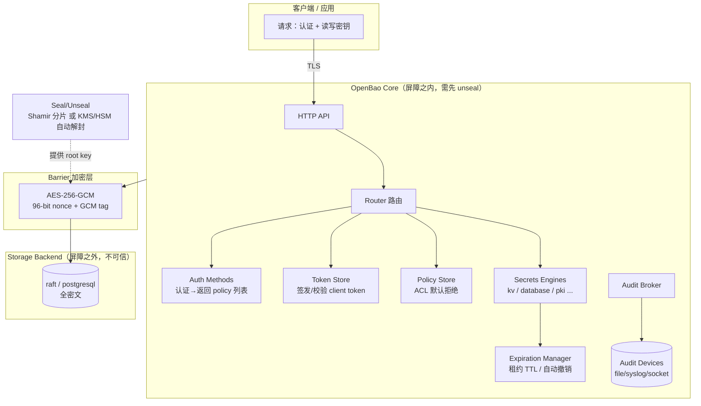

# OpenBao — 自托管密钥引擎（Vault 的纯开源分叉）

> **一句话定位**：OpenBao 是 HashiCorp Vault 在其改用 BSL 许可后的社区分叉，由 Linux Foundation 治理，**许可证 = MPL-2.0（文件级 copyleft）**。它是一个面向应用/机器的密钥管理与动态凭证引擎，是 Custos 自研引擎**最重要的设计借鉴对象**。
>
> 本笔记基于本地克隆 `research/openbao`（含官方文档 `website/content/docs/`）与源码结构精读，**只学架构与设计思想，不搬运代码**（MPL-2.0 文件级 copyleft，混入会污染我们的 Apache-2.0 仓库）。

---

## 1. 它解决什么问题 & 核心架构

**解决的问题**：把分散在配置文件、环境变量、代码里的长期静态密钥，收口到一个加密的、带访问控制与审计的中心；并支持**动态凭证**（请求时现场签发、到期自动销毁），把"长期密钥泄漏"问题转化为"短时凭证 + 最小窗口"。

OpenBao 的核心心智模型是一道 **Barrier（加密屏障）**：屏障之外（存储后端）一律视为**不可信**，所有数据落盘前加密；屏障之内是解封后的明文运行态。



**理论运行流程**（来自官方 `internals/architecture.mdx`）：服务启动 → `sealed` 状态（知道存储在哪但无法解密）→ 提供 unseal key 重建 root key → 解密 keyring → 进入 `unsealed` → 加载 audit/auth/secrets engines → 处理请求（Core 串起 路由→认证→ACL→secrets engine→租约登记→审计）。

---

## 2. 关键机制如何实现（含源码定位）

### 2.1 Barrier 加密层（`vault/barrier/`）
- 所有离开 Core 写入存储后端的数据，统一用 **AES-256-GCM**、**96-bit 随机 nonce**（每个加密对象随机生成）加密；读取时校验 **GCM 认证标签**以检测篡改（来源：`internals/security.mdx`、`internals/architecture.mdx`）。
- 这是"机密性 + 抗篡改"二合一：GCM 是 AEAD，密文自带完整性校验。

### 2.2 密钥层级（四层）与 Seal/Unseal（`vault/seal.go`、`vault/seal/`、`vault/seal_autoseal.go`、`vault/init.go`，Shamir 在 `sdk/helper/shamir/shamir.go`）

官方 `concepts/seal.mdx` 明确的层级（**这是 Custos 必须照搬的安全骨架**）：

```
业务数据  ──(被)── encryption key（存在 keyring 里）
encryption key/keyring  ──(被)── root key
root key  ──(被)── unseal key（绝不落盘）
unseal key  ──(被)── Shamir 分片  或  KMS/HSM 自动解封
```

| 解封方式 | 机制 | 要点 |
|---|---|---|
| **Shamir 分片**（默认） | 把 unseal key 用 Shamir's Secret Sharing 切成 N 片（默认 5），重建需阈值 M 片（默认 3）；分片可分散到不同人/机器，逐片输入 | 体现 two-person rule；root key 不落盘、只能由分片重建；分片本身不能用于请求，只能解封 |
| **Auto Unseal（KMS/HSM）** | 启动时调用云 KMS/HSM 解密从存储读到的 root key | 降低运维复杂度；改用 **recovery key**（也走 Shamir 切片）做 generate-root 等高危授权；强生命周期依赖——KMS key 删了集群无法恢复（连备份也救不回） |

- **检测到入侵可一键 `seal`**：丢弃内存中的 root key，立即锁库，需重新解封（`concepts/seal.mdx`）。
- **密钥轮换**：`vault/rotate.go`、`logical_system_rotate.go` 支持 barrier key / unseal key / recovery key 轮换。

### 2.3 租约 / 撤销（`vault/expiration.go`）
来自 `concepts/lease.mdx`：
- 每个**动态密钥**和 `service` 型 token 都强制带 **lease**（含 TTL、可否续约等元数据）。
- **Expiration Manager** 是后台关键活动：到期**自动 revoke**；revoke 立即失效并阻止续约（如 Kubernetes engine 会真的删掉 service account）。
- **续约 increment 从"当前时间"起算**（不是在现有 TTL 末尾叠加），方便提前缩短租约、尽早回收资源。
- **前缀批量吊销**：lease_id 的前缀就是请求路径，可 `revoke -prefix auth/userpass/` 批量吊销一棵子树；**token 被吊销时，级联吊销该 token 创建的所有 lease**。→ 入侵时可快速大面积失效。

### 2.4 动态凭证签发（`builtin/logical/database/`）
- `path_roles.go`：定义角色的 `creation_statements`（建账号 SQL 模板）+ `default_ttl`/`max_ttl`。
- `path_creds_create.go`：请求时**现场连后端建临时账号**，返回 user/pwd + lease。
- `rotation.go` / `path_rotate_credentials.go`：静态账号的定期轮换 + 连接用根账号的自动轮换。
- 到期由 Expiration Manager 调 revoke → 执行 `revocation_statements`（DROP USER）销毁。

### 2.5 可插拔存储后端（`physical/`）
- **关键差异**：OpenBao 的 `physical/` 已**大幅精简**，本地克隆只见 **`raft/`（集成存储，自带 Raft 强一致 HA）** 与 **`postgresql/`**（外加 `crosstest/`）。Vault 上游保留远多于此的后端（consul/mysql/s3/...）。
- 抽象接口在 `sdk/physical`；存储后端**只存密文**，被设计为不可信。
- 对 Custos 的含义：我们 PRD 首版要 **MySQL** 存储——OpenBao 现在并不内置 MySQL physical 后端，**不能指望直接复用**，要自研存储抽象（这反而印证"引擎自研"的必要）。

### 2.6 审计（`audit/`）
- `audit.go` / `format_json.go` / `formatter.go`：审计 broker 把"请求 + 响应"分发到所有配置的 audit devices，**审计写入先于把密钥材料返回客户端**（`security.mdx` 的可问责性要求）。
- `hashstructure.go`：对敏感字段做 **HMAC**（用一个审计专用密钥），让日志可关联但不泄露明文。
- ⚠️ **重要差异点**：OpenBao 审计的核心是"HMAC 脱敏 + 多设备分发"，**默认并非哈希链/防篡改追加链**——日志文件本身的防篡改依赖外部（如只追加文件、SIEM）。**这正是 Custos 要强化为"哈希链防篡改审计"的差异点（PRD E7）。**

### 2.7 威胁模型（`internals/security.mdx`，Custos `02-engine-crypto` 必抄的清单）
- **在模型内**：窃听通信、篡改静态/传输数据（可检测并中止）、未认证/未授权访问、无问责访问、静态密钥机密性、故障下可用性（HA）。
- **明确不在模型内**：① 对存储后端的任意控制（可删可回滚）；② 密钥"存在性"泄露；③ **对运行中进程的内存分析**；④ 外部系统/插件漏洞；⑤ 宿主机代码执行/写权限；⑥ 客户端被攻陷后凭其凭证访问；⑦ 管理员注入恶意配置。
- 启示：Custos 的威胁建模要**显式声明边界**（尤其内存分析——这也是 PRD「内存清零 + 禁 swap」要补强的地方）。

---

## 3. 在 AI Agent 场景下的不足 / 与 Nacos 生态的脱节

| 维度 | OpenBao 的局限（站在 Custos 立场） |
|---|---|
| **身份是"应用/人"范式** | token + policy 模型为长生命周期应用设计；Agent 是**临时、海量、每会话**身份，OpenBao 无 per-session 身份与生命周期概念 |
| **无 OBO 委托** | 没有"用户 ∩ Agent 取最小权限"的派生令牌概念；委托要自己在外面拼 |
| **凭证仍会"到手"** | 动态凭证返回给调用方——Agent 仍会拿到 user/pwd，**不是 secretless**；要"密钥不进 LLM"必须在外面再包一层经纪/代理 |
| **无 MCP / 工具级 scope** | 不懂 MCP、不懂"工具/动作级"授权（SEP-835），接 Claude/Codex 要自建经纪层 |
| **与 Nacos 完全脱节** | 控制面是自身的 `sys/` + 自有 HA（Raft）；不消费 Nacos 注册/配置，**拿不到"Nacos 配置热更新 = 秒级吊销"这条护城河** |
| **授权可解释性弱** | ACL 是路径前缀匹配 + 并集，缺少 Cerbos 那种"给出命中策略与原因"的可解释决策 |
| **运维偏重** | seal/unseal、HA、插件体系学习与运维成本高 |

---

## 4. 可借鉴的设计 vs 要避免的坑（对 Custos 的取舍）

| ✅ 借鉴（设计思想，自己实现） | ⚠️ 要避免 / 改造的坑 |
|---|---|
| **Barrier 模型**：存储后端不可信、落盘前 AES-256-GCM、随机 nonce、GCM tag 抗篡改 | 不照搬其插件/路径体系的复杂度；Custos 首版聚焦一条纵向线 |
| **四层密钥层级** data→keyring→root key→unseal key | 不要把 master/root key 任何时刻明文落盘 |
| **Seal/Unseal 双模式**：Shamir（默认）+ KMS 自动解封 + recovery key | KMS auto-unseal 的强生命周期依赖（key 删=不可恢复）要在文档显著告警 + 备份策略 |
| **Lease/Expiration Manager**：强制租约、自动撤销、前缀批量吊销、token 级联吊销 | OpenBao 撤销靠自身后台；Custos 要把**吊销与 Nacos 热更新打通**做到秒级、可验证 |
| **动态凭证**：creation/revocation statements 模板 + TTL | — |
| **审计先于返回密钥** + HMAC 脱敏 | 默认不是哈希链——**Custos 升级为哈希链/只追加防篡改审计** |
| **显式威胁模型**（声明边界） | OpenBao 不防内存分析——Custos 用内存清零/禁 swap **缩小**该缺口 |
| **集成存储 Raft 做强一致 HA** | OpenBao 已砍掉多数 physical 后端；Custos 存储需自研抽象，首版 MySQL |

---

## 5. 许可证与对 Custos 的约束

| 项 | 内容 |
|---|---|
| **许可证** | **MPL-2.0**（Mozilla Public License 2.0），`research/openbao/LICENSE` 确认；治理方为 Linux Foundation |
| **copyleft 性质** | **文件级 copyleft**：修改 MPL 文件需以 MPL 公开该文件；但**不要求**整个项目变 MPL（与 GPL 不同）。然而 Custos 计划 **Apache-2.0**，为避免许可混杂与合规审查负担，**严禁把 OpenBao 任何源码文件复制/改写进 Custos**。 |
| **我们的应对** | ①只读其**官方文档与架构思想**，机制用自己的话重述；②引用其文件路径/概念作"灵感来源"标注；③引擎 **100% 原创实现**；④密码学用审计过的标准库（Java：BouncyCastle / Tink；国密：BouncyCastle GM / Tongsuo）实现标准算法，绝不照抄其 Go 实现。 |
| **可直接借用的非代码资产** | 其**威胁模型清单**、**seal/unseal 概念**、**lease 语义**属通用安全工程知识，可作为 Custos `02-engine-crypto` 的设计依据（注明灵感来源）。 |

> **结论**：OpenBao 是 Custos 引擎内核的头号"设计教科书"——Barrier、四层密钥、Shamir/KMS 双解封、Lease/撤销、动态凭证、显式威胁模型几乎可整套借鉴**思想**。但要在三处做出 Custos 的差异化：① 审计升级为**哈希链防篡改**；② 吊销与 **Nacos 热更新**打通做到秒级；③ 在其上叠加 **Agent per-session 身份 + OBO + secretless MCP 经纪**。代码必须自研，许可证红线（MPL 文件级 copyleft）不可触碰。
