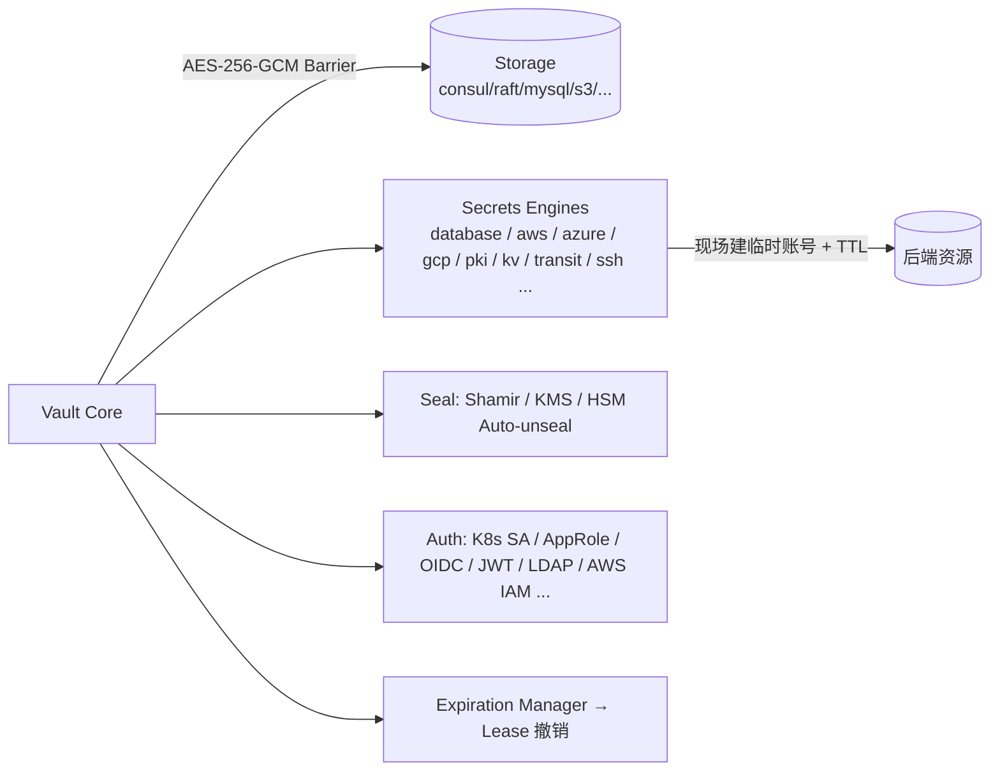

# HashiCorp Vault — 动态密钥引擎的事实标准（⚠️ BSL 许可，只读学设计）

> **一句话定位**：Vault 是密钥管理与动态凭证领域的事实标准与 OpenBao 的**上游**。2023 年起开源版改用 **BSL-1.1（Business Source License）**，这正是社区分叉出 OpenBao（MPL-2.0）的导火索。
>
> ⚠️ **本笔记为只读设计学习**：`research/vault/LICENSE` 确认为 BSL-1.1。**严禁把 Vault 任何代码复制/改写进 Custos**。凡受 Vault 启发处，本笔记标注「灵感来源：Vault」，结论一律用自己的话。Vault 与 OpenBao 结构几乎同源，机制细节见 [`openbao.md`](./openbao.md)，本篇聚焦**二者差异**与**许可证影响**。

---

## 1. 它解决什么问题 & 核心架构

与 OpenBao 同源（OpenBao 是 Vault 的分叉）：同样的 **Barrier 加密屏障 + Seal/Unseal + Secrets Engines + Lease 租约 + Audit** 架构。Vault 的"杀手锏"是 **Dynamic Secrets（动态密钥）**——凭证请求时现场生成、到期自动销毁。

Vault 动态 DB 凭证标准流程（来自密钥竞品对比资料）：① Agent/应用认证（K8s SA / AppRole / OIDC）拿 Vault token → ② 请求 `database/creds/<role>` → ③ Vault 连库 `CREATE USER`（只读 + TTL）→ ④ 返回临时 user/pwd + lease_id + TTL → ⑤ 用临时凭证查询 → ⑥ 租约到期/撤销 → `DROP USER`。

---

## 2. 关键机制：Vault vs OpenBao 的设计差异（对 Custos 选型有用）

| 维度 | Vault（上游） | OpenBao（分叉） | 对 Custos 的启示 |
|---|---|---|---|
| **许可证** | **BSL-1.1**（源码可见、有商用限制，4 年后转 MPL） | **MPL-2.0**（纯开源，文件级 copyleft），LF 治理 | 都不能抄码；**OpenBao 文档更适合作公开引用**（纯开源），Vault 仅作设计佐证 |
| **Secrets Engines 广度** | 极广：database/aws/azure/gcp/pki/transit/ssh/kv/consul/... | 同源但社区维护，部分企业版引擎缺失 | Custos 首版**只做 database engine 一条线**，不追广度 |
| **Storage 后端** | 保留大量后端（consul/mysql/s3/dynamodb/raft/...） | **大幅精简**（主要 raft + postgresql） | 两者都不直接满足"MySQL 存储"——Custos 自研存储抽象 |
| **Transit Engine（加解密即服务）** | 有（EaaS：不暴露密钥，代客户端加解密） | 有 | **思路可借鉴**：Custos secretless 经纪本质类似"操作即服务" |
| **企业特性** | Performance/DR Replication、HSM、命名空间多为企业版 | 社区化部分能力 | Custos 自定义 namespace 走 **Nacos**，不依赖其企业版 |
| **Shamir 实现位置** | 顶层 `shamir/shamir.go` | `sdk/helper/shamir/shamir.go` | 都印证 Shamir 是标准件——Custos 用审计库实现，不自写 |
| **生态集成** | Spring Cloud Vault、K8s auth 成熟 | 兼容 Vault API，生态可复用 | Custos 提供自己的 Spring Boot Starter，不绑 Vault 协议 |

**设计灵感（来源：Vault）**：
- **Dynamic Secrets 范式**（即用即焚）——Custos `06-secrets-broker` 的 S1 动态 DB 凭证直接对标。
- **Transit/EaaS"操作不暴露密钥"**——为 Custos 的 **secretless 经纪**（PEP 只回结果）提供原型思路。
- **认证方法可插拔**（K8s SA / OIDC / JWT）——Custos 身份层 ID2 多认证方法的范式。

---

## 3. 在 AI Agent 场景下的不足 / 与 Nacos 生态的脱节

与 OpenBao 完全一致（同源）：
- 身份为"应用/人"范式，无 Agent per-session 身份、无 OBO 委托；
- 动态凭证仍"到手"，非 secretless（Transit 是例外但需改造）；
- 不懂 MCP / 工具级 scope；
- **与 Nacos 彻底脱节**，控制面是自身；拿不到"Nacos 热更新=秒级吊销"护城河；
- **额外的 BSL 许可风险**：企业自托管商用需评估 BSL 条款，这也是国内"自主可控"诉求下不宜深绑 Vault 的现实理由。

---

## 4. 可借鉴的设计 vs 要避免的坑

| ✅ 借鉴（灵感来源：Vault） | ⚠️ 要避免 |
|---|---|
| Dynamic Secrets 即用即焚范式 | **任何代码复制**（BSL 红线，比 MPL 更严） |
| Transit/EaaS "操作不暴露密钥"思路 → secretless 经纪 | 追求 Vault 那样的引擎/后端广度（首版做窄做深） |
| 可插拔认证方法（K8s SA/OIDC/JWT） | 深绑 Vault API/协议（与"自主可控"冲突） |
| 成熟的 Spring Cloud Vault 集成体验值得对标 | 依赖其企业版才有的能力（replication/HSM/namespace） |

---

## 5. 许可证与对 Custos 的约束

| 项 | 内容 |
|---|---|
| **许可证** | **BSL-1.1**（Business Source License），`research/vault/LICENSE`（MariaDB BSL 文本）确认。源码可读，但有"生产/商用"使用限制，约定时间后转为 MPL-2.0。 |
| **约束** | 比 MPL 更严：**任何场景都不得把 Vault 代码用于 Custos**；连"只读改写"都不行。Vault 仅用于**理解设计意图与行业基线**。 |
| **应对** | 所有引用以**官方公开文档/概念**为准并标"灵感来源：Vault"；优先引用 **OpenBao（MPL）** 的等价文档作为可公开的参考资料；Custos 引擎 100% 原创、用审计过的标准/国密密码库实现。 |
| **自主可控视角** | Vault 的 BSL + 海外治理，与本项目"国内自主可控、Nacos-native、Apache-2.0"的定位天然有距离；这是 Custos 差异化叙事的一部分（自托管、纯开源、国密可切换）。 |

> **结论**：Vault 定义了这条赛道的设计语言（Barrier / Seal / Dynamic Secrets / Lease / 可插拔 auth & storage），Custos **继承其设计思想、对标其能力基线**，但因 **BSL 许可 + 海外治理 + 与 Nacos 脱节**，既不抄码也不深绑协议。需要可公开引用的等价设计时，一律走 **OpenBao（MPL）** 文档。
