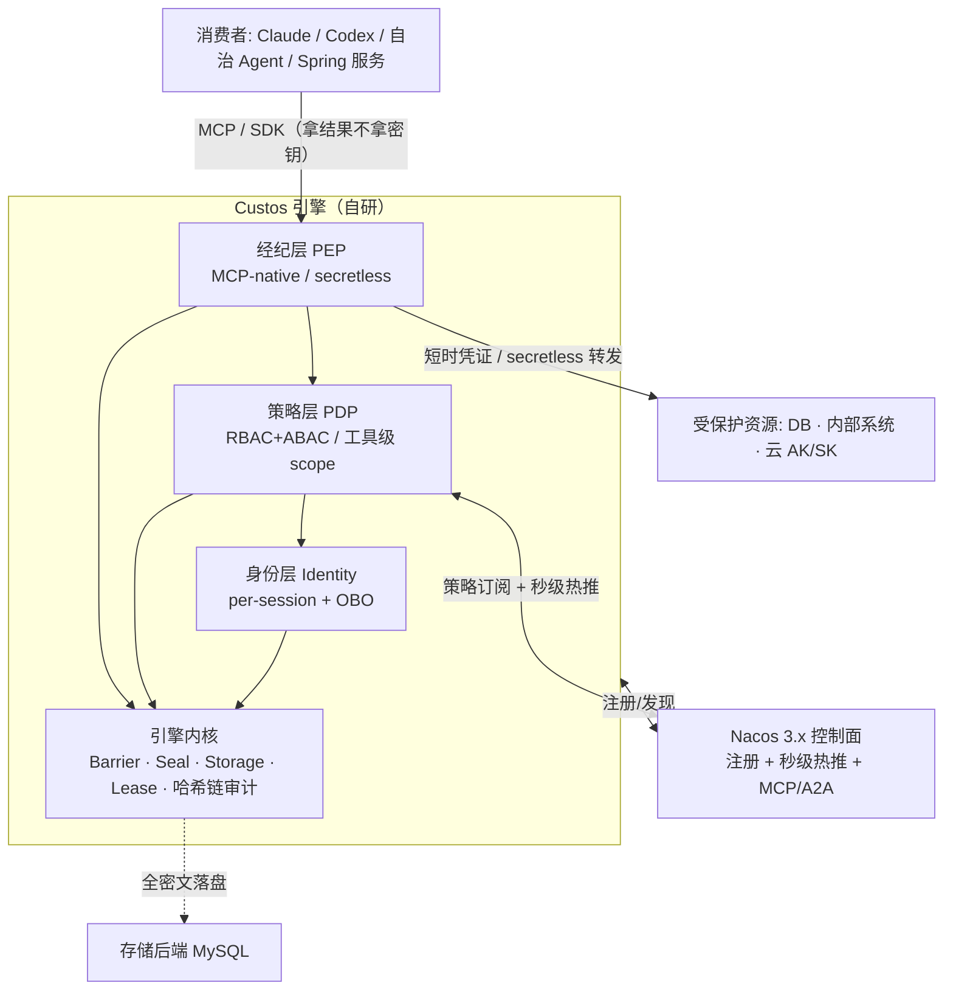

# Custos 整体架构规格（Overall Architecture Spec）

> **类型**：产品级纲领 spec（v0.1~v0.4 蓝图）。统合 `docs/design/00~08` 详设为单一总览，**引用而非重复**详设内容。
> **校订**：2026-06-09 · **状态**：评审中 · **许可**：Apache-2.0
> **配套**：实现级 spec 见 `2026-06-09-custos-mvp-v0.1-design.md`；详设见 `docs/design/`；竞品依据见 `docs/research/`。

---

## 1. 概述与定位

**Custos**（拉丁语「守护者」）= 为 **Nacos / Spring Cloud 生态**打造的、**自托管**的 **AI Agent 身份 · 密钥 · 权限统一引擎**。密钥引擎完全自研（借鉴 Vault/OpenBao 思想，不抄码），Nacos 作注册/控制面。

**差异化护城河（四支柱，无竞品同时具备）**：① Nacos-native ② 自托管·纯开源·自主可控（Apache-2.0 + 国密可切换） ③ 身份·密钥·权限一体 ④ 策略热更新=秒级吊销。

**范围 / 非目标**：做 Agent 身份/密钥/权限引擎；**不做** AI 网关、注册中心本体、RAG、Agent 编排、通用人类 SSO/IDP、交付灰度（本期）。详见 PRD §2、`docs/design/00-synthesis.md` §4。

---

## 2. 系统总览

经典 **PDP/PEP** 模型：Nacos = 控制面（注册 + 策略分发 + 秒级热推）；策略层 = PDP；经纪层 = PEP；三层叠在**自研引擎内核**之上。

> 详见 `docs/design/01-architecture.md`。

---

## 3. 组件职责边界 + 对外接口总览

| 模块（`io.custos.*`）| 一句话职责 | 关键对外接口 | 详设 |
|---|---|---|---|
| `engine` | 加密存储/解封/租约/哈希链审计 | `CipherSuite`、`Barrier`、`SealManager`、`Storage`、`LeaseManager`、`AuditLog` | `02` |
| `identity` | per-session 身份 + OBO 委托 | `Authenticator`、`Sts.exchange`、`TokenService` | `03` |
| `authz` | PDP 决策（RBAC+ABAC、工具级 scope、可解释） | `Pdp.decide`、`PolicyAdapter`、`PolicyWatcher` | `04` |
| `broker` | MCP-native PEP + secretless 经纪 + 动态凭证 | `Tool.invoke`、`Broker.issueCreds`、`Rotator` | `06` |
| `nacos` | 控制面集成（注册/配置订阅/秒级热推/MCP） | `ControlPlane`、`McpRegistry` | `05` |
| `sdk` | Spring Boot Starter 取凭证/注入身份 | starter 注解/自动配置 | `08` |
| `cli` | 解封/策略/审计运维 | `custos operator unseal`/`policy`/`audit verify` | `07` |

**边界铁律**：`engine` 不懂业务/MCP；`authz` 不持密钥；`broker` 不判策略（调 PDP）；`nacos` 只做控制面、**绝不存密钥**。

---

## 4. 关键数据流（MVP 纵向线）

Agent 代表用户请求只读库 → 身份层签 per-task 令牌（OBO 交集）→ PDP 校验（策略来自 Nacos，可解释准/拒）→ 经纪层经引擎签发 1h 只读 DB 凭证、**secretless 执行只回结果** → 哈希链审计 → 在 Nacos 改策略即**秒级吊销** → 租约到期 DROP USER。完整时序见 `docs/design/01-architecture.md` §4。

---

## 5. 跨切关注点

| 关注点 | 要点 | 详设 |
|---|---|---|
| **安全/威胁模型** | STRIDE + 显式声明边界；最高价值资产 = master key / 审计完整性 / 密钥不进 LLM | `02` §3 |
| **秒级吊销** | 策略=Nacos 配置（Raft CP）+ gRPC 秒级热推；端到端可测；Nacos 不可用 fail-safe（高危默认拒） | `05` §2 |
| **密码学** | 不自创算法；AES-256-GCM/SHA-256/ECDSA 默认，**国密 SM4/SM3/SM2 经 CipherSuite 可切换** | `02` §9/§10 |
| **内存安全** | byte[] 清零、堆外、JNA mlock、禁 swap/core dump | `02` §8 |
| **可观测** | Prometheus 指标 + ELK/OTel 链路 + 解封/密封状态监控 | `01`/PRD |
| **兼容** | Nacos 3.x；Spring Boot↔Cloud↔Cloud Alibaba 版本对齐；K8s | `08` |
| **合规** | 凭证最小只读 + TTL；密钥不进 LLM/Nacos/代码仓库；可追溯到用户 | PRD |

---

## 6. 技术选型与依赖（自主可控）

栈：**Java 21 + Spring Boot 3.x/Spring Cloud Alibaba**；密码学 **BouncyCastle(+GM)** / 可选 **Tongsuo**；授权 **jCasbin**（国产）；控制面 **Nacos 3.x**（国产）；存储 **MySQL**（可换 OceanBase/TiDB）；接口 **MCP Java SDK**。

依赖与许可证合规表（摘要，全表见 `docs/design/00-synthesis.md` §7）：所有依赖 Apache/MIT/无 BSL；**严禁** OpenBao(MPL)/Vault(BSL)/Infisical-EE(商业) 代码混入；Custos 自身 Apache-2.0。

---

## 7. 关键设计决策登记（ADR 摘要）

| ID | 决策 | 选择 | 理由 | 详设 |
|---|---|---|---|---|
| ADR-1 | 引擎语言 | **Java 全栈** | 生态一致 + Nacos 原生；内存短板工程补齐；engine 留进程边界后路 | `08` §2 |
| ADR-2 | 解封方式 | **Shamir 默认 + KMS 接口预留** | 自主可控、可演示；信创 KMS 可切 | `02` §6 |
| ADR-3 | 存储后端 | **MySQL 全密文（首版）→ Raft/JRaft HA（v0.3）** | 国内普遍、PRD 指定 | `02` §7 |
| ADR-4 | 国密策略 | **默认国际套件 + 国密可切换（CipherSuite）** | 兼顾通用与信创卖点 | `02` §9 |
| ADR-5 | 授权落地 | **借 Cerbos 设计 + jCasbin 落地 + 自研 Nacos Watcher** | 自主可控 + Java 同栈 + 护城河缝合 | `04` §1 |
| ADR-6 | 审计 | **哈希链/只追加防篡改** | 竞品默认仅 HMAC 脱敏，差异化 | `02` §11 |
| ADR-7 | 身份令牌 | 首版 JWT（双载体 X.509 后续）；OBO 用 OAuth2 token-exchange | 降复杂度 + 委托新造 | `03` |

---

## 8. 版本路线（v0.1~v0.4）

| 版本 | 重点 | 验收 |
|---|---|---|
| **v0.1**（MVP） | 纵向线 + 单节点引擎 + 动态 DB 凭证 + Nacos 秒级吊销 + secretless + 哈希链审计 | demo 链路全通，吊销可演示（见 MVP spec）|
| **v0.2** | OBO 委托、ABAC/风险分级、AK/SK engine + 轮换、JIT 人工审批流 | 委托链与高危审批闭环 |
| **v0.3** | HA（Raft/JRaft 强一致）、SPIFFE 认证、更多 secrets engine、SDK/CLI 完善 | 集群高可用，租约不丢不重 |
| **v0.4** | **外部安全审计**、加固、性能压测、文档与示例 | 安全审计通过，具备生产条件 |

---

## 9. 风险登记（摘要）

| 风险 | 级 | 应对 |
|---|---|---|
| 自研引擎安全风险 | 🔴 | 审计库 + 威胁建模 + TDD/模糊测试 + v0.4 外部审计 |
| master key 泄漏 | 🔴 | Shamir/KMS、不明文落盘、最小存活、一键 seal |
| 吊销/租约不可靠 | 🟠 | 强一致(Nacos 配置 Raft) + 端到端验证 + fail-safe |
| Java 内存残留 | 🟠 | 堆外 + 清零 + mlock；必要时 engine 进程化 Go |
| 同方向竞品 | 🟠 | 钉死 Nacos-native + 一体化 + 国密差异化 |
| 强绑 Nacos | 🟡 | 抽象控制面接口（护城河定位不可替换）|

---

## 10. 文档地图

- **详设**：`docs/design/00-synthesis`（综合/许可）· `01-architecture` · `02-engine-crypto`（重中之重）· `03-identity` · `04-authz` · `05-nacos` · `06-broker` · `07-mvp` · `08-scaffold`
- **竞品依据**：`docs/research/{openbao,vault,spire,cerbos,casbin,nacos,infisical}.md`
- **引用资料**：`docs/references/*`
- **实现级 spec**：`2026-06-09-custos-mvp-v0.1-design.md`
- **浏览版**：`custos-design.html`
